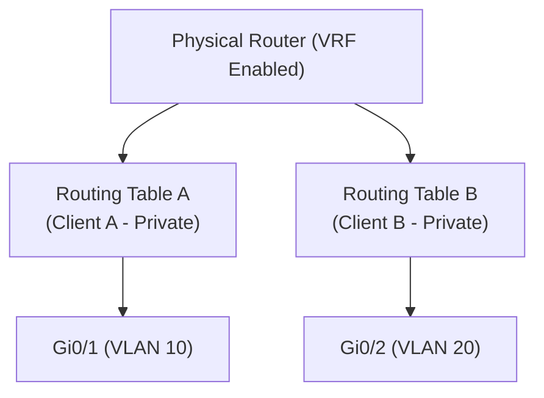

← [[Course on CCNA|Go Back to Course Hub]]

# 🌐 Day 53: Virtualization and Cloud (Hypervisors, Cloud Services, and VRF)

Welcome to the notes for **Day 53: Virtualization and Cloud** of Jeremy's IT Lab CCNA Complete Course! Aaj hum modern datacenter aur cloud infrastructures ke base pillars ko seekhenge. Hum seekhenge ki Server Virtualization kya hoti hai, Type 1 Bare-Metal aur Type 2 Hosted Hypervisors ke difference kya hain, Cloud Computing ke essential characteristics aur service models (IaaS, PaaS, SaaS) kya hain, aur router level virtualization technology **VRF (Virtual Routing and Forwarding)** kaise kaam karti hai. Ye notes Hinglish language aur English/Latin script mein hain.

---

## 🚦 1. Server Virtualization & Hypervisors

Traditional server deployment mein ek single physical server hardware par ek hi Operating System (OS) aur applications chalte the, jisse computing resources (CPU, RAM) 90% time idle/waste hote the.

**Virtualization** ke zariye hum ek single physical hardware (**Host**) par multiple independent software OS instances (**Virtual Machines / VMs / Guests**) chalate hain. 

### The Hypervisor:
Hypervisor ek virtual layer software hai jo physical hardware aur VMs ke beech resources allocate aur coordinate karta hai. Hypervisors do types ke hote hain:

```text
  TYPE 1 HYPERVISOR (Bare-Metal)                TYPE 2 HYPERVISOR (Hosted)
+-------------------------------+             +-------------------------------+
|  Virtual Machines (VM 1 & 2)  |             |  Virtual Machines (VM 1 & 2)  |
+-------------------------------+             +-------------------------------+
|  Type 1 Hypervisor (ESXi/KVM) |             |  Type 2 Hypervisor (VB/VMw)  |
+-------------------------------+             +-------------------------------+
|       Physical Hardware       |             |     Host OS (Windows/Linux)   |
+-------------------------------+             +-------------------------------+
                                              |       Physical Hardware       |
                                              +-------------------------------+
```

1.  **Type 1 Hypervisor (Bare-Metal):**
    *   **Installation:** Ye software directly physical hardware server block par installed hota hai (no underlying OS).
    *   **Performance:** High efficiency aur low latency kyunki host OS ka koi interference nahi hota.
    *   **Enterprise Standard:** Enterprise datacenters mein 99% yahi use hote hain.
    *   *Examples:* VMware ESXi, Microsoft Hyper-V, KVM (Kernel-based Virtual Machine).
2.  **Type 2 Hypervisor (Hosted):**
    *   **Installation:** Ye pehle se installed Host OS (jaise Windows, Linux, macOS) ke upar ek regular application software ki tarah install hota hai.
    *   **Performance:** Slightly slow kyunki iska traffic host OS pipelines se hokar hardware tak jata hai.
    *   **Usage:** Personal testing, labs ya development platforms ke liye.
    *   *Examples:* Oracle VirtualBox, VMware Workstation / Player.

---

## 🏛️ 2. Cloud Computing Fundamentals

NIST (National Institute of Standards and Technology) ke mutabik, Cloud computing networks par dynamic resources lease pe dene ka dynamic computing model hai.

### A. The 5 Essential Characteristics of Cloud:
1.  **On-Demand Self-Service:** Users bina service provider ke manual intervention ke, click-to-deploy method se dynamic resources (VMs, database) deploy kar sakte hain.
2.  **Broad Network Access:** Cloud services internet ke through kisi bhi standard device (Laptop, Mobile, IP Phone) se globally access ki ja sakti hain.
3.  **Resource Pooling:** Provider ke physical resources multiple tenants (clients) ke beech dynamically distribute aur share hote hain.
4.  **Rapid Elasticity:** Demand badhne par VMs automatically scale up/out (add memory/servers) ho sakte hain aur demand down hone par automatically scale down/in ho sakte hain.
5.  **Measured Service:** Billing dynamic telemetry meters par chalti hai (Pay-as-you-go / Jitna use kiya utne ke paise do).

---

### B. Cloud Service Models (IaaS, PaaS, SaaS):

```text
+-----------------------+      +-----------------------+      +-----------------------+
|  IaaS (Infrastructure)|      |   PaaS (Platform)     |      |   SaaS (Software)     |
+-----------------------+      +-----------------------+      +-----------------------+
|  * Provider manages:  |      |  * Provider manages:  |      |  * Provider manages:  |
|    Virtualization,    |      |    Virtualization,    |      |    EVERYTHING!        |
|    Hardware, Storage. |      |    Hardware, OS,      |      |    (Hardware, OS,     |
|  * You manage:        |      |    Runtime, DBs.      |      |     Application,      |
|    OS, Database, Apps.|      |  * You manage:        |      |     Data)             |
|                       |      |    Application Code   |      |                       |
+-----------------------+      +-----------------------+      +-----------------------+
```

1.  **IaaS (Infrastructure as a Service):**
    *   Organization raw computing power (Virtual Machines, Storage space, virtual firewalls) lease par leti hai. OS install aur configure karna customer ki responsibility hoti hai.
    *   *Examples:* Amazon EC2, Microsoft Azure VMs, Google Compute Engine.
2.  **PaaS (Platform as a Service):**
    *   Developer tools, runtime systems, databases aur operating systems provider manage karta hai. Customer ko sirf apna application code upload karna hota hai.
    *   *Examples:* AWS Elastic Beanstalk, Heroku, Google App Engine.
3.  **SaaS (Software as a Service):**
    *   Complete end-user application jo web browser ke through directly run hoti hai. customer ko software configurations ya patchings ki tension nahi leni hoti.
    *   *Examples:* Microsoft 365, Google Workspace, Salesforce, Zoom.

---

### C. Cloud Deployment Models:
*   **Public Cloud:** Multi-tenant infrastructure jo publicly internet par globally available hai (AWS, Azure).
*   **Private Cloud:** Single organization ke liye customized private datacenter cloud model (highly secure, hosted on-premise).
*   **Hybrid Cloud:** Public and Private clouds ka bridge setup (e.g. database runs in secure private cloud, web interfaces scale on public AWS cloud).

---

## 🧭 3. VRF (Virtual Routing and Forwarding)

Jaise hum single physical switch par multiple logical Layer 2 boundaries (**VLANs**) banate hain, vaise hi single physical router par multiple independent routing tables chalane ko **VRF (Virtual Routing and Forwarding)** kehte hain.



*   **How it Works:**
    *   Router par har routing table aapas mein completely isolated hoti hai.
    *   *Overlapping IP Address Spaces:* Client A aur Client B dono static networks par `192.168.1.0/24` range use kar sakte hain aur unka traffic single router se bina bleed (intermix) huye separate channels par travel karega.
    *   *Usage:* ISP backbone routers (Multi-tenancy segmentation) aur secure enterprise segment designs.

---

## 📝 4. CCNA Day 53 Practice Questions

1. **Q1: Type 1 Hypervisor (Bare-Metal) and Type 2 Hypervisor (Hosted) ke installation parameters mein primary differences kya hain?**
   <details>
   <summary>🔓 Click to Reveal Answer</summary>
   **Answer:** Type 1 Hypervisor directly server physical hardware over-the-metal install hota hai, jabki Type 2 Hypervisor host machine ke already running OS (jaise Windows/Linux) ke upar application ki tarah run hota hai.
   </details>

2. **Q2: VMware ESXi aur Microsoft Hyper-V kis hypervisors category ke instances hain?**
   <details>
   <summary>🔓 Click to Reveal Answer</summary>
   **Answer:** **Type 1 Hypervisor** (Bare-Metal).
   </details>

3. **Q3: Cloud computing NIST criteria ke dynamic scale scaling points par 'Rapid Elasticity' property kya indicate karti hai?**
   <details>
   <summary>🔓 Click to Reveal Answer</summary>
   **Answer:** System dynamic users query traffic analysis par automatically CPU/RAM scale up/out (allocate extra servers) ya scale down/in (release idle resources) automatic scale speed kar sakta hai.
   </details>

4. **Q4: Cloud model check points par, IaaS model customers ko kya physical control and configurations settings bypass manage karne deta hai?**
   <details>
   <summary>🔓 Click to Reveal Answer</summary>
   **Answer:** Raw virtualized hardware, servers and storage access. Customer ko manually host virtual machine settings, OS patching, runtime and databases deploy aur manage karne hote hain.
   </details>

5. **Q5: Customer app code updates deploy karne ke liye, runtime resources, OS aur background databases layers check provider dwara pre-configured hold hone wale model type ko kya bolte hain?**
   <details>
   <summary>🔓 Click to Reveal Answer</summary>
   **Answer:** **PaaS (Platform as a Service)**.
   </details>

6. **Q6: Google Workspace aur Microsoft 365 applications templates kis cloud service framework categories ke baseline parameters hain?**
   <details>
   <summary>🔓 Click to Reveal Answer</summary>
   **Answer:** **SaaS (Software as a Service)**.
   </details>

7. **Q7: Public cloud flexibility aur private cloud data security features coordinates bypass mix structures deployment model ko kya bolte hain?**
   <details>
   <summary>🔓 Click to Reveal Answer</summary>
   **Answer:** **Hybrid Cloud**.
   </details>

8. **Q8: Router virtualization technology jo ek hi physical router hardware par multiple independent Layer 3 routing engine tables run karti hai, use kya bolte hain?**
   <details>
   <summary>🔓 Click to Reveal Answer</summary>
   **Answer:** **VRF (Virtual Routing and Forwarding)**.
   </details>

9. **Q9: VRF technology multi-tenant enterprise settings ya ISPs ko overlapping IP addresses cases handle karne mein kaise help karti hai?**
   <details>
   <summary>🔓 Click to Reveal Answer</summary>
   **Answer:** Kyunki har VRF domain ke paas ek standalone isolated routing database hoti hai, isliye physical router overlap addresses nodes ko distinct dynamic tables par separate path maps dynamically resolve karke cross-talk prevent karta hai.
   </details>

10. **Q10: Personal desktop systems par testing labs run karne ke liye standard hypervisors model select check kya kiya jata hai?**
    <details>
    <summary>🔓 Click to Reveal Answer</summary>
    **Answer:** **Type 2 Hypervisor** (e.g. VMware Workstation, Oracle VirtualBox).
    </details>
