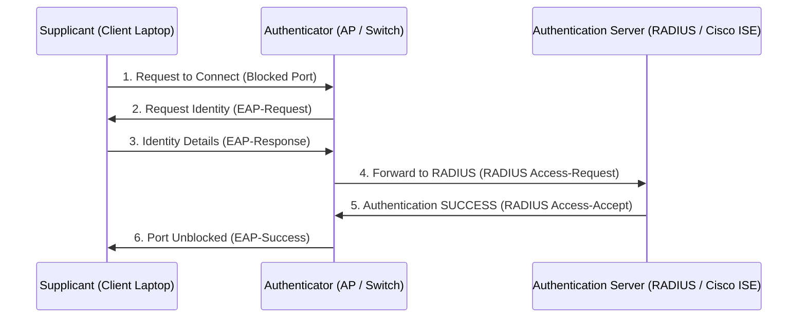

← [[Course on CCNA|Go Back to Course Hub]]

# 📶 Day 56: Wireless Security (WEP, WPA, WPA2, WPA3, and 802.1X/EAP)

Welcome to the notes for **Day 56: Wireless Security** of Jeremy's IT Lab CCNA Complete Course! Wireless networks completely open air medium use karte hain, isliye inki security wired segment se zyada critical hai. Aaj hum legacy and vulnerable protocols (WEP, WPA), modern standard secure options (**WPA2 AES/CCMP, WPA3 SAE/Dragonfly**), deployment models (Personal vs Enterprise), aur enterprise AAA authentication framework **802.1X (EAP/RADIUS)** ko detailed steps, diagrams, aur core exam guidelines ke sath cover karenge. Ye notes Hinglish language aur English/Latin script mein hain.

---

## 🚦 1. Legacy and Vulnerable Wi-Fi Security Protocols

Wireless security ke evolution mein multiple standards use huye hain:

1.  **WEP (Wired Equivalent Privacy):**
    *   *Legacy:* Original 802.11 standard security protocol (1997).
    *   *Mechanism:* Static RC4 stream cipher encryption key use karta tha.
    *   *Vulnerability:* Static keys easily analyze ho sakti hain. Aaj kal ke tools se WEP security ko few minutes mein easily crack kiya ja sakta hai. (Never use in production!).
2.  **WPA (Wi-Fi Protected Access):**
    *   *Legacy:* WEP ke loopholes ko urgent patch karne ke liye dynamic temporary standard design kiya gaya.
    *   *Mechanism:* **TKIP (Temporal Key Integrity Protocol)** use karta tha jo har packet ke liye dynamic encryption keys change karta hai, but backing code base RC4 standard par hi reliance rakhta tha. Isme bhi mathematical flaws mile aur ise deprecate kar diya gaya.

---

## 🏛️ 2. Modern and Secure Wi-Fi Security Protocols

Enterprise standard wireless secure networks ko setup karne ke liye niche diye protocols use hote hain:

### A. WPA2 (Wi-Fi Protected Access 2):
*   **Encryption Standard:** WPA2 dynamic RC4 and TKIP ko replace karke globally trusted **AES (Advanced Encryption Standard)** use karta hai.
*   **L2 Protocol:** **CCMP** (Counter Mode Cipher Block Chaining Message Authentication Code Protocol) framework run karta hai data integrity aur confidentiality guarantee karne ke liye.
*   **Vulnerability:** WPA2 personal key exchange 4-way handshakes offline dictionary / brute-force attacks ke liye vulnerable hain.

### B. WPA3 (Modern Standard):
*   ** dragonfly exchange:** WPA3 ne personal preshared key exchange (PSK) ko completely secure **SAE (Simultaneous Authentication of Equals)** jise **Dragonfly Key Exchange** bhi kehte hain, se replace kiya hai.
*   *Advantage:* Ye **offline dictionary attacks ko block karta hai** aur **Forward Secrecy** provide karta hai (agar hacker future mein passphrase leak karwa le, toh bhi past captured traffic decrypt nahi ho sakta).
*   **Enterprise Encryption:** 192-bit cryptographic strength option capabilities support karta hai.

---

## 🧭 3. Personal vs. Enterprise Security Deployments

WPA2 aur WPA3 ko deploy karne ke do methods hain:

### A. Personal Mode (WPA-Personal / WPA-PSK):
*   **Use Case:** Home networks aur small business offices.
*   **Mechanism:** Ek single generic **Pre-Shared Key (PSK)** ya password set hota hai jo pure network par connect hone wale saare users (devices) share karte hain.

### B. Enterprise Mode (WPA-Enterprise / 802.1X):
*   **Use Case:** Corporate office campuses aur organizations.
*   **Mechanism:** Har user/employee apne **unique credentials** (individual username & password ya unique digital certificates) se authentication process pass karta hai via centralized **RADIUS (Authentication Server)**.

---

## 🛡️ 4. The 802.1X / EAP Architecture

WPA-Enterprise authentication cycle **802.1X** standards framework use karta hai jo teen core entities (roles) par operate hota hai:

1.  **Supplicant:**
    *   Client wireless device (laptop, phone, tablet) jo network access request kar rahi hai. Is par 802.1x client software running hona mandatory hai.
2.  **Authenticator:**
    *   Network access device (Wireless Access Point (AP) ya Layer 2 switch port). 
    *   *Rule:* Authenticator client ko directly network traffic send nahi karne deta jab tak verify success accept return na ho. Ye supplicant ke authentication frames ko central server tak bridge karta hai.
3.  **Authentication Server:**
    *   Centralized database server (typically running **RADIUS** protocol like Cisco ISE - Identity Services Engine).
    *   Ye server supplicant ke credentials ko check/validate karta hai aur Authenticator ko final decision (Accept/Reject) bhejta hai.

### Extensible Authentication Protocol (EAP):
EAP actually authentication message exchange format negotiate karne ka container framework hai:
*   **PEAP (Protected EAP):** Only server digital certificate use karta hai, client username/password input karta hai (highly popular).
*   **EAP-TLS:** **Most Secure**. Server aur Client **dono ke paas digital certificates hona mandatory hai**.

---

## 📝 5. CCNA Day 56 Practice Questions

1. **Q1: Legacy WEP (Wired Equivalent Privacy) protocol kis cipher encryption algorithm use karta hai aur iski core weakness kya hai?**
   

   
🔓 Click to Reveal Answer

   **Answer:** WEP **RC4 stream cipher** use karta hai jisme encryption key static parameters par hoti hai, jisse dynamic frames capture karke hacker easily few minutes mein key predict/crack kar lete hain.
   

2. **Q2: WPA1 standard ne WEP encryption weaknesses ko patch karne ke liye kis temporary protocol key framework ka use kiya tha?**
   

   
🔓 Click to Reveal Answer

   **Answer:** **TKIP (Temporal Key Integrity Protocol)**.
   

3. **Q3: WPA2 wireless standard confidentiality and integrity ensure karne ke liye kis encryption standard aur L2 protocol combination ka use karta hai?**
   

   
🔓 Click to Reveal Answer

   **Answer:** **AES (Advanced Encryption Standard)** encryption aur **CCMP** framing standard.
   

4. **Q4: Modern WPA3 personal security deployments mein offline brute-force key handshake attacks ko bypass karne ke liye kis key exchange technology ka use kiya jata hai?**
   

   
🔓 Click to Reveal Answer

   **Answer:** **SAE (Simultaneous Authentication of Equals)**, jise **Dragonfly Key Exchange** bhi bola jata hai.
   

5. **Q5: WPA Personal aur WPA Enterprise deployment models ke authentication authentication methods mein core difference kya hai?**
   

   
🔓 Click to Reveal Answer

   **Answer:** WPA Personal mein saare clients ek common shared password (**Pre-Shared Key / PSK**) use karte hain, jabki WPA Enterprise mein dynamic users check unique logins run karte hain jise backend central **RADIUS database server** verify karta hai.
   

6. **Q6: 802.1X corporate security architecture elements check ke under client devices/host configurations ko kis specific term se refer kiya jata hai?**
   

   
🔓 Click to Reveal Answer

   **Answer:** **Supplicant**.
   

7. **Q7: Switch port ya Access Point (AP) jo user network access line block access check hold karta hai, use 802.1X security framework mein kya bolte hain?**
   

   
🔓 Click to Reveal Answer

   **Answer:** **Authenticator**.
   

8. **Q8: User credentials verify validation run karne wale database engines (jaise Cisco ISE) ko AAA authentication protocol rules mein kya bolte hain?**
   

   
🔓 Click to Reveal Answer

   **Answer:** **Authentication Server** (running RADIUS or TACACS+ protocols).
   

9. **Q9: Extensible Authentication Protocol (EAP) frameworks parameters check par, 'EAP-TLS' validation pass karne ke liye supplicant aur server side mandatory configuration kya hai?**
   

   
🔓 Click to Reveal Answer

   **Answer:** Client machine (Supplicant) aur Server (Authentication Server) **dono par digital certificates installed hona mandatory hai** (highly secure standard).
   

10. **Q10: WPA3 personal deployments forward secrecy capabilities properties kya hold karti hain?**
    

    
🔓 Click to Reveal Answer

    **Answer:** Agar future me generic passphrase keys leak ho jayein, tab bhi past capture data streams decrypt nahi kiye ja sakte (independent session keys limits).
    

