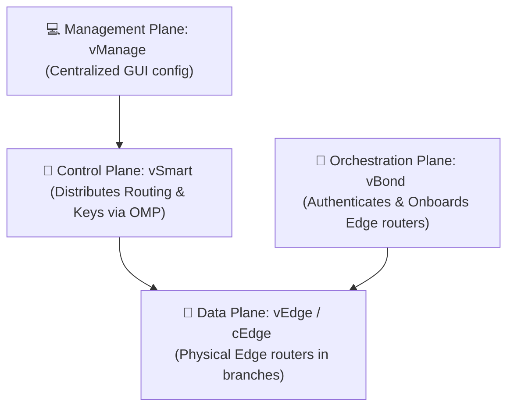

← [[Course on CCNA|Go Back to Course Hub]]

# 🤖 Day 61: Software-Defined Networking (SDN) (SD-Access, SD-WAN, and DNA Center)

Welcome to the notes for **Day 61: Software-Defined Networking (SDN)** of Jeremy's IT Lab CCNA Complete Course! Aaj hum Cisco ke advanced software-defined enterprise architectures—**SD-Access** aur **SD-WAN**—aur centralized SDN management platform **Cisco DNA Center (Catalyst Center)** ke baare mein seekhenge. Hum seekhenge ki campus fabric setups mein LISP, VXLAN, aur TrustSec SGTs kaise kaam karte hain, SD-WAN ke four operational planes (vManage, vSmart, vBond, vEdge) kya roles perform karte hain, aur DNA Center ke primary workflows (Design, Policy, Provision, Assurance) ko detailed steps, comparisons, aur diagrams ke sath cover karenge. Ye notes Hinglish language aur English/Latin script mein hain.

---

## 🚦 1. Cisco SD-Access (Software-Defined Access)

**Cisco SD-Access** campus local networks (LAN) ke liye Cisco ka standardized SDN solution hai. Ye physical underlay network ko virtualized logical networks (**Fabric**) mein convert kar deta hai.

```text
  +-------------------------------------------------------------+
  |              SD-ACCESS POLICY & FABRIC OVERLAY              |
  |  - Control Plane: LISP (Resolves Endpoint IDs to RLOCs)     |  <-- Overlay plane
  |  - Data Plane:    VXLAN (L2 frames in L3 UDP encapsulation)  |
  |  - Policy Plane:  TrustSec SGTs (Security Group Tags)       |
  +-------------------------------------------------------------+
                                 ||
                                 || Running on top of
                                 \/
  +-------------------------------------------------------------+
  |              PHYSICAL UNDERLAY INFRASTRUCTURE               |  <-- Underlay plane
  |  - Physical switches & links                                |
  |  - Core Routing Protocol: IS-IS (Standard recommendation)   |
  +-------------------------------------------------------------+
```

### SD-Access Fabric Architecture:
SD-Access teen core technologies ke dynamic combination se chalta hai:
1.  **Control Plane - LISP (Locator/ID Separation Protocol):**
    *   *Concept:* Traditional routers MAC aur IP tables dynamically local check map karte hain. LISP is database ko split kar deta hai.
    *   *EID (Endpoint Identifier):* Host ka IP address (Who you are).
    *   *RLOC (Routing Locator):* Us switch ka IP jisse client connected hai (Where you are).
    *   *Result:* LISP router memory checks ko reduce karta hai aur location tracking ko scale karta hai (similar to how DNS resolves hostname to IP).
2.  **Data Plane - VXLAN (Virtual Extensible LAN):**
    *   *Concept:* Standard VLANs only 4094 IDs support karte hain. VXLAN ek tunneling encapsulation protocol hai jo Layer 2 frames ko standard Layer 3 UDP packets mein wrap kar deta hai.
    *   *Advantage:* Layer 3 boundaries (routers) ke paar bhi same Layer 2 networks stretch ho sakte hain, aur ye $2^{24} \approx 16 \text{ Million}$ virtual IDs support karta hai.
3.  **Policy/Security Plane - Cisco TrustSec:**
    *   *Concept:* Traditional security source/destination IPs ke access lists (ACLs) par rely karti hai (hard to manage).
    *   *SGT (Security Group Tag):* TrustSec data packets par user identity block tag (**SGT**) insert kar deta hai (e.g. SGT 10 for HR, SGT 20 for Finance). Switches traffic firewalling IP ranges ke badle in tags ke base par karte hain, jo config design ko static list management se clear up kar deta hai.

---

## 🏛️ 2. Cisco SD-WAN (Software-Defined WAN)

Traditional WAN setups (DMVPN, MPLS BGP) configuration-wise complex hote the. **Cisco SD-WAN** (Viptela-based architecture) WAN boundaries ko organize karne ke liye networks ko **four distinct operational planes** mein split kar deta hai:



### The Four Planes of SD-WAN:
1.  **Management Plane (vManage):**
    *   *Role:* Centralized dashboard web GUI.
    *   *Function:* Admin isi platform se pure WAN templates, configs aur policies write aur verify karta hai.
2.  **Control Plane (vSmart):**
    *   *Role:* WAN ka central brain.
    *   *Function:* Route details aur IPSec encryption keys branch routers ke beech distribute karta hai using **OMP (Overlay Management Protocol)**. Branch routers aapas mein routing updates swap nahi karte, direct vSmart se information receive karte hain.
3.  **Orchestration Plane (vBond):**
    *   *Role:* The Gatekeeper.
    *   *Function:* Jab koi branch router (Edge) pehli baar internet par boot hota hai, toh vBond use authenticate karke central WLC/vManage controllers se match karwata hai aur setup onboard coordinate karta hai.
4.  **Data Plane (vEdge / cEdge):**
    *   *Role:* Actual traffic routing hardware.
    *   *Function:* Branches aur headquarters mein lagaye jane wale physical routers (vEdge are Viptela hardware; cEdge are Cisco IOS-XE routers) jo dynamic traffic encrypt karke tunnels ke andruni paths par forward karte hain.

---

## 🧭 3. Cisco DNA Center (Catalyst Center)

**Cisco DNA Center (Catalyst Center)** SD-Access campus LAN networks ka centralized SDN controller aur management platform appliance hai.

### The 4 Core Workflows of DNA Center:
1.  **Design:** Network layout setups aur settings define karna (IP addresses pools, site profiles, wireless SSID profiles, switch floor maps).
2.  **Policy:** Business policy target access define karna. (e.g. TrustSec SGT groups banana, specific clients traffic bandwidth access lists rules dynamic blocks set karna).
3.  **Provision:** Configurations ko switches, routers, and WLCs par physical push/onboard karna (Zero-Touch Provisioning setups).
4.  **Assurance:** Network telemetry monitoring engine. Devices se real-time SNMP queries, Syslog streams, aur NetFlow data receive karke network issues ko pre-diagnose/troubleshoot karna (health scores index outputs display karna).

---

## 📝 4. CCNA Day 61 Practice Questions

1. **Q1: Cisco SD-Access LAN architectures overlay control plane mappings resolve karne ke liye kis protocol logic ka use karta hai?**
   <details>
   <summary>🔓 Click to Reveal Answer</summary>
   **Answer:** **LISP (Locator/ID Separation Protocol)** (maps Endpoint IDs to Routing Locators).
   </details>

2. **Q2: VXLAN (Virtual Extensible LAN) SD-Access fabric me layer 2 data frames encapsulation kaise perform karta hai?**
   <details>
   <summary>🔓 Click to Reveal Answer</summary>
   **Answer:** Layer 2 frames ko **Layer 3 UDP packets** mein wrap/encapsulate karke L3 boundaries ke paar transit direct routes create karta hai.
   </details>

3. **Q3: SD-Access security policy enforcement ke liye dynamic IP-based ACLs ke badle data headers par kya tag parameters insert karta hai?**
   <details>
   <summary>🔓 Click to Reveal Answer</summary>
   **Answer:** **SGT (Security Group Tags)** using Cisco TrustSec technology.
   </details>

4. **Q4: Cisco SD-WAN architecture planes ke classification status me, orchestration control and entry gatekeeper role kis component ko mila hai?**
   <details>
   <summary>🔓 Click to Reveal Answer</summary>
   **Answer:** **vBond** (orchestration plane).
   </details>

5. **Q5: SD-WAN control plane device 'vSmart' branch edge routers ke beech routes and cryptographic keys share karne ke liye kis protocol ka use karta hai?**
   <details>
   <summary>🔓 Click to Reveal Answer</summary>
   **Answer:** **OMP (Overlay Management Protocol)**.
   </details>

6. **Q6: Administrators dwara templates deploy, dynamic configurations aur monitor panels access karne ke liye user-facing SD-WAN portal dashboard system kya hai?**
   <details>
   <summary>🔓 Click to Reveal Answer</summary>
   **Answer:** **vManage** (management plane).
   </details>

7. **Q7: Cisco SD-WAN hardware edge routers 'cEdge' aur 'vEdge' ke functional code base systems kya standard differences show karte hain?**
   <details>
   <summary>🔓 Click to Reveal Answer</summary>
   **Answer:** **vEdge** legacy Viptela OS run karta hai, jabki **cEdge** standard Cisco **IOS-XE** operating systems range scale run karta hai.
   </details>

8. **Q8: Cisco DNA Center (Catalyst Center) workflow checks parameters me, dynamic automatic config pushes aur device onboarding workflows ko kya bolte hain?**
   <details>
   <summary>🔓 Click to Reveal Answer</summary>
   **Answer:** **Provision** workflow.
   </details>

9. **Q9: DNA Center parameters par network devices telemetry statistics, syslog updates data analyze karke troubleshooting health scores display dashboard workflow options name kya hai?**
   <details>
   <summary>🔓 Click to Reveal Answer</summary>
   **Answer:** **Assurance** workflow.
   </details>

10. **Q10: SD-Access physical switches core paths underlay segment checks par general switch reachability dynamic standard setup run ke liye recommended protocol kya hai?**
    <details>
    <summary>🔓 Click to Reveal Answer</summary>
    **Answer:** **IS-IS (Intermediate System to Intermediate System)** routing protocol.
    </details>
