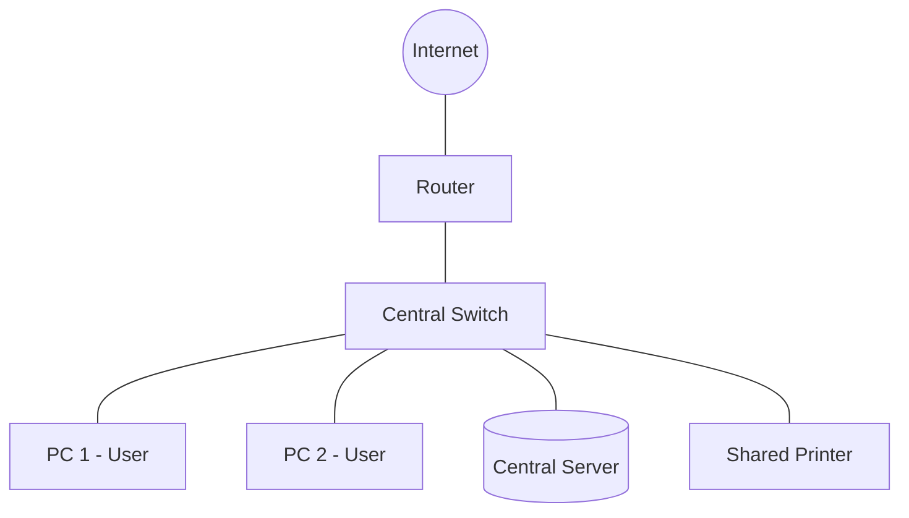

← [[Computer Networking - Study Notes|Go Back to Networking Hub]]

# 🌐 1. What is a Computer Network?

### 📝 Introduction (Intro)
Jab do ya do se zyada computers ya networking devices (jaise printers, servers) aapas me connect hote hain taaki wo data, resources, aur files share kar sakein, toh us system ko hum **Computer Network** kehte hain. 

Ye connections physically copper cables ya fiber optics ke jariye (wired) ho sakte hain, ya fir radio waves (Wi-Fi, Bluetooth) ke jariye (wireless) ho sakte hain.

### ➕ Advantages (Fayde)
* **Resource Sharing:** Sabse bada fayda ye hai ki hardware (jaise expensive printers) aur software resources ko multiple users share kar sakte hain.
* **Easy Communication:** Network ke jariye email, chat, aur video conferencing aasaan aur fast ho jati hai.
* **Cost Saving:** Ek hi internet connection ya printer poore office me distribute kiya ja sakta hai, jisse paisa bachta hai.
* **Centralized Data Management:** Data ko ek central server par save kiya ja sakta hai, jisse data backup lena aur manage karna bahut simple ho jata hai.
* **Reliability:** Agar ek system me problem aaye, toh doosre system se backup lekar kaam chalaya ja sakta hai.

### ➖ Disadvantages (Nuksan)
* **Security Risks:** Network par data leak hone, viruses failne, aur hacking ka khatra badh jata hai.
* **High Setup Cost:** Network switches, routers, cabling, aur servers setup karne me shuruati kharch zyada aata hai.
* **Single Point of Failure:** Agar network ka main device (jaise Switch ya Router) ya central server crash ho jaye, toh poora network band ho sakta hai.
* **Complexity:** Bade networks ko set karne aur maintain karne ke liye specialized IT staff (Network Administrators) ki zaroorat hoti hai.

### 📊 Diagram
Ye ek simple local network (LAN) ka diagram hai jahan devices ek central Switch ke jariye router aur internet se connected hain:

### 💡 Real-world Example (Udaharan)
* **Ghar ka Wi-Fi:** Aapke ghar ka router ek mini computer network hai. Isse aapka mobile, laptop, smart TV, aur smart speaker sabhi aapas me connected hain aur ek hi internet connection share kar rahe hain.
* **Office Setup:** Ek room me baithe 20 designers ek hi physical storage server se files download karte hain aur ek hi heavy-duty printer par print commands bhejte hain.

### 🚀 Application (Kahan use hota hai?)
* **The Internet:** Duniya ka sabse bada public computer network jisse billions of devices aapas me connect hain.
* **Local Area Networks (LAN):** Schools, colleges, offices aur home networks me files aur printers share karne ke liye.
* **Mobile Networks (cellular network):** Calls, messages, aur mobile internet access ke liye.
* **E-Commerce & Banking:** Net banking, online shopping gateways aur ATMs ke dynamic transactions aapas me link karne ke liye.

---