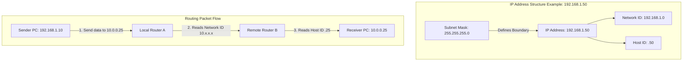

← [[Computer Networking - Study Notes|Go Back to Networking Hub]]

# 🆔 5. IP Address & How It Works

### 📝 Introduction (Intro)
**IP Address (Internet Protocol Address)** ek unique logical label/numerical identifier hota hai jo network par connected har device (computer, phone, router, printer) ko assign kiya jata hai. Iska main kaam do cheezein hoti hain: network interface ki identification aur uski physical/logical location address.

IP Addresses ke do primary versions hote hain:
* **IPv4 (32-bit):** Decimal formats me likha jata hai (e.g. `192.168.1.50`). Isme total 4.3 billion unique combinations milte hain.
* **IPv6 (128-bit):** Hexadecimal format me colons ke sath likha jata hai (e.g. `2001:0db8:85a3:0000:0000:8a2e:0370:7334`). Iski capacity behad infinite hai.

#### ⚙️ How it Works (Kaise Kaam Karta Hai?):
Ek IP Address do main components me split hota hai:
1. **Network ID:** IP address ka wo part jo identify karta hai ki device kis network/subnet se belong karta hai (jaise Area Code).
2. **Host ID:** Network ke andar ki specific device ko identify karta hai (jaise House Number).

* **Subnet Mask:** Router ko ye batata hai ki IP Address ka kitna part Network ID hai aur kitna part Host ID. Jaise subnet `/24` (ya `255.255.255.0`) ka matlab hai ki shuru ke teen groups Network ID hain aur aakhri group Host ID hai.
* **Routing:** Jab koi packet bheja jata hai, toh router packet ke destination IP address ke Network ID ko check karta hai, use target network ke gateway tak route karta hai, aur local router Host ID ke basis par device tak data deliver karta hai.

### ➕ Advantages (Fayde)
* **Global Interconnectivity:** Bina IP address ke koi bhi computer internet se connect ya data receive nahi kar sakta.
* **Efficient Packet Routing:** Routers dynamic IP networks ke through traffic flow aur optimization aasaani se kar lete hain.
* **Flexible Logic Boundaries (Subnetting):** Ek bade network block ko separate virtual segments me divide kiya ja sakta hai jo safety aur control ke liye helpful hai.
* **Diagnosable / Traceable:** Troubleshooting ke dauran packets path track (tracert/traceroute) karna aur connectivity check karna easy ho jata hai.

### ➖ Disadvantages (Nuksan)
* **IPv4 Address Exhaustion:** Duniya bhar me badhti devices ke wajah se IPv4 ranges bilkul khatam hone ki kagar par hain (is wajah se NAT aur IPv6 adapt karna zaroori hai).
* **Cyber Security Vulnerabilities:** Agar attacker ko aapka IP address pata chal jaye, toh wo DDoS (Distributed Denial of Service) attack kar sakta hai ya locations track kar sakta hai.
* **IP Spoofing:** Attackers networking packets me fake source IP inject karke filters ko bypass ya cheat kar sakte hain.
* **Complex IPv6 Management:** IPv6 hexadecimal ranges kafi lambi aur complicated hoti hain jise manually handle/type karna hard hai.

### 📊 Diagram
Ye IP Address ke structure (Network vs Host ID) aur dynamic router packet delivery flow ko dikhata hai:

### 💡 Real-world Example (Udaharan)
* **Mailing Address Analogy:** 
  - **Network ID = Area PIN Code:** Jaise Pin code batata hai ki letter kis shahar/area me jana hai (e.g. 110001).
  - **Host ID = Flat Number:** Jo batata hai ki us area ke kaunse flat/room me deliver karna hai (e.g. Flat B-402).
  - **Router = Post Office:** Post office letters ko PIN code padh kar sahi shahar transport karta hai, aur local delivery boy flat number padh kar packet deliver kar deta hai.

### 🚀 Application (Kahan use hota hai?)
* **The Internet:** Global standard communication rules ke sath networking dynamic execution.
* **Domain Name System (DNS):** DNS human-readable website names (jaise google.com) ko unke actual logical IPs (e.g. `142.250.190.46`) me badalta hai taaki connection establish ho sake.
* **NAT (Network Address Translation):** Home connections me multiple private devices ko single public IP ke through router se internet connect karna.
* **Firewalls & Security Policies:** Dynamic rules set karna ki kaunsi specific IPs network me access karengi aur kaunsi block rahengi.

---