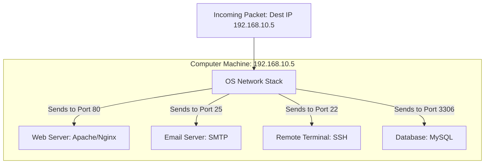

← [[Computer Networking - Study Notes|Go Back to Networking Hub]]

# 🔌 7. Ports (Physical vs Logical Ports)

### 📝 Introduction (Intro)
Computer networking me **Port** ek data endpoint ya interface hota hai jiske jariye information aapke computer ke andar aati hai ya bahar jati hai. Ports basically do tarah ke hote hain:

1. **Physical Ports (Hardware):** Ye computer ya switches par physical socket holes hote hain jahan hum network cables plug-in karte hain. Jaise RJ-45 Ethernet port, USB ports, aur SFP fiber module slots.
2. **Logical Ports (Software/Network):** Ye operating system ke level par logical address ranges hote hain jo alag-alag softwares, apps, aur web services ko map karte hain. Jab aapki machine internet se connected hoti hai, toh logical port numbers OS ko batate hain ki specific incoming network packet kis app (jaise Chrome, Spotify, ya Discord) ke paas bhejni hai.

#### 🔢 Logical Ports Classification (Total: 65,536 Ports):
Logical port numbers `0` se lekar `65535` tak hote hain, jinhe teen ranges me category wise divide kiya gaya hai:
* **Well-known Ports (0 to 1023):** Ye core internet protocols ke liye reserved hain. Jaise Web traffic ke liye Port 80 aur 443.
* **Registered Ports (1024 to 49151):** Ye specific applications ya vendors dwara register hote hain. Jaise SQL database server Port 3306 use karta hai.
* **Dynamic / Private Ports (49152 to 65535):** Ye ports operating system dynamically kisi short-term communication session (jaise web browsing download tasks) ke liye system client apps ko assign karta hai.

### ➕ Advantages (Fayde)
* **Simultaneous Connections (Multi-tasking):** Ek hi IP address par aap ek sath web browse kar sakte hain, online game khel sakte hain, aur music stream kar sakte hain, kyunki sabhi apps alag-alag logical ports use kar rahi hoti hain.
* **Granular Network Security:** Firewall ki help se specific high-risk ports (jaise FTP port 21 ya Telnet port 23) ko block karke network access secure kiya ja sakta hai.
* **Standard Protocols:** Well-known ports globally standard hote hain. Har server world me generic port rules ke sath kaam karta hai, jisse dynamic setup aasaan ho jata hai.

### ➖ Disadvantages (Nuksan)
* **Security Scanning Targets:** Hackers tools (jaise Nmap) ka use karke computer par open ports check karte hain (**Port Scanning**). Agar koi port unsafe application open chhod de, toh hacker system exploit kar sakta hai.
* **Port Conflict:** Ek machine par ek hi port number ko ek time par do applications bind nahi kar saktin. Agar do software same port par chalne ki koshish karenge, toh conflict aayega aur ek crash ho jayega.
* **Performance Impact:** Background services aur applications agar unnecessary ports par network updates listen karti rahein, toh computer CPU aur RAM waste hoti hai.

### 📊 Diagram
Ye logical ports ke network traffic distribution pattern ko darshata hai:

### 💡 Real-world Example (Udaharan)
* **Apartment Building Analogy:**
  - **IP Address = Building Street Address:** Jo poore apartment building ko dhoondhne ke liye ek unique road address deta hai (e.g. 5, Park Street).
  - **Logical Port = Flat Number:** Apartment ke andar 100 flats hain (Flat 101, Flat 102). Courier boy (Data packet) building address se aayega par kis flat me letter deliver hona hai wo flat number (Port number) se pata chalega.
  - **Application = Flat Owner:** Flat number 201 par delivery hone par wahan rehne wala specific person (specific application) hi use accept karega.

### 🚀 Application (Kahan use hota hai?)
Niche common system protocols aur unke defined standard logical port numbers ki list hai:

| Port Number | Protocol Name | Service Details / Use Case |
| :--- | :--- | :--- |
| **20 & 21** | **FTP** | File Transfer Protocol (Bulk file uploads) |
| **22** | **SSH** | Secure Shell (Remote server terminal login) |
| **25** | **SMTP** | Simple Mail Transfer Protocol (Outgoing Emails) |
| **53** | **DNS** | Domain Name System (Name to IP resolution) |
| **80** | **HTTP** | Hypertext Transfer Protocol (Normal Web traffic) |
| **110** | **POP3** | Post Office Protocol 3 (Incoming Emails) |
| **143** | **IMAP** | Internet Message Access Protocol (Email Sync) |
| **443** | **HTTPS** | HTTP Secure (Encrypted safe web browsing) |
| **3306** | **MySQL** | Database queries network connections |

---