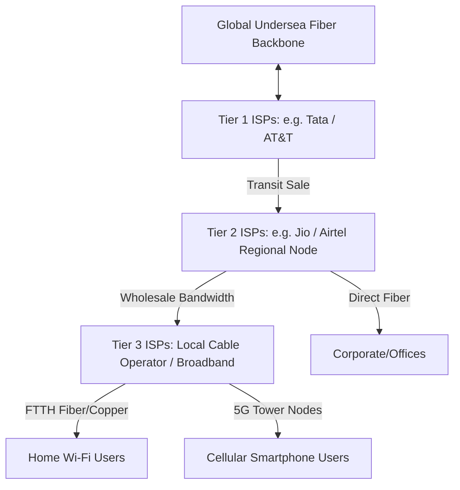

← [[Computer Networking - Study Notes|Go Back to Networking Hub]]

# 🌐 8. ISP (Internet Service Provider)

### 📝 Introduction (Intro)
**ISP (Internet Service Provider)** ek aisi company ya organization hoti hai jo consumers aur businesses ko internet access, domain routing, mail hosting, aur website storage services provide karti hai. Hum jo phone me mobile network ya ghar par Wi-Fi use karte hain, wo ISP ke dynamic networks ke jariye hi chalta hai.

#### 📶 The Hierarchy of ISPs (Tiers of ISP):
Internet koi single company nahi chalaati, balki ye teen tiers (levels) ke networks ka ek interconnection hai:
* **Tier 1 ISP (The Backbone):** Ye internet ke asli malik kehlate hain. Inke paas khud ke global undersea fiber-optic cable networks hote hain jo continents ko aapas me connect karte hain (e.g. Tata Communications, AT&T, Deutsche Telekom). Ye bin kisi charge ke aapas me data share karte hain (Peering Agreements).
* **Tier 2 ISP (Regional Providers):** Ye Tier 1 se internet bandwidth buy karte hain aur bade deshon/states me networks lagate hain. (e.g. Jio ya Airtel in India).
* **Tier 3 ISP (Local Providers):** Ye Tier 2 se wholesale bandwidth kharidte hain aur copper ya local fiber line ke through end-users (hamare ghar aur offices) tak internet service deliver karte hain (e.g. local cable broadband providers).

### ➕ Advantages (Fayde)
* **Global Access:** ISP internet ka gateway hai. Inke bina hum dynamic web servers se connect nahi ho sakte.
* **Flexible Technologies:** Hamari requirements ke according ISPs fiber-optics (ultra-fast), satellite (remote area), 4G/5G mobile, ya cable connection types hume provide karte hain.
* **Symmetric Bandwidth (Leased Line):** Corporates ke liye ISPs custom packages dete hain jahan high performance SLAs, constant speeds, aur redundancy back-up milta hai.

### ➖ Disadvantages (Nuksan)
* **Net Neutrality Issues:** ISPs chahein toh traffic throttling (speed intentionally slow karna) kar sakte hain ya targeted site limits laga sakte hain agar net-neutrality rules strict na hon.
* **Monopoly & Pricing Control:** Remote areas me aksar single ISP hota hai jo poor service aur very high charge karta hai (Competition na hone ke karan).
* **Privacy Controls & Logging:** ISPs aapki browsed website requests (DNS query history logs) track karte hain aur government requests par contents ya sites block (censorship) karte hain.
* **Cable Outage Risks:** Undersea fiber cuts ya physical local fiber cut (digging tasks) hone par poore network zones offline ho sakte hain.

### 📊 Diagram
Ye Tiers of ISP aur consumer distribution channels ko visual karta hai:

### 💡 Real-world Example (Udaharan)
* **Water Supply System Analogy:**
  - **Tier 1 (The Ocean/Main Glaciers):** Jo nature me global main supply hai aur jahan se pani filter hota hai.
  - **Tier 2 (City Water Board Pipelines):** Badi pipelines jo pani ko alag-alag areas aur treatment units tak transport karti hain.
  - **Tier 3 (Local Tankers/Society Water Pipes):** Jo hamari building aur kitchen tap tak pipelines bhejta hai. ISP wo local water connection authority hai jise hum monthly pani (data) use karne ka bill dete hain.

### 🚀 Application (Kahan use hota hai?)
* **Consumer Broadband & Cellular Data:** Ghar par entertainment streams aur cellular phone networks connectivity chalaney ke liye.
* **Enterprise Leased Line (ILL):** IT sector aur e-commerce industries ko 24/7 dedicated internet backbone connectivity dene ke liye.
* **Satellite Internet (Starlink):** Mountains, forests, aur ships me high-speed link establish karne ke liye.
* **Domain Name Registration & Hosting:** Naye blogs ya sites ko physical web register data paths aur corporate email ids setup karke dena.

---