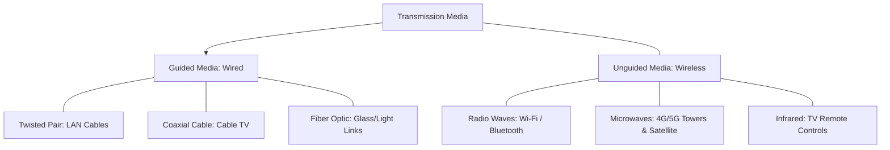

← [[Computer Networking - Study Notes|Go Back to Networking Hub]]

# 🔌 9. Guided vs Unguided Media (Wired vs Wireless)

### 📝 Introduction (Intro)
Computer networking me data ko ek place se dusre place tak move karne ke liye physical channels ya mediums ki zaroorat hoti hai. In paths ko hum **Transmission Media** kehte hain, jo do main types me split hote hain:

1. **Guided Media (Wired / Bounded):** Isme data signals ko ek physical boundary ya metallic/glass path ke jariye "guide" kiya jata hai. Signals cables ke physical pipeline se bahar nahi ja sakte.
   * **Twisted Pair Cable (Ethernet):** Copper wires twisted pairs me hotey hain. (e.g. LAN connections).
   * **Coaxial Cable:** Central copper conductor surrounded by insulation and metal shield. (e.g. Cable TV).
   * **Fiber Optic Cable:** Glass or plastic strands jo light reflection (TIR) ke principle par data transfer karti hain (e.g. Internet backbones).
2. **Unguided Media (Wireless / Unbounded):** Isme data transmit karne ke liye kisi physical wiring pipeline ki zaroorat nahi hoti. Data electromagnetic wave frequencies ke jariye hawa, paani, ya vacuum ke through broadcast hota hai.
   * **Radio Waves:** Omni-directional waves jo long distances cover karti hain (e.g. Wi-Fi, FM Radio).
   * **Microwaves:** Uni-directional waves jo high frequency line-of-sight networks me use hoti hain (e.g. Mobile towers, Satellites).
   * **Infrared Waves:** Short range dynamic controls (e.g. TV Remote).

### ➕ Advantages (Fayde)
#### Guided Media (Wired):
* **High Bandwidth & Speeds:** Fiber optic cable gigabits to terabits per second tak ki massive speeds easily deliver kar sakta hai.
* **Highly Secure:** Hacking/Sniffing karna difficult hai kyunki physical copper/glass wire me direct physical access kiya bina details nikalna mushkil hai.
* **Low Noise Interference:** Metal shielding aur twist configurations signals ko outer electrical noise se protect rakhte hain.

#### Unguided Media (Wireless):
* **Complete Mobility:** Users chalte-phirte networks se connected reh sakte hain (no wire boundaries).
* **Rapid Deployment:** Rural areas, mountains, ya dense cities me wires bichhane ka heavy mechanical process nahi karna padta. Router/Tower lagate hi area connect ho jata hai.
* **Maintenance Ease:** Physical cables tutne/cut hone ka koi risk nahi hota jisse bar-bar wiring repair ki zarurat nahi padti.

### ➖ Disadvantages (Nuksan)
#### Guided Media (Wired):
* **No Mobility:** Devices strictly physical cable wires ke through bandhi rehti hain.
* **High Infrastructure Cost:** Long distance fiber routes aur switches laying me kafi heavy investments lagte hain.
* **Physical Vulnerability:** Underground construction digs, earthquakes, ya heavy animals (jaise undersea sharks) cables ko damage kar sakte hain.

#### Unguided Media (Wireless):
* **High Security Risks:** Signals hawa me charo taraf broadcast hote hain, isiliye packets capture (sniffing) karna aasaan hai. Proper encryption (AES/WPA3) compulsory hai.
* **Attenuation & Obstacles:** Outer factors (walls, rain, dust, weather events) waves ko deflect/absorb karke signals aur network speeds weak kar dete hain.
* **Lower Bandwidth Limits:** Copper/Glass internal paths ke comparison me air transmission me spectrum bandwidth capabilities limited hoti hain.

### 📊 Diagram
Ye Transmission Media ke hierarchical division ko visual map karta hai:

### 💡 Real-world Example (Udaharan)
* **Train Tracks vs. Aeroplane Route:**
  - **Guided Media = Train Tracks (Railway):** Train ko chalne ke liye track ki visual boundary chahiye. Wo tracks se bahar kahin nahi ja sakti.
  - **Unguided Media = Aeroplane (Airways):** Plane bina kisi road/track ke hawa ke raste directly mountains aur oceans ke upar se fly kar sakta hai.
* **Wired Ethernet vs. Wi-Fi:** Jab aap PC me green/yellow LAN wire insert karte hain wo **Guided** hai, aur jag aap phone me Wi-Fi on karke bina wire connect karte hain wo **Unguided** hai.

### 🚀 Application (Kahan use hota hai?)
* **Local Area Networks (LAN):** Offices aur schools me secure servers connect karne ke liye Ethernet (Guided).
* **Undersea Global Backbones:** Countries ke beech terabytes data pass karne ke liye Fiber Optic (Guided).
* **Public Hotspots & PAN:** Cafes aur homes me portable devices connect karne ke liye Wi-Fi (Unguided).
* **Mobile Networks:** SIM connections ke jariye data aur calls distribute karne ke liye Cellular Towers (Unguided).
* **Satellite systems (Starlink/GPS):** Inter-continental long-range navigation broadcasts (Unguided).

---