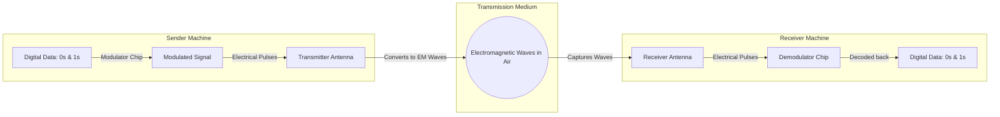

← [[Computer Networking - Study Notes|Go Back to Networking Hub]]

# 📡 11. Wireless Connection & Wireless Data Transfer

### 📝 Introduction (Intro)
**Wireless Connection** ka matlab hai bina kisi physical cable ya wire ke do ya do se zyada devices ko aapas me connect karna. Isme data signals air (hawa) ya space ke jariye electromagnetic waves ke roop me travel karte hain.

#### ⚙️ How Data Transfers Through Wireless (Kaise Kaam Karta Hai?):
Wireless data transfer main 5 steps me complete hota hai:
1. **Digital Data Creation (Bits):** Aapke phone ya PC me data hamesha `0` aur `1` (Digital format) ki form me hota hai.
2. **Modulation (Signal Mixing):** In digital bits ko direct hawa me nahi bheja ja sakta. Isliye sender wireless card digital bits ko high-frequency carrier wave ke sath superimpose (mix) karta hai. Is process ko **Modulation** (AM, FM, Phase, ya QAM) kehte hain, jisse digital data electromagnetic signal me convert ho jata hai.
3. **Transmission (Antenna):** Modulated electrical signals antenna ke paas jate hain. Antenna in electrical signals ko high-frequency **Electromagnetic Radio Waves** me convert karke environment me broadcast (release) kar deta hai.
4. **Propagation (Medium):** Waves space/air me light speed (\(3 \times 10^8 \text{ m/s}\)) se destination ki taraf travel karti hain.
5. **Reception & Demodulation:** Target receiver device ka antenna in waves ko receive karke vapas electrical pulses me badalta hai. Fir receiver wireless chip un waves ko decode (**Demodulate**) karke carrier frequency se data alag karti hai aur use wapas raw `0` aur `1` bits me convert karke system memory ko de deti hai.

### ➕ Advantages (Fayde)
* **Tension-Free Mobility:** Aap room me chalte-phirte, travel karte hue bina wires ke bandhan ke internet aasaani se use kar sakte hain.
* **Multiple Device Connections:** Ek single wireless access point (Wi-Fi router) ek sath dozens of devices (phones, laptops, smart TVs, speakers) ko smoothly connect kar leta hai.
* **Easy & Damage-Free Setup:** Deewaron me holes karna ya physical cables run karne ka mechanical jhanjhat nahi hota, jisse infrastructure clean rehta hai.
* **Geographical Flexibility:** Wires bichhana jahan impossible ho (jaise pahad, jangal, ya remote areas), wahan wireless satellite links se connectivity di ja sakti hai.

### ➖ Disadvantages (Nuksan)
* **Signal Attenuation & Range Limits:** Solid objects (concrete walls, glass doors, steel structures) wireless waves ko restrict kar dete hain, jisse signal drops aur range coverage issues aate hain.
* **Frequency Interference:** Hawa me bohot saari signals hoti hain (Wi-Fi, Bluetooth, microwave ovens, baby monitors). Inke frequency overlap ke karan network speeds drop ho jati hain (Crosstalk).
* **Security & Eavesdropping:** Wireless signals open air me travel karte hain. Agar network properly encrypted (jaise WPA3 security protocol) na ho, toh koi bhi range me baitha person packets capture aur read kar sakta hai.
* **Fluctuating Speeds & Higher Latency:** Wired fibers ke mukable wireless systems me ping rates (latency) fluctuation aur temporary packet losses high hote hain.

### 📊 Diagram
Ye wireless data transmit aur capture pipeline ko darshata hai:

### 💡 Real-world Example (Udaharan)
* **Megaphone Analogy:**
  - **Data:** Aapke dimaag ke thoughts.
  - **Modulation:** Thoughts ko sound waves me vocal cord ke jariye mix karke loud bolna (Carrier frequency = tone of voice).
  - **Antenna:** Megaphone horn jo sound ko air me door tak push karta hai.
  - **Medium:** Hawa jisme sound wave travel karti hai.
  - **Receiver Antenna (Ears):** Dost ka kaan jo sound vibrations receive karta hai.
  - **Demodulation:** Dost ka brain jo us high volume voice ko wapas thoughts/meaning me decode kar leta hai.
* **Wireless Mouse:** Jab aap table par wireless mouse move karte hain, mouse ki internally chip radio signals bhejti hai jise USB dongle receiver capture karke screen cursor movement sync karta hai.

### 🚀 Application (Kahan use hota hai?)
* **Wi-Fi (IEEE 802.11):** Gharo aur offices me localized high-speed wireless local area network setups.
* **Mobile Cellular Network (4G/5G):** Mobile handsets me wireless calls, SMS aur high performance data connectivity.
* **Bluetooth PAN:** Audio headsets, smartwatches, keyboards aur local devices wireless connection interface.
* **Satellite Broadband (Starlink):** Remote geolocations me high bandwidth satellite microwave data transfers.
* **NFC & RFID:** Metro entry token taps aur cards contactless transactions.

---