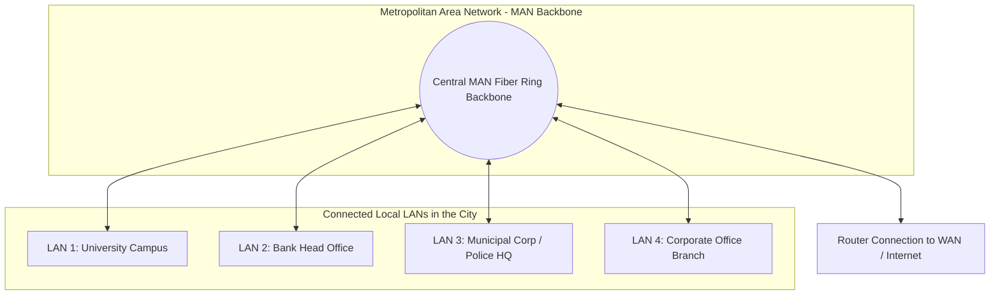

← [[Computer Networking - Study Notes|Go Back to Networking Hub]]

# 🏙️ 13. MAN (Metropolitan Area Network)

### 📝 Introduction (Intro)
**MAN (Metropolitan Area Network)** ek aisa computer network hai jo ek poore shahar (city), town, ya bade metropolitan geographic region ko cover karta hai. Iska size aur range **LAN** se bada hota hai par **WAN** se chota hota hai (typically iski range **5 Kilometers se 50 Kilometers** tak hoti hai).

Metropolitan network basically ek city me faili alag-alag organizations, colleges, aur government departments ke multiple local networks (LANs) ko aapas me interconnect karke ek unified large communication network banata hai. Isme raw data transport karne ke liye heavy copper trunks ya high-capacity fiber-optic cable loops use hote hain.

### ➕ Advantages (Fayde)
* **Wide Geographical Area (City-wide):** Ek poore metropolitan area me high performance connectivity deta hai, jisse ek shahar ke banks ya university offices instantly links share kar paate hain.
* **Faster Speeds than WAN:** Regional limit hone ke karan MAN ki data speed WAN (Wide Area Network) ke comparison me high hoti hai (typically runs on dedicated Gigabit fiber rings).
* **Centralized LAN Integration:** Ek city ke different locations par host ho rahi LAN databases aur security networks centralized access controls ke jariye real-time sync kar paate hain.
* **Cost Savings on Shared Internet Backbone:** Alag-alag branches ke liye multiple individual WAN lease routes lene ke bajaye single MAN connection share karna economical padta hai.

### ➖ Disadvantages (Nuksan)
* **High Deployment & Installation Costs:** Ek city me fiber cables ka underground network design karna, high level permissions le kar dig (gadhdha) karna, aur fiber lay karna highly expensive aur time-consuming process hai.
* **Maintenance & Support Complexity:** Shahar me roads digging aur heavy machinery operations se cables drop/cut hone ka darr constant rehta hai, jise repair karna complex hota hai.
* **Security & Vulnerabilities Risks:** Cabling network door-door tak public areas se hokar guzarta hai, jisse tapping, cable thefts, aur unauthorized wire intercepts ke security breaches ka scope badh jata hai.
* **Latency compared to LAN:** Local networks (LAN) ke comparison me range high hone aur data links transit switch limits badh jaane ke karan propagation delay (latency) thodi high rehti hai.

### 📊 Diagram
Ye ek city level Metropolitan Area Network (MAN) infrastructure setup ko represent karta hai:

### 💡 Real-world Example (Udaharan)
* **City Metro Railway Analogy:**
  - **LAN = Escalator / Lift:** Jo ek specific building/metro station ke andar hi kaam karti hai.
  - **MAN = Metro Trains Network:** Jo alag-alag stations/areas (LANs) ko poore shahar me aapas me interconnect karti hai, jisse log poore shahar me fast travel kar sakte hain.
* **Cable TV Network:** Shahar me chalne wala cable operator network jo ek main center base station se pure shahar ke har home cable points tak feeds deliver karta hai.

### 🚀 Application (Kahan use hota hai?)
* **Smart Cities Infrastructures:** City control centers se connected public Wi-Fi hotspots, traffic monitoring cameras, aur smart digital boards coordinate karna.
* **University Campuses Connect:** Ek shahar me divide different departments, research blocks aur hostels ko central main library server se merge karna.
* **Banking Operations:** Banks ki regional branches aur ATMs ko head server repository databases se high performance private links (MPLS rings) dwara update karna.
* **Military / Govt Networks:** Municipal corporations aur disaster units ke networks ko real-time telemetry send karne ke liye setup.

---