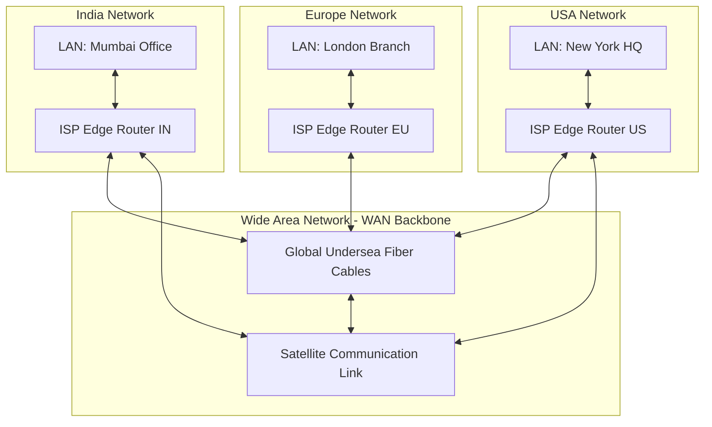

← [[Computer Networking - Study Notes|Go Back to Networking Hub]]

# 🌍 16. WAN (Wide Area Network)

### 📝 Introduction (Intro)
**WAN (Wide Area Network)** ek aisa computer network hai jo ek bohot bade geographical area ko cover karta hai—jaise ek state, poori country, ek continent, ya fir poori Earth (globally). 

**The Internet** duniya ka sabse bada aur sabse well-known public WAN hai. WAN basically dunyabhar me split thousands of LANs (Local Area Networks) aur MANs (Metropolitan Area Networks) ko aapas me link karta hai. Isme data transfer karne ke liye copper leased lines, fiber-optic undersea cables, microwave links, aur satellites ka complex mixture use kiya jata hai.

### ➕ Advantages (Fayde)
* **Global Area Coverage:** Businesses aur multinational organizations duniya me kahin se bhi apne database servers aur offshore offices se connect reh sakti hain.
* **Centralized Data Storage:** Multinationals ko alag-alag countries me duplicate physical servers ki zarurat nahi padti; wo ek hi central HQ server par data host kar sakti hain, jisse management easy ho jata hai.
* **Instant Global Communication:** Emails, international video conferencing, and instant messages exchange dynamically smooth aur easy ho jate hain.
* **High Data Carrying Capacity:** Undersea fiber channels aur high frequency satellites terabytes of data packets per second cross-continents bhej sakte hain.

### ➖ Disadvantages (Nuksan)
* **High Latency & Ping:** Data ko thousands of kilometers dur physical routing nodes aur oceans ke bottom se guzarne me time lagta hai, isiliye iska network delay (latency) LAN ke mukable kafi high hota hai.
* **Behad Expensive Setup:** Undersea cables dalna, satellite launch contracts, aur dynamic routing core infrastructure setup bohot expensive aur complex hota hai (isiliye ise sirf ISPs ya Governments hi chala sakti hain).
* **Lower Physical Security:** Data public cables aur multiple intermediate countries se route hota hai, jisse sniffing aur wiretap threats badh jate hain. Proper advanced encryption (SSL/IPsec VPN) compulsory hota hai.
* **Management Complexity:** Network troubleshoot karna, alag-alag countries ke rules regulations map karna, aur massive traffic congestions control karna bohot complex hota hai.

### 📊 Diagram
Ye globally spread alag-alag deshon ke LAN networks ko WAN backbone (undersea fiber & satellites) ke through connected dikhata hai:

### 💡 Real-world Example (Udaharan)
* **Global Air Travel Analogy:**
  - **LAN = Escalators/Corridors:** Jo aapko airport terminal building ke sandar hi ghumaate hain.
  - **MAN = City Cab/Metro System:** Jo aapko ek city limits me ek building se dusre building tak travel karwata hai.
  - **WAN = International Flights:** Jo continents ko aur oceans ko cross karke aapko New Delhi se direct New York pahunchata hai.
* **Google Search Journey:** Jab aap India me apne browser par Google.com open karte hain aur search query bhejte hain, toh aapka data packets Mumbai gateway se nikal kar undersea cable route ke through directly US me Google ke data center server tak jata hai aur reply lekar wapas aata hai.

### 🚀 Application (Kahan use hota hai?)
* **The Public Internet:** Globally website browsing, video streaming aur online system access karna.
* **Multinational Corporation (MNC) Intranets:** Amazon ya Microsoft ke global office loops jo dynamic cloud databases (e.g. AWS/Azure) se connected rehte hain.
* **Global Financial Systems (SWIFT):** Deshon ke beech international money transfers aur banking transactions sync karna.
* **Cloud Storage Services:** Remote location data storage systems (OneDrive, Google Drive, iCloud) access karna.

---