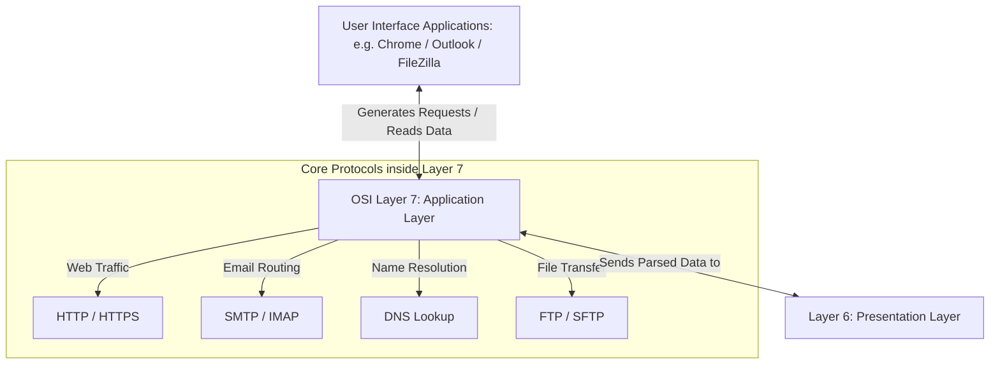

← [[Computer Networking - Study Notes|Go Back to Networking Hub]]

# 💻 20. Layer 7 - Application Layer

### 📝 Introduction (Intro)
**Application Layer (Layer 7)** OSI Model ki sabse top-most (sabsay upar wali) layer hoti hai jo directly end-user aur software application ke contact me hoti hai.

* **Function:** Ye layer software programs (jaise Web Browser, E-mail clients) ko network services ke sath interact karne ke liye ek **Interface (Bridge)** deti hai. Ye layer data packets ko network friendly format me badalne ke liye client requests generate karti hai.
* **Clarification:** Google Chrome, WhatsApp ya Zoom apps khud Layer 7 nahi hain, balki in apps ke andar jo communication protocols chalte hain (jaise browser me HTTP/HTTPS, mail programs me SMTP), wo Application Layer ke standard protocols hain.

#### 🔑 Key Protocols of Layer 7:
* **HTTP/HTTPS (Hypertext Transfer Protocol Secure):** Web pages load aur browse karne ke liye.
* **DNS (Domain Name System):** Domain names (google.com) ko unke actual IP addresses me translate karne ke liye.
* **SMTP / IMAP / POP3:** E-mails send, synchronize, aur download karne ke liye.
* **FTP / SFTP (File Transfer Protocol):** Client-server ke beech files upload/download karne ke liye.
* **DHCP (Dynamic Host Configuration Protocol):** Devices ko automatically IP configurations details distribute karne ke liye.

### ➕ Advantages (Fayde)
* **Seamless User Interaction:** Complex binary binary numbers ya hex codes ke bajaye user interface ko soft, simple, aur readable graphic interfaces me render karta hai.
* **Diverse Service Support:** Single top layer ke andargat multi-services (web routing, bulk files uploading, real-time emails syncing) concurrent execute ho sakti hain.
* **Resource Access Control:** Application level protocols remote server shared resources ko locate aur pull karne ki access capability dete hain.

### ➖ Disadvantages (Nuksan)
* **Primary Cyber Target:** Hackers and malware threats sabse zyada target Layer 7 ko karte hain (e.g. Cross-Site Scripting - XSS, SQL Injection, Web application level DDoS) kyunki ye data close to users hoti hai.
* **Performance Overhead:** Heavy formatting scripts aur authentication details add karne ke karan local computer CPU processing speed aur bandwidth constraints badh jate hain.
* **Complete Dependency:** Is layer ke paas khud ki transmission reliability capability nahi hoti. Data packet secure and error-free destination tak pahunchega ya nahi, iske liye ye lower Transport Layer (TCP) par complete depend rehta hai.

### 📊 Diagram
Ye user interface applications aur background Application Layer protocols ke interaction mapping ko darshata hai:

### 💡 Real-world Example (Udaharan)
* **Restaurant Metaphor:**
  - **User (Aap):** Jo restaurant ki table par baithe hain (End User).
  - **Application Layer (The Menu Card):** Menu card khud khana cook nahi karta (underlying network transmission) aur na hi use table tak lata hai, par ye aapko ek interface deta hai dekhne aur order select karne ka. Menu card ke bina aap kitchen ke chef se directly coordinate nahi kar sakte.
* **Web Browsing:** Jab aap search bar me `https://google.com` type karke enter dabate hain, Chrome browser **HTTPS protocol (Layer 7)** engine run karke web request draft karta hai.

### 🚀 Application (Kahan use hota hai?)
* **Web Browser Services:** HTTP/HTTPS parsing protocols loading web pages.
* **Email Client Interfaces:** Mail routing and directory sync systems (SMTP/IMAP).
* **FTP File Syncing:** File transfer applications (jaise FileZilla or WinSCP) transferring large setup files to servers.
* **Network Name Directory services:** Local network dynamic domain mapping servers.

---