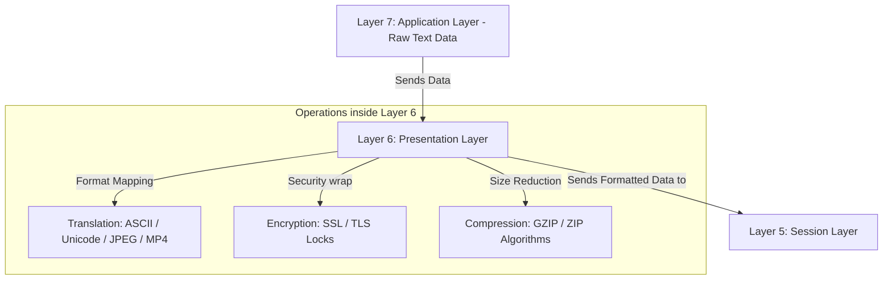

← [[Computer Networking - Study Notes|Go Back to Networking Hub]]

# 🎨 21. Layer 6 - Presentation Layer

### 📝 Introduction (Intro)
**Presentation Layer (Layer 6)** OSI Model ki doosri sabse top layer hoti hai. Ise hum **"Syntax Layer"** ya **"Translator Layer"** ke naam se bhi jaante hain.

Is layer ka main purpose ye ensure karna hota hai ki data jo bhejha ja raha hai, wo receiver device dwara sahi format me parse aur "present" (samjha) ja sake, bhale hi dono devices ke operating systems aur coding standards alag hon.

#### 🔑 Core Functions of Layer 6:
1. **Translation (Anuvad):** Alag-alag platforms (jaise EBCDIC character codes on Mainframes and ASCII/Unicode on PCs) ke character formats ko compatible standard encoding format me translate karna.
2. **Encryption / Decryption (Suraksha):** Data ko network transit ke dauran secure rakhne ke liye plaintext se unreadable formats me scramble (Encrypt) karna, aur receiver side par decrypt karna (e.g. SSL/TLS).
3. **Compression / Decompression (File size reduce karna):** Network bandwidth ko save karne ke liye data packets ka physical storage size compress (squeeze) karna, aur target end par decompress karna.

### ➕ Advantages (Fayde)
* **Data Privacy & Security:** SSL/TLS jaise standards ke jariye information transfer se pehle encrypt ho jati hai, jisse data leaks ka khatra negligible ho jata hai.
* **Bandwidth Optimization:** Data compression and packaging ke karan files (audio/video/images) network transit me kam space leti hain, jisse load speed improve hoti hai.
* **Format Compatibility:** Mac, Linux, aur Windows platforms ke internal syntax standard differences ko resolve karke format crashes ko dhyan se prevent karta hai.

### ➖ Disadvantages (Nuksan)
* **Heavy CPU Processing Overhead:** Encryption algorithms, compression mathematics, aur conversions execute karne me local systems ke CPU aur RAM par kafi stress padta hai.
* **Latency & Network Delays:** Packets ko encode aur decrypt karne me lagne wale milliseconds extra processing time ke karan network ping (delay) badh jati hai.
* **Redundant Processing:** Pehle se fully compressed files (jaise MP4 videos or ZIP archive folders) ko ye layer bypass nahi kar pati aur useless double-check cycles me systems speed exhaust karti hai.

### 📊 Diagram
Ye diagram Layer 7 se aane wale data ke presentation formatting pipelines ko clear map karta hai:

### 💡 Real-world Example (Udaharan)
* **Royal Diplomat Metaphor:**
  - **Sender (King A - Chinese speaking):** Jisne raw thoughts and messages paper par draft kiye (Layer 7 App).
  - **Royal Translator (Layer 6):** 
    1. **Translation:** Chinese document ko English language (Common standard) me translate kiya.
    2. **Encryption:** Letter ko security seals aur code words me convert kiya taaki raste me leak na ho.
    3. **Compression:** Document ko fold karke ek glass capsule (Compressed size) me pack kiya taaki deliver karna easy ho.
  - Target King B ka translator standard format me capsule receive karke decoding (decompress, decrypt, translate) karega.
* **Secure Login:** Jab aap bank site par apna password `MyPass99` likhte hain, toh transport se pehle Layer 6 SSL engine use unreadable codes `xk89#$f3` me encrypt kar deta hai.

### 🚀 Application (Kahan use hota hai?)
* **Secure Web Connections (SSL/TLS):** Web servers par client credentials secure rakhna (HTTPS transactions).
* **Multimedia Formats:** Audio-visual assets configurations (JPEG, PNG for images; MP4, AVI for videos; MP3 for sound).
* **Data Encoding Schemes:** Character formatting matrices (ASCII, Unicode, UTF-8 standards).
* **Network compression engines:** Web server outputs compression rules (GZIP/Deflate).

---