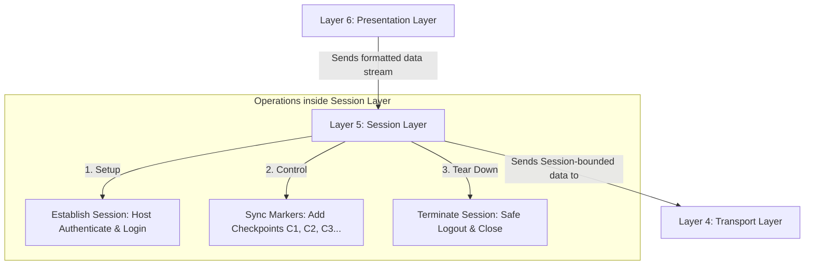

← [[Computer Networking - Study Notes|Go Back to Networking Hub]]

# 🗣️ 22. Layer 5 - Session Layer

### 📝 Introduction (Intro)
**Session Layer (Layer 5)** OSI Model ki 5th layer (neeche se) hoti hai. Is layer ka main target do communicating hosts ke applications ke beech chalne wali dialogues/connections ko coordinate karna hai.

* **Function:** Ye layer do devices ke beech **Sessions** (logical connections) ko **Establish (shuru)** karti hai, **Maintain (manage)** karti hai, aur kaam poora hone par **Terminate (safely close)** karti hai.

#### 🔑 Core Functions of Layer 5:
1. **Dialogue Control:** Ye manage karti hai ki data flow kis duplex type me hoga:
   * *Simplex:* Ek hi taraf se data transmission (e.g. keyboard sending to PC).
   * *Half-Duplex:* Dono side se data transmit hoga par ek bar me ek hi side (e.g. Walkie-Talkie).
   * *Full-Duplex:* Dono side se same time par concurrent communication (e.g. Mobile phone call).
2. **Synchronization (Checkpoints):** Data streams ke beech me markers/checkpoints insert karti hai. Agar file transfers ke beech me network crash ho jaye, toh download dynamic point se recover ho jata hai, zero state se nahi.
3. **Session Recovery & Token Management:** Multiple servers query mapping sync karna aur secure access tokens manage karna.

### ➕ Advantages (Fayde)
* **Efficient Recovery (Resume Capabilities):** Checkpoint feature ke chalte bare files data transmission crash hone par initial index se start nahi karna padta, jisse time aur high bandwidth bachte hain.
* **Collision Prevention (Session Control):** Do hosts aapas me simultaneous transmission karke traffic mix na kar dein, iske liye logical dialog locks dynamic use karti hai.
* **Auto Session Terminations:** Secure banking applications me agar user screen touch na kare toh automatic security locks (Session Timeouts) run karake misuse prevent karti hai.

### ➖ Disadvantages (Nuksan)
* **Complex State Monitoring:** Continuous sync signals, clocks matching, aur checkpoints tracking records run karne se background application logic heavy ho jata hai.
* **Keep-Alive Overhead:** Agar session me devices idle hain toh bhi active state verify karne ke liye continuous "Keep-Alive" background packets send hote hain, jo bandwidth consume karte hain.
* **Independent of Routing:** Ye layer purely logical boundaries check karti hai, actual packaging, packets path routing aur error detection lower levels par dependent hote hain.

### 📊 Diagram
Ye diagram Layer 6 se aane wale raw segments par sessions control structures (checkpoints aur authentication mapping) ko map karta hai:

### 💡 Real-world Example (Udaharan)
* **Secretary Metaphor:**
  - **Aap (Manager):** Jo deal close karna chahta hai (Layer 7/6).
  - **Secretary (Layer 5):** 
    1. **Call setup:** Target office ke secretary ko call karke authentication verification checks lagati hai (Establish session).
    2. **Call Monitor (Sync):** Call drop hone par wapas line connect karti hai aur bolti hai: "Sir, last transaction $500 billing discuss ho chuki thi, aap aage continue karein" (Checkpoints).
    3. **Disconnect:** Baat finish hone par switchboard line safely break/close kar deti hai (Terminate).
* **Session Timeouts:** Jab aap HDFC ya SBI banking net portal open karte hain aur dynamic page 5 mins tak empty chhod dete hain, toh page automatically close hokar **"Session Expired, please login again"** prompt kar deta hai.

### 🚀 Application (Kahan use hota hai?)
* **Session Tracking Tools:** Browser cookies engines identifying logged-in users profiles.
* **VPN Tunnel Protocols:** Point-to-Point Tunneling Protocols (PPTP) maintaining stable session loops.
* **Name Resolutions:** NetBIOS (Network Basic Input/Output System) name matching nodes.
* **Remote Commands Executions:** Remote Procedure Call (RPC) networks communicating database servers.

---