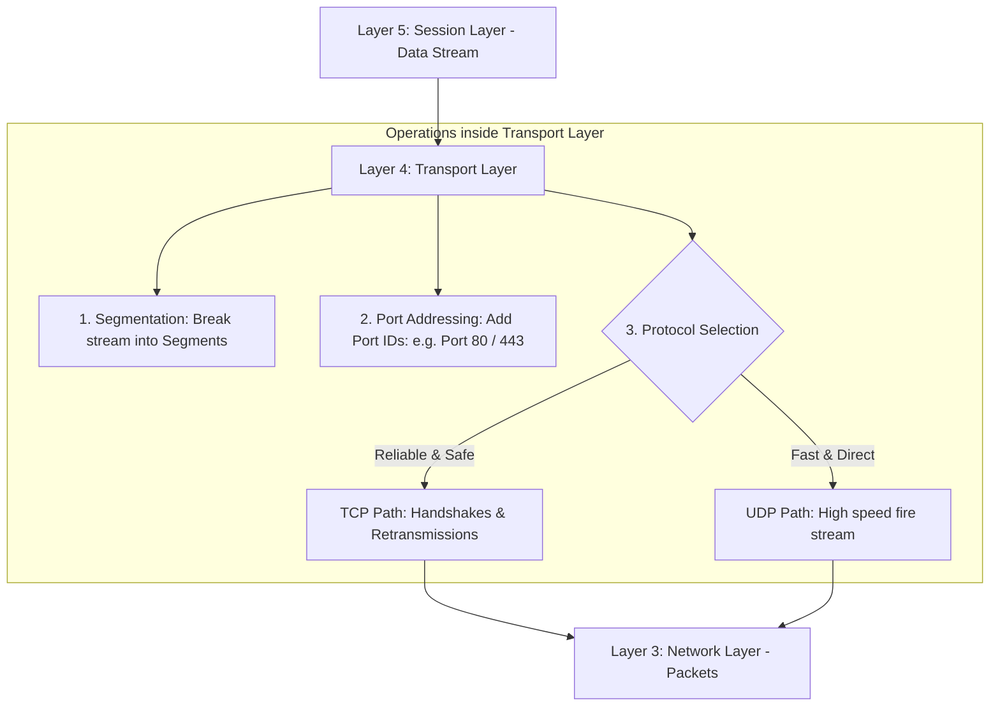

← [[Computer Networking - Study Notes|Go Back to Networking Hub]]

# 🚚 23. Layer 4 - Transport Layer (Heart of OSI)

### 📝 Introduction (Intro)
**Transport Layer (Layer 4)** ko OSI Model ka **"Heart"** (dil) kaha jata hai. Is layer ka main target data ko ek computer ke specific software program (process) se doosre computer ke specific software program tak end-to-end safely aur accurately deliver karna hota hai (called **Process-to-Process Delivery**).

* **Function:** Ye layer data stream ko chhotay units me break karti hai aur transmission flow, speed boundaries, aur error detection structures control karti hai.

#### 🔑 Core Functions of Layer 4:
1. **Segmentation & Reassembly:** Upper session layers se aane wale heavy size data streams ko small units me split karti hai jinhe **Segments** kehte hain. Har segment par ek **Sequence Number** (serial) add hota hai taaki receiver end par unhe line up (re-assemble) kiya ja sake.
2. **Port Addressing (Service Point Addressing):** Har segment header par **Source Port** aur **Destination Port** (e.g. HTTP = Port 80, HTTPS = Port 443) tags chipkata hai, taaki router se data direct right operating program application ko hi deliver ho.
3. **Flow Control:** Dynamic speed checks lagana. Agar receiver ka memory buffer slow hai, toh sender ko signals bhejkar packet dispatch speed decrease karwana (buffer overflow protection).
4. **Error Control (Checksums):** Data integrity check karna. Agar koi segment corrupted ya missing ho, toh target source se retransmission demand karna.

#### ⚖️ The Two Pillars (Protocols):
* **TCP (Transmission Control Protocol):** Connection-oriented. Ye pehle target node se handshakes set karta hai aur guaranteed error-free data delivery deta hai (Slower but 100% Reliable).
* **UDP (User Datagram Protocol):** Connectionless. Bina kisi dynamic handshakes or error tracking ke direct speed fire data packets bhejta hai (Super Fast but Unreliable).

### ➕ Advantages (Fayde)
* **Process-to-Process Precision:** Web browsers, online music, aur chat backups ka data aapas me mix nahi hota (multiplexing via ports).
* **High Reliability (TCP):** Data delivery aur order sequence ki guarantee hoti hai. Drop packets automatically background me restore ho jate hain.
* **Flow Adaptability:** Speed adjustments ke chalte network bottlenecks par network crashes dynamically avoid ho jate hain.

### ➖ Disadvantages (Nuksan)
* **Handshake Ping Latency (TCP):** Connection open karne se pehle chalne wale 3-Way Handshake ping checks latency badhate hain (Lag in real-time actions).
* **Heavy Segment Headers:** TCP headers (min 20 bytes) sequence tracker numbers, port mappings aur checksums filters ke sath extra bandwidth consume karte hain.
* **State Management CPU stress:** System OS kernels ko concurrent running ports TCP states registers dynamic maintain karne padte hain, jisse memory usage badhti hai.

### 📊 Diagram
Ye flow mapping Transport layer me data break-up (Segmentation), port assignment, aur TCP vs UDP pathways ko represent karta hai:

### 💡 Real-world Example (Udaharan)
* **Courier Packing Manager Metaphor:**
  - **Aap (Sender):** Aapko apne dost ko ek badi 500-pieces ki toy train lego set parcel karni hai.
  - **Transport Layer (Packing Manager):**
    1. **Segmentation:** Set ko ek bada box me pack karne ke bajaye, 5 chhote boxes me divide karti hai. Har box par marker se `1/5, 2/5, 3/5` sequence serial number likhti hai.
    2. **Port Address:** Label lagati hai: "Send to Flat 104 - Kids playroom" (Port ID).
    3. **Reliability Choice:**
       - **TCP Courier:** Delivery boy se bolti hai ki har box ki signature confirmation slip wapas lana. Agar raste me box 3 leak ho jaye, toh call karke backup box 3 dispatch karna.
       - **UDP Courier:** Ek open truck loader se saare boxes direct speed dispatch karwa deti hai bina receipt logs check ke.
* **Browsing vs Video Call:** Jab aap Gmail check karte hain, toh backup packets missing nahi hone chahiye, isiliye **TCP** use hota hai. Lekin Zoom video call me agar ek packet drop bhi ho jaye toh minor screen freeze chalega par high-speed constant feed zaroori hai, isiliye **UDP** engine chalte hain.

### 🚀 Application (Kahan use hota hai?)
* **Reliable Transfers (TCP):** Web browsers accessing sites (HTTP/HTTPS), email networks (SMTP), remote server accesses (SSH).
* **Real-time Streams (UDP):** VoIP telephone calls, IPTV streams, live esports games packet sync, aur fast directory lookups (DNS).

---