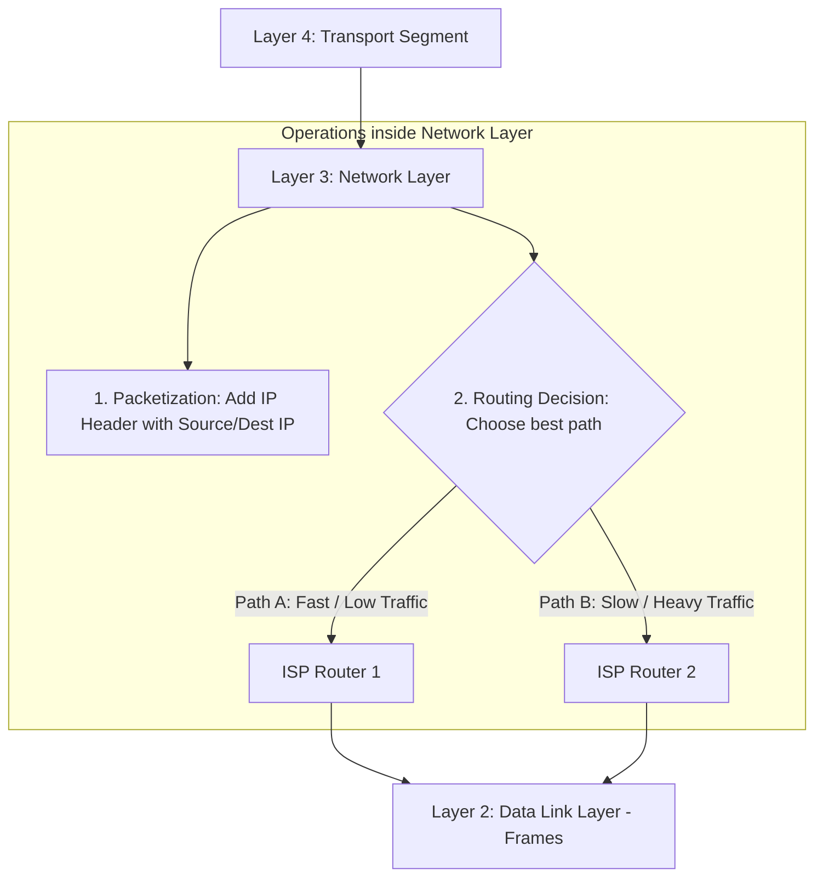

← [[Computer Networking - Study Notes|Go Back to Networking Hub]]

# 🗺️ 24. Layer 3 - Network Layer (Logical Routing)

### 📝 Introduction (Intro)
**Network Layer (Layer 3)** OSI Model ki teesri layer (neeche se) hoti hai. Is layer ka main target data packets ko source device se target device tak deliver karna hai, bhale hi wo dono devices alag-alag local networks (different subnets/regions) me located hon (called **Host-to-Host** ya **End-to-End Delivery**).

* **Function:** Ye layer segments par logically routing codes (IP Addresses) add karti hai aur different physical systems/routers ke beech best pathway choose karti hai.

#### 🔑 Core Functions of Layer 3:
1. **Logical Addressing (IP Addressing):** Har packet header par sender aur receiver ka **IP Address** (jaise 192.168.1.1 or IPv6 addresses) stamp karti hai, taaki globally har node ki location identity defined rahe.
2. **Routing (Path Determination):** Different networks ke beech me sabse chhota aur fast connection route determine karna. Ye decisions **Routers** dwara dynamic protocols tables run karke liye jate hain.
3. **Packetization:** Transport Layer se aane wale data segments par IP headers lagakar unhe **Packets (Datagrams)** me convert karti hai.
4. **Fragmentation & Reassembly:** Agar data packet size local hardware limit (MTU - Maximum Transmission Unit) se bada ho, toh ye layer packet ko pieces me tod deti hai (Fragmentation) aur target host par unhe reassemble karti hai.

#### 🔑 Core Protocols:
* **IP (IPv4 / IPv6):** Packet addressing aur delivery routing structure.
* **ICMP (Internet Control Message Protocol):** Trouble reporting aur network check errors batane ke liye (like *ping* testing).
* **ARP (Address Resolution Protocol):** IP address input lekar corresponding MAC address output trace karna (Layer 2 bridge).

### ➕ Advantages (Fayde)
* **Global Connectivity:** Alag-alag locations aur network limits ko bypass karke globally computers connect karta hai (base of internet).
* **Optimal Path Routing:** Traffic delay aur routes damage ko scan karke automatic dynamic alternate routes select karne ki capability.
* **Network Segmentation:** Massive networks ko localized Subnets me divide karke, unwanted broadcast traffic filters lock karta hai.

### ➖ Disadvantages (Nuksan)
* **Best-Effort (Unreliable) Delivery:** Standard IP protocol connectionless hota hai. Ye is baat ki guarantee nahi deta ki packet safe pahuchega hi; packet drop/loss handling Layer 4 (TCP) par dependent hoti hai.
* **IP Header Overhead:** Har packet par minimum 20 bytes (IPv4) ya 40 bytes (IPv6) ka header overhead add hone se efficiency minor level down hoti hai.
* **Computational Cost:** Core routers ko dynamic routes lookup tables map aur process karne me hardware memory aur computational overhead lagta hai.

### 📊 Diagram
Ye flow mapping Transport segment par IP header encapsulation aur router level path selection decisions ko show karti hai:

### 💡 Real-world Example (Udaharan)
* **Global Postal Mail Metaphor:**
  - **Courier Loader (Layer 4):** Jisne boxes bundle packing complete kari.
  - **Network Layer (Postal Sorting Hub & Road Guides):**
    1. **IP Address = Postal PIN Code / Address:** Envelope par pure deshon aur shehron ke static locations addresses likhna.
    2. **Routing:** Post office manager packages ke pin code dekhta hai: "Delhi to Mumbai package goes via train route 1 because flights are delayed." Wo parcels ko right logistics vehicle router me load karwata hai.
    - Router local destination building gate block/MAC address nahi check karega; wo bas regional PIN area border cross karwayega.
* **Ping Tests:** Jab aap terminal par `ping google.com` run karte hain, toh background me **ICMP protocols (Layer 3)** Google server ko ping packets bhejte hain latency aur paths loss status trace karne ke liye.

### 🚀 Application (Kahan use hota hai?)
* **Hardware Gateways:** Routers, Layer 3 Switches.
* **Network Testing Command Lines:** `ping`, `traceroute`, `tracert` tools.
* **Dynamic Addressing:** DHCP distributing IP networks coordinates to local PCs.
* **ISP Backbone Routers:** Telecom switches mapping heavy inter-country data loops.

---