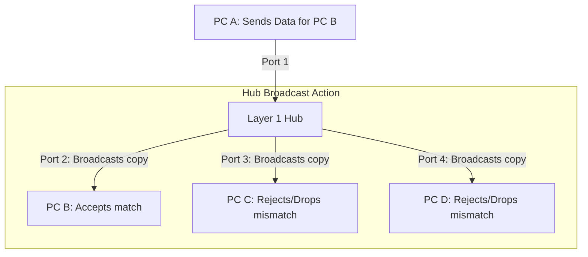

← [[Computer Networking - Study Notes|Go Back to Networking Hub]]

# 🔌 28. Network Hub & Types of Hubs (Passive, Active, Intelligent)

### 📝 Introduction (Intro)
**Hub** ek elementary central networking device hai jo OSI Model ki **Physical Layer (Layer 1)** par kaam karta hai. Ise hum **Multi-port Repeater** bhi kehte hain, kyunki iska functional model ek basic repeater jaisa hi hota hai par multiple input-output port connections ke sath.

* **How it Works (The Broadcast Issue):** Hub ke paas koi routing logic ya address lookup engine (MAC/IP tables) nahi hota. Jab kisi port A se iske paas frame aata hai, toh ye bina soche-samjhe us data bits stream ko **baki sabhi active ports (except source port A)** par copy karke repeat (broadcast) kar deta hai. Sabhi clients data packet check karte hain aur jiske address se match na ho, use reject/drop kar dete hain.

#### 🗂️ Types of Network Hubs:
1. **Passive Hub:** Ye purely mechanical and structural connection ports setup hai. Ye incoming signals ko regenerate or boost nahi karta. Ye bas physical wire connections details pass-through karwata hai. Isko run karne ke liye external electricity supply power connection ki zarurat nahi hoti.
2. **Active Hub:** Ye physical interfaces connectivity ke sath-sath signals clean, amplify aur regenerate bhi karta hai (acts as a Multi-port Active Repeater). Isko power supply dynamic operations ke liye local electricity input zaroori hota hai.
3. **Intelligent Hub (Smart Hub):** Ye active hubs ke upar management modules add karta hai. Isme administrators switch networks diagnostic parameters monitors kar sakte hain, individual ports disconnect/shut down kar sakte hain aur traffic flow analytics remote check kar sakte hain.

### ➕ Advantages (Fayde)
* **Extremely Inexpensive:** Switches aur routers ke comparison me ye hardware setup cost me sabse sasta hai.
* **Simplistic Deployability:** Kisi technical coding configuration or software mappings settings ki zarurat nahi padti. Straightforward plug-and-play layout.
* **Star Topology support:** Central connections hubs ke taur par multiple computers ko star configuration design me easily wrap karta hai.

### ➖ Disadvantages (Nuksan)
* **Heavy Bandwidth Waste (Congestion):** Data sirf PC B ko deliver karna tha par data packets office ke har active system par reach hota hai. Is-se dynamic line efficiency waste hoti hai.
* **Critical Security Risk:** Data private transmission nahi hai. Traffic monitoring sniffing tools (like Wireshark) run karke hackers easily packets copy/read kar sakte hain (Data interception).
* **Single Collision Domain:** pure ports single logical wire channel share karte hain. Agar do computers simultaneous transmission try karenge toh logical signals collide ho kar crash ho jayenge.
* **Half-Duplex Only:** Connected systems ek bar me ya toh send kar sakte hain ya receive (Walkie-Talkie model), single channel rules constraints.

### 📊 Diagram
Ye layout Hub ke broadcast mechanism (sending data to all ports except source A) ko represent karta hai:

### 💡 Real-world Example (Udaharan)
* **Classroom Megaphone Announcer Metaphor:**
  - **Switch approach:** Teacher candidate specific roll number ko direct desk par aakar paper handover karti hai (Secure unicast).
  - **Hub approach:** Announcer room gate par khada hokar pure megaphone/megaphone par chillata hai: "Roll 12 Ramesh, aapke 5 marks fail hain!" Ab Ramesh ko result toh mil gaya, par pure school ko bin-baat ke unke records data sunna pad gaya.
* **Power Extension Multi-Socket:** Ghar me dynamic extension board box me 4 plug slots hote hain. Board logic ko nahi pata aapne mobile charger insert kiya hai ya heavy iron; wo sabhi slots me equal voltage current supply bypass kar deta hai.

### 🚀 Application (Kahan use hota hai?)
* **Legacy Networks (Historical):** 1990s and early 2000s school network computer labs (completely replaced by modern L2 Switches today).
* **Network Traffic Diagnostic Labs:** Port mirroring or passive tapping tests pipelines mapping me, taaki pure ports traffic monitoring cards par sync copy collect ho sake.
* **Small scale hobby tasks:** Simple low complexity internal laboratory setups.

---