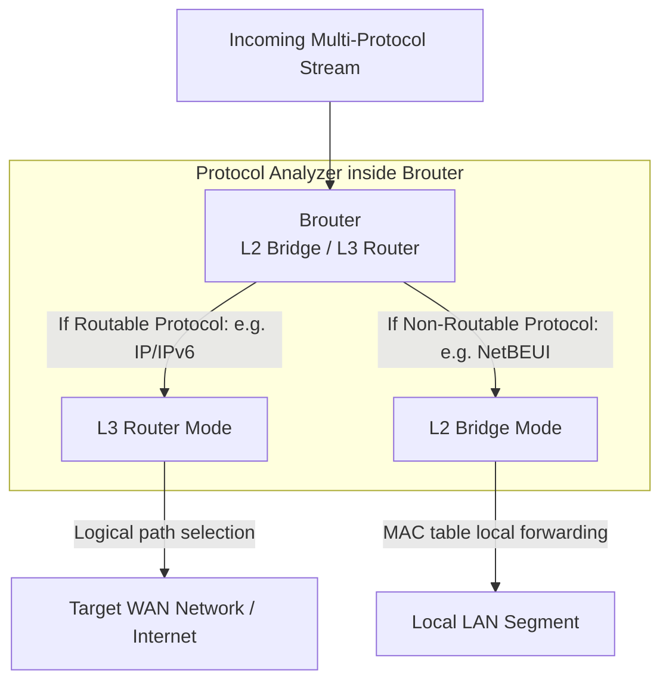

← [[Computer Networking - Study Notes|Go Back to Networking Hub]]

# 🎛️ 32. Network Brouter (Bridge Router Hybrid)

### 📝 Introduction (Intro)
**Brouter (Bridging Router)** ek unique hybrid hardware networking device hai jo **Bridge** aur **Router** dono ke functionalities ko single hardware chassis me combine karta hai. Ye OSI Model ki **Data Link Layer (Layer 2)** aur **Network Layer (Layer 3)** dono par simultaneously operate karne ki capability rakhta hai.

* **How it Works (Dynamic Protocol Filtering):** Jab Brouter ke pass incoming data streams aate hain, toh ye unke dynamic protocol standards ko inspect karta hai:
  - **As a Router (Layer 3):** Agar packet me dynamic routable protocol (jaise **IP** address or IPv6 addresses) hai, toh Brouter as a Router behave karta hai aur packet routing tables ke base par target destination network path par forward kar deta hai.
  - **As a Bridge (Layer 2):** Agar packet me non-routable legacy protocol (jaise **NetBEUI** or **DECnet**) hai jisme IP structure nahi hota, toh Brouter automatically L2 Bridge Mode me switch ho jata hai aur local MAC address maps ke through data bridge (forward/filter) kar deta hai.

### ➕ Advantages (Fayde)
* **Hybrid Operations:** Single device dynamic requirements ke according logical routing aur physical bridge segmentation dono parallel execute kar leta hai.
* **Deployment Cost Savings:** Alag-alag Router aur Bridge hardware purchase karne ke badle single hybrid brouter deployment sasta aur rack-space saving hota hai.
* **Backwards Compatibility:** Multi-campus structures me modern internet routing chalane ke sath-sath legacy local non-routable communication channels ko block hone se protect karta hai.

### ➖ Disadvantages (Nuksan)
* **High Configuration Complexity:** Dual operational modes (Layer 2 MAC tables & Layer 3 IP routing charts) sync rakhne ke karan administrators ke liye network configuration mapping complex ho jati hai.
* **Obsolete Technology:** Modern high-speed networking me brouters completely dead ho chuke hain, kyunki modern standard routers software levels par hi bridging operations configure karne ki permission de dete hain.
* **Troubleshooting Difficulty:** Data transmission delays check karne me debugging process complex ho jata hai (hard to trace if issue is in L2 learning registers or L3 routing algorithms).

### 📊 Diagram
Ye layout Brouter ke classification filter logic aur pathways outputs (routing vs bridging) ko show karta hai:

### 💡 Real-world Example (Udaharan)
* **Postman-cum-Local Delivery Boy Metaphor:**
  - Maan lijiye ek specialized courier delivery hub manager hai.
  - **Routable Envelope (IP Packet):** Ek box par proper PIN code and State location printed hai. Manager (as a Router) use index check karke direct inter-city transport truck me load kar deta hai (Routing).
  - **Non-Routable Postcard (NetBEUI):** Ek envelope par koi PIN address code system nahi hai, bas local cabin name likha hai: "Shyam from IT desk". Manager (as a Bridge) bina highway rules check kiye directly use local corridor dispatcher ko de deta hai taaki local building switch segment me deliver ho sake (Bridging).
* **Legacy Windows NT Networks:** 1990s me corporate database offices me files transfer NetBEUI (non-routable local protocol) par chalta tha aur internet browsing IP protocol par. Tab Brouter un andruni computers ko global internet link dete hue direct files sharing channels active rakhta tha.

### 🚀 Application (Kahan use hota hai?)
* **Legacy Networks Maintenance:** Industrial setups jahan dynamic computer interfaces change nahi kiye ja sakte aur legacy systems protocols linked rakhne padte hain.
* **Hybrid WAN Terminals:** Small scale corporate locations needing simple hybrid links.

---