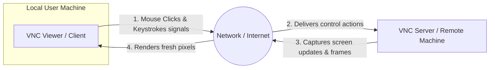

← [[Computer Networking - Study Notes|Go Back to Networking Hub]]

# 🖥️ 33. VNC (Virtual Network Computing - Remote Desktop)

### 📝 Introduction (Intro)
**VNC (Virtual Network Computing)** ek client-server desktop-sharing system hai jo network (ya internet) ke jariye user ko ek computer se doosre computer ko **Remotely Control** karne ki facility deta hai.

* **How it Works (RFB Protocol):** VNC background me **RFB (Remote Frame Buffer)** protocol standard use karta hai. Isme do core parts hote hain:
  1. **VNC Server:** Ye target remote machine (jise control karna hai) par run hota hai. Ye screen pixel changes ko capture aur compress karke network par send karta hai.
  2. **VNC Viewer (Client):** Ye user ke desktop screen par remote server ka live view display karta hai. Jab user mouse click or key press karta hai, toh VNC Viewer in input signals ko network ke through server par raw commands executions ke liye dispatch kar deta hai.

### ➕ Advantages (Fayde)
* **Cross-Platform Compatibility:** Platform-independent architecture hai. Aap Windows computer par baith kar raw Linux database command centers ko complete GUI window se manage kar sakte hain.
* **Visual Desktop Control:** Text-only command interface (SSH) ke badle direct mouse and graphics-level desktop control milta hai jo simple and interactive hota hai.
* **Efficient Support Systems:** Remote systems repair desks aur technical support operations smoothly handle karne me madadgar hai.

### ➖ Disadvantages (Nuksan)
* **High Bandwidth Consumption:** VNC pure desktop screen pixels updates ko image formats frames me continuously transmit karta hai, jisse dynamic text-only systems se kafi zyada bandwidth consume hoti hai.
* **Lag & Network Latency:** internet line weak hone par screens refreshing drop ho jati hai, jisse mouse cursors movements highly laggy/slow operate hote hain.
* **Standard Security Flaws:** Default VNC traffic headers unencrypted format me run hote hain (except initial logins hash). Secure connection loops ke liye isko SSH tunnels standard wrapper ke sath run karna compulsory hota hai.

### 📊 Diagram
Ye layout VNC Viewer control inputs aur VNC Server screen frame responses flows maps ko show karta hai:

### 💡 Real-world Example (Udaharan)
* **Toy Car Live Video Metaphor:**
  - Maan lijiye aapke pass ek remote-controlled toy car hai jo kisi doosre des me rakhi hai aur us-par ek live streaming camera laga hai.
  - Aap yahan monitor par car ka live route and feed dekh rahe hain (Screen frames receipt) aur remote buttons press kar rahe hain (Keystrokes upload). Aapka button press car wahan forward kar deta hai. Yahi VNC client-server control flow hai.
* **Help Desk Support:** Jab aapke laptop me network setting corrupt ho jaye aur aapka friend remote tool (TeamViewer, AnyDesk, or UltraVNC) se access lekar aapke screens controls check karke settings restore karta hai.

### 🚀 Application (Kahan use hota hai?)
* **Server GUI Administrations:** Headless servers (servers without hardware monitors) ko cloud database me graphical interface se manage karna.
* **Technical Helpdesk centers:** Technical supports agents resolving bugs on user systems.
* **Work from Home (WFH):** Corporate work profiles me office desktop files dynamic access and operations remotely execution from home systems.

---