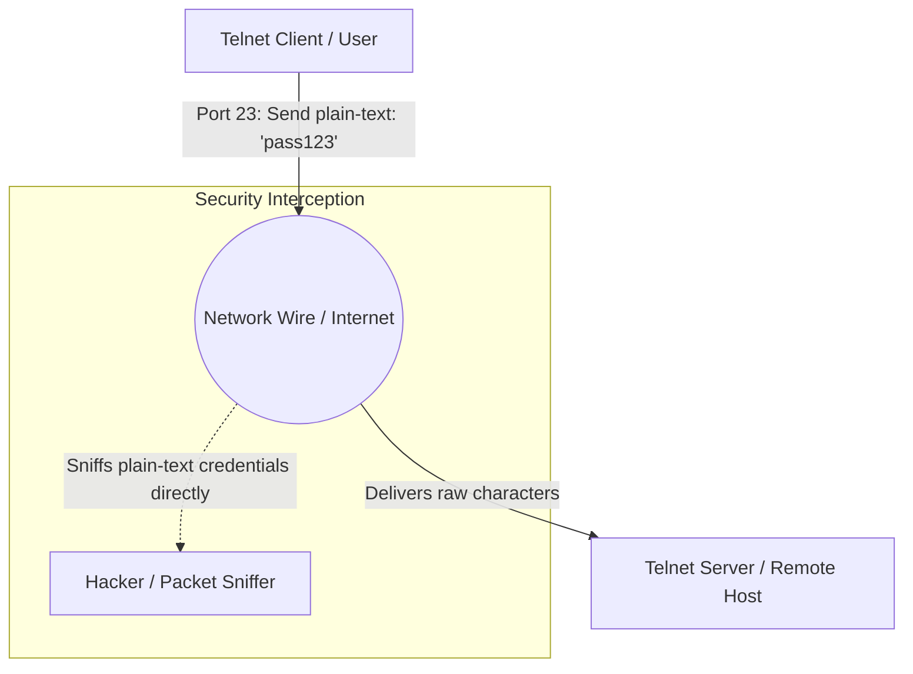

← [[Computer Networking - Study Notes|Go Back to Networking Hub]]

# 📜 34. Telnet Protocol (Teletype Network - Insecure Remote Text)

### 📝 Introduction (Intro)
**Telnet (Teletype Network)** ek classic application layer protocol hai jo user ko remote servers ya devices ko dynamic **Command Line Interface (CLI)** ke through access aur manage karne ki facility deta hai. Ye standard TCP/IP networking models par kaam karta hai aur **TCP Port 23** use karta hai.

* **Client-Server Model:** Telnet operation me client machine remote target server par run ho rahi shell console services ko secure ports ke through initiate karti hai.
* **Plain-Text Transmission (The Sniffing Issue):** Telnet ka design 1969 me develop hua tha jab internet par cyber security issues negligible the. Isme koi encryption nahi hota, jis-se credentials (username & passwords) aur commands transmission raw **Plain-Text** me travel karte hain.

### ➕ Advantages (Fayde)
* **Extremely Lightweight:** Graphic remote sharing mechanisms (VNC, RDP) ke opposite, Telnet me raw character commands transport hote hain, jisse bandwidth requirements zero percent level ke barabar hoti hain.
* **Speedy Actions:** Graphic processing overlays na hone ke karan data packet exchanges instant aur lagging-free execute hote hain.
* **Open Port Diagnostics:** Iska use networks me remote hosts ports connectivity testing ke liye troubleshooting tools ki tarah kiya jata hai.

### ➖ Disadvantages (Nuksan)
* **Severe Security Vulnerability:** Packet data unencrypted hone ke karan hacker packet sniffing software (jaise Wireshark) run karke dynamic passwords aur commands instantly read/steal kar sakte hain.
* **No GUI Support:** Graphical window interfaces and screens mouse clicks handles nahi kar sakta, complete operations shell commands par limited hote hain.
* **Obsolete Status:** Secure shell protocols **SSH (Port 22)** ke global entry ke baad Telnet security parameters ke chalte modern internet communication me completely ban ho gaya hai.

### 📊 Diagram
Ye layout Telnet unencrypted flows aur hacker intercept vulnerability models ko show karta hai:

### 💡 Real-world Example (Udaharan)
* **Megaphone Banking Metaphor:**
  - **SSH (Secure) approach:** Aap bank cabin clerk se security desk ke peechhe low voice me verification detail confirm karte hain.
  - **Telnet (Insecure) approach:** Aap bank entry hall center me khade hokar pure megaphone par chillate hain: "Mera account number 505 hai aur password pin 9999 hai!" Aapke side khada har customer aapka data steal kar leta hai.
* **Transparent Mail Envelope:** Agar aap apni personal bank cheque transparent plastic wrap mail bag me pack karke post block me drop karte hain, toh delivery postman se lekar dynamic transport layers tak har reader value contents view kar sakta hai.

### 🚀 Application (Kahan use hota hai?)
* **Simple Network Port Diagnostics:** Web-server testing controls check commands (jaise: `telnet google.com 80` to verify port 80 accessibility).
* **Isolated Private Networks:** Purane switches routers console setups jahan network local limits me locked ho aur internet exposure zero ho.

---