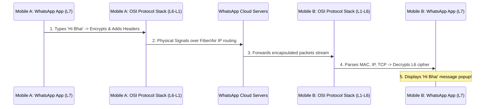

← [[Computer Networking - Study Notes|Go Back to Networking Hub]]

# 💬 36. WhatsApp Communication Flow (OSI Model Mapping)

### 📝 Introduction (Intro)
Maan lijiye **PC A (ya Mobile A)** se **PC B (ya Mobile B)** ko WhatsApp par ek message bheja jata hai: **"Hi Bhai"**. Ye raw message receiver ke phone screen par display hone se pehle OSI model ki saari **7 Layers** ke through niche (encapsulation) aur receiver side par wapas upar (decapsulation) travel karta hai.

#### 🗺️ Layer-by-Layer WhatsApp Communication Mapping:

```
[ Sender: Mobile A ]                                           [ Receiver: Mobile B ]
  Layer 7: Application (Types "Hi Bhai" in UI)                   Layer 7: Application (Displays "Hi Bhai" in UI)
        |                                                              ^
  Layer 6: Presentation (Encrypts message to Cipher)             Layer 6: Presentation (Decrypts Cipher to text)
        |                                                              ^
  Layer 5: Session (Manages continuous socket channel)           Layer 5: Session (Manages continuous socket channel)
        |                                                              ^
  Layer 4: Transport (TCP Segment: adds Port 443)                Layer 4: Transport (Strips L4 Header, verifies Port)
        |                                                              ^
  Layer 3: Network (IP Packet: adds Source/Dest IPs)             Layer 3: Network (Strips L3 Header, verifies IP)
        |                                                              ^
  Layer 2: Data Link (Frame: adds MAC: Router/Phone)             Layer 2: Data Link (Strips L2 Header, verifies MAC)
        |                                                              ^
  Layer 1: Physical (Bits convert to radio frequency waves) ===> Layer 1: Physical (Receives radio waves, converts to bits)
```

1. **Layer 7 - Application Layer (WhatsApp UI app):**
   * User A WhatsApp app open karke text box me "Hi Bhai" type karke Send par click karta hai.
   * WhatsApp background protocols (jaise **custom WebSocket/XMPP connection** aur **Noise Protocol Framework**) client interaction handle karte hain.
2. **Layer 6 - Presentation Layer (Encryption/Compression):**
   * Message "Hi Bhai" ko **Signal Protocol** ke encryption logic se encrypt kiya jata hai, jisse wo ek unreadable format (Ciphertext: `xyZ987#@!`) me convert ho jata hai (End-to-End Encryption - E2EE).
   * Agar koi media file (image/video) hai, toh wo compress hokar optimize standard format me change hoti hai.
3. **Layer 5 - Session Layer (Session Management):**
   * Mobile A aur WhatsApp servers ke beech background persistent TCP connection **session** coordinate hota hai.
   * Agar network temporary switch (Wi-Fi to 4G) ho, toh session recovery bina message fail kiye database connection map kiye rakhti hai.
4. **Layer 4 - Transport Layer (Process-to-Process - TCP vs UDP):**
   * WhatsApp reliability ke liye **TCP** (Transmission Control Protocol) use karta hai chat messages send karne me, taaki ensure ho sake ki packet drop zero ho. WhatsApp VoIP voice/video calling cases me high-speed **UDP** use kiya jata hai.
   * Ye layer segment headers add karti hai aur destination port set karti hai (jaise secure HTTPS connection port **443** ya XMPP port **5222**).
5. **Layer 3 - Network Layer (Logical Routing - IP Address):**
   * Segment ko packet me wrap karke source IP (A's mobile IP address) aur destination IP (WhatsApp server IP address) chipkaye jate hain.
   * Internet routers is layer ke details padh kar packet ko local city nodes se global cloud database tak route karte hain.
6. **Layer 2 - Data Link Layer (Node-to-Node - MAC Address):**
   * IP packet ko **Frame** me segment karke local network addresses maps add kiye jate hain.
   * Mobile A ka MAC address as a source aur local home Wi-Fi router ka MAC address as a destination set hota hai. (Wi-Fi standards: **IEEE 802.11** ya cellular carrier LTE/5G formats protocols control the physical links flow).
7. **Layer 1 - Physical Layer (Bit Transmission over Media):**
   * Local Wi-Fi chip/cellular modem binary codes (0s and 1s) ko radio waves frequency me convert karke air/cables transmission line me dispatch kar deta hai.

* **At WhatsApp Server (Intermediate Hop):** L1 se incoming signal catch karke L7 application stream par check hota hai (delivery ticks mapping updates), aur fir se server niche encapsulation L7 to L1 process run karke use Receiver Mobile B ki taraf direct dispatch route data forward kar deta hai.
* **At Receiver Mobile B (Decapsulation):**
  * L1 radio waves ko reads karke bits stream me badalta hai.
  * L2 checks local MAC matching to verify frame target.
  * L3 checks destination IP matching (Is this for Mobile B?).
  * L4 checks Port 443 and routes payload to WhatsApp App process thread.
  * L5 checks session security validation tokens.
  * L6 decrypts ciphertext `xyZ987#@!` back to clean text **"Hi Bhai"** using Mobile B's private key.
  * L7 WhatsApp UI displays notification popup and prints **"Hi Bhai"** on user screen.

### ➕ Advantages (Fayde)
* **Layer Independence (Modular Architecture):** WhatsApp developers application logic (L7 UI styling) modify kar sakte hain bina user ke network card configurations (L1/L2) change kiye.
* **Granular Security implementation:** signal protocol calculations L6 par encryption handles karte hain, jisse absolute physical transit secure ho jata hai.
* **Reliable Connection Fallbacks:** TCP sockets standard rules ensure complete text deliveries safely.

### ➖ Disadvantages (Nuksan)
* **Header Encapsulation Overhead:** Har layer (L7 se L1) apna header and metadata add karti hai, jisse actual payload ("Hi Bhai" - just 7 characters/bytes) ke comparative dynamic network overhead badh jata hai.
* **Dependency Chain:** Agar is process me local router network layer (L3 IP routing) drops issues ho rahe hon, toh L7 screen display updates error states standard show karega (single clock drop breaks the complete flow).

### 📊 Diagram
Ye visual diagram user message dynamic flows (Sender side Downward flows & Receiver side Upward flows) transitions to show karta hai:



### 💡 Real-world Example (Udaharan)
* **Sending an International Courier Metaphor:**
  1. **L7 (Application):** Aapne paper par letter likha (Chat text).
  2. **L6 (Presentation):** Us letter ko coded language code me badal kar envelope me pack kiya (Encryption).
  3. **L5 (Session):** Courier company se batch session slip verify kiya.
  4. **L4 (Transport):** Slip par process tags ports chipkaye (TCP reliability label).
  5. **L3 (Network):** Envelope par source aur destination home addresses (IPs) likhe.
  6. **L2 (Data Link):** Box storage hub routes specify kiye (Local post transport node - MAC).
  7. **L1 (Physical):** Delivery van speed me routes cross karke box destination drop kar aati hai.

### 🚀 Application (Kahan use hota hai?)
* **IM platforms architecture configurations:** Messenger apps (Telegram, Signal, WhatsApp) design processes structure layouts.
* **VoIP Call stream sync designs:** WebRTC integrations inside communication applications.

---