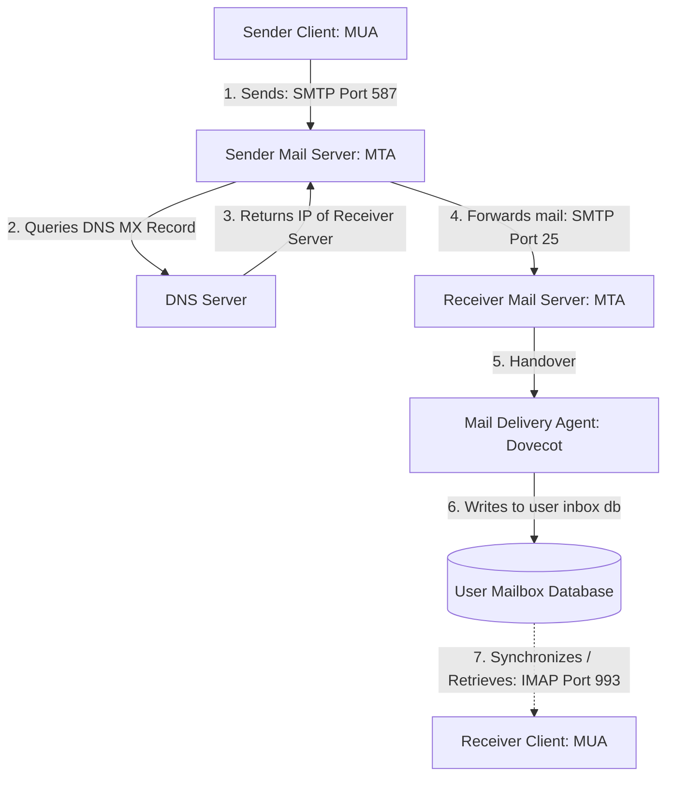

← [[Computer Networking - Study Notes|Go Back to Networking Hub]]

# 📧 37. How Email Works (SMTP, IMAP, POP3 and Mail Servers)

### 📝 Introduction (Intro)
**Email (Electronic Mail)** client-server model par kaam karne wali ek asymmetric communication service hai. Jab aap Gmail ya Outlook me write karke email send button par click karte hain, toh background me multi-level agents aur protocols aapas me sync hokar message deliver karte hain.

#### 🔑 Core Components of Email System:
1. **MUA (Mail User Agent):** Ye client application hai jise user interact karta hai (e.g. Gmail App, Outlook client, Apple Mail).
2. **MTA (Mail Transfer Agent):** Ye mail servers hain jo background forwarding logic handles karte hain (e.g. Postfix, Microsoft Exchange servers).
3. **MDA (Mail Delivery Agent):** Ye servers par aane wale inbox contents local folders me place/write karne ka task handle karta hai.

#### 📜 Primary Email Protocols:
* **SMTP (Simple Mail Transfer Protocol - Ports: 25, 465, 587):** Ye **Email Send (Outgoing)** karne ka protocol hai. Client se local server, aur local server se receiver server tak message sirf SMTP ke through hi forward hota hai.
* **IMAP (Internet Message Access Protocol - Ports: 143, 993):** Ye **Email Receive (Incoming)** karne ka standard protocol hai. Isme email mail server par save rehta hai, aur aap use direct live view/sync karte hain. Aap mobile/laptop dono se sync changes check kar sakte hain.
* **POP3 (Post Office Protocol 3 - Ports: 110, 995):** Incoming protocol. Isme email server se client system me local download ho jata hai aur server se automatic delete ho jata hai (Single system dependency locks).

### ➕ Advantages (Fayde)
* **Asynchronous Communication:** Sender aur Receiver dono ko ek sath online rahne ki zarurat nahi hoti, mail server inbox database registers parameters hold rakhta hai.
* **Global Standard Protocols:** SMTP aur IMAP standards global hain, jisse Gmail user Yahoo or Custom domains users ko easily mail send kar sakta hai.
* **Rich attachments formats:** Text ke sath-sath image, document files (PDFs) easily transport ho jate hain.

### ➖ Disadvantages (Nuksan)
* **High Spams / Phishing threats:** Open SMTP limits ke karan spam links aur spoofed email senders domains banana easy hai, jisse hackers dynamic banking info phish kar sakte hain.
* **Size Limitations limits:** Standard email servers maximum 25 MB frames se badi files support nahi karte (heavy data transfers require cloud storage links).
* **Delivery delays validation:** Instant delivery sync validation parameters real-time systems jaise fast nahi hote; network congestion aane par delay periods runtime dynamic hotey hain.

### 📊 Diagram
Ye layout Sender client se lekar Receiver inbox delivery tak ke complete flow channels ko show karta hai:

### 💡 Real-world Example (Udaharan)
* **Physical Post Box Metaphor:**
  1. **Application (MUA):** Aapne paper par letter likhkar post box me drop kiya (Sender Gmail app).
  2. **Outgoing Server (SMTP MTA):** Local Post Office ne use receive kiya. Unhone postal code list check kiye taaki target state destination map ho sake (DNS MX lookup query).
  3. **Transport to Destination:** Local post team ne vehicle ke through use target city main post office me handover kar diya (SMTP forward transfer).
  4. **Inbox Local Delivery (MDA):** Target area delivery agent ne box se letter lekar target receiver ke physical door key-box box slot me insert kar diya (POP3/IMAP storage slot).
  5. **Retrieval:** User jab ghar aaya, key check karke box open kiya aur mail extract kiya (IMAP fetch client view).

### 🚀 Application (Kahan use hota hai?)
* **Business Correspondence:** Corporate communications flows and logs documentation systems.
* **Automated Alerting Alerts:** Transaction logs, banking OTP services, and website registrations notifications systems.
* **Online marketing platforms:** newsletters alerts campaigns tracking logs.

---