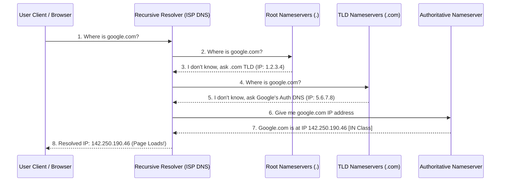

← [[Computer Networking - Study Notes|Go Back to Networking Hub]]

# 🔍 38. DNS & DNS Classes (Domain Name System & IN, CH, HS Classes)

### 📝 Introduction (Intro)
**DNS (Domain Name System)** ko Internet ki **"Phonebook"** kaha jata hai. Iska main target human-friendly domain names (jaise `google.com`) ko machine-readable IP addresses (jaise `142.250.190.46`) me resolve (translate) karna hai. Ye **Application Layer (Layer 7)** protocol hai jo queries ke liye typically **UDP Port 53** (aur heavy data transfers ke liye TCP Port 53) use karta hai.

#### 🗂️ DNS Classes (DNS Database Categories):
DNS system ke records ke andar ek field hoti hai jise **Class** kehte hain. Ye batata hai ki record kis network space standard se bilong karta hai:
1. **IN (Internet - Class Code 1):** Ye sabse main aur dynamic class hai. Internet ke 99.99% records (A, AAAA, MX, CNAME, TXT) isi class ka hissa hote hain.
2. **CH (Chaosnet - Class Code 3):** Chaosnet ek legacy network protocol standard tha jo MIT me built hua tha. Aaj ke modern internet me iska use sirf BIND server version checking or database diagnostics query chalane ke liye kiya jata hai.
3. **HS (Hesiod - Class Code 4):** Hesiod MIT Project Athena ka directory database protocol tha. Ye legacy system directory information (jaise users database or filesystems info) store karne ke liye use hota tha.

#### 🗼 DNS Resolution Hierarchy (Servers Types):
* **Recursive Resolver:** Client se request receive karta hai aur baki servers se query collect karke domain IP lakar user ko deta hai (ISP DNS).
* **Root Nameserver:** Pehla step hierarchy me (`.`). Ye batata hai ki TLD server (.com, .in) kahan milega.
* **TLD Nameserver:** Domain extension handles (.com, .org) check nodes.
* **Authoritative Nameserver:** Final destination jiske pass domain ka actual IP record mapped hota hai.

### ➕ Advantages (Fayde)
* **Human-Friendly Browsing:** Users ko dynamic complex IP addresses yaad rakhne nahi padte, simple alpha names yaad rakhne hote hain.
* **Dynamic IP updates:** Domain owner IP address change kar sakta hai background server update karke, bina domain user experience break kiye.
* **DNS Caching:** Locally stored caching ke chalte repetitive website requests milliseconds ke andar resolve ho jati hain.

### ➖ Disadvantages (Nuksan)
* **DNS Spoofing / Cache Poisoning:** Hackers resolver cache memory corrupt karke dummy IP insert kartey hain, jisse users automatic duplicate phishing links par redirect ho jate hain.
* **Propagation Delay (TTL):** Jab aap records change karte hain, toh local ISP resolvers cache expire hone tak dynamic changes publish hone me time lagta hai.
* **Single Point of Failure:** Agar local ISP recursive DNS server freeze/down ho jaye, toh internet connectivity active hote hue bhi website queries resolve hona stop ho jati hain.

### 📊 Diagram
Ye layout DNS query resolution hierarchy sequence layers (Root -> TLD -> Authoritative) mapping flow ko show karta hai:

### 💡 Real-world Example (Udaharan)
* **Finding a Contact Number in Phonebook:**
  - **No DNS:** Aapko apne 100 doston ke phone numbers direct dial digits yaad rakhne hon (IP addresses memory).
  - **DNS Setup:** Aap phonebook contacts index open karke type karte hain: "Amit Kumar" (Domain name). Aapka contact app automatic backend directory database se Amit ka target phone number search karke background me dial kar deta hai.
* **Librarian Guidance:** Jab aap university library me durlabh book search karne jate hain. Head counter (Root) aapko batata hai science compartment (TLD) jao. Science room head (TLD Nameserver) aapko batata hai physics segment cupboard (Authoritative Nameserver) jao. Cupboard check karke aapko book (IP address) mil jati hai.

### 🚀 Application (Kahan use hota hai?)
* **Web Browsing lookup:** Rerouting URL strings to target server IPs.
* **Email Delivery Routing:** SMTP query checking MX records configurations to send emails.
* **System Version Diagnostics:** Chaosnet class checking local BIND query loops (e.g. `dig @ns1.domain.com version.bind txt chaos`).

---