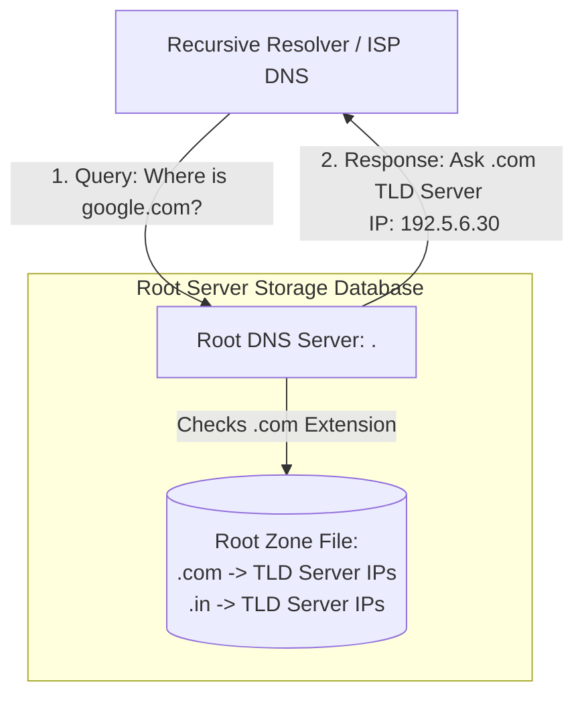

← [[Computer Networking - Study Notes|Go Back to Networking Hub]]

# 🌲 39. Root DNS Server (The Base of Domain Name Hierarchy)

### 📝 Introduction (Intro)
**Root DNS Server** internet ke domain resolution hierarchy (Domain Name System tree) me sabse topmost/root position par hote hain, jise single Dot (`.`) se represent kiya jata hai. Jab bhi aap website search karte hain aur local cache me entry nahi milti, toh DNS lookup process sabse pehle isi Root Server ko contact karta hai.

* **Main Function:** Root Server ko kisi individual page ya specific server ka final IP address nahi pata hota. Par ye janta hai ki TLD (.com, .org, .in, etc.) servers kahan hain. Ye dynamic query request ko respective Top-Level Domain (TLD) Nameservers ki taraf route/redirect kar deta hai.
* **The 13 Logical Root Servers:** Global internet structure ko chalane ke liye exact **13 Logical Root Server Names** allocate kiye gaye hain:
  - Addresses range from `a.root-servers.net` to `m.root-servers.net`.
  - Inko different global institutions aur authorities operate karti hain (jaise ICANN, NASA, Verisign, US Army Research Lab, University of Maryland, RIPE NCC, etc.).

### ➕ Advantages (Fayde)
* **High Availability via Anycast Routing:** Original technology constraints ke chalte logical names 13 hi hain, par **IP Anycast Routing** ke through globally iske **1500+ physical mirror servers** installed hain. Anycast automatic request ko user ke physical location se sabse nearest working node/mirror par routing forward karta hai, jisse dynamic performance fast aur latency low ho jati hai.
* **Redundancy and Reliability:** Multiple physical mirror sites hone ke karan agar ek country ke root server location crash ho jaye, toh traffic automatically next nearest copy node par switch ho jata hai (Zero Internet Downtime).
* **DNSSEC Security:** Root zone file cryptographic level signature keys (DNSSEC validation) provide karti hai, jisse source authenticity secure and certified rehti hai.

### ➖ Disadvantages (Nuksan)
* **High-Value Target for DDoS Attacks:** Puri duniyawale root paths use karte hain, isiliye hackers root servers network block freeze karne ke liye massive Distributed Denial of Service (DDoS) attack launch karte hain (e.g. historical attacks try to flood the 13 root IPs).
* **Root Zone Dependency:** Agar IANA/ICANN system database level par manual entry error ho jaye, toh pure internet domains routing system collapse ho sakti hai.

### 📊 Diagram
Ye layout Root DNS Server ke redirection function aur TLD mapping response to recursive resolver flow ko show karta hai:

### 💡 Real-world Example (Udaharan)
* **Shopping Mall Grand Directory Counter Metaphor:**
  - Maan lijiye aap ek bade shopping mall (Internet) me **"Nike Shoes Shop"** dhundhne jate hain.
  - Counter receptionist (Root Server) ko nahi pata ki exact Nike shoes shelf kahan rakhi hai, par use mall directory map pata hai.
  - Receptionist aapko bolti hai: "Nike segment ke liye third floor (TLD Server: `.com`) par jao." Jab aap third floor par jate hain, toh wahan ka floor directory assistant (TLD Server) aapko exact counter store (Authoritative Server) aur targeted shoes room (IP address) bata deta hai.

### 🚀 Application (Kahan use hota hai?)
* **First Hop of Global DNS Resolution:** Caching missing updates hone par queries path resolution base.
* **Anycast IP Distribution Testing:** Network routing lines updates verification.
* **Root Zone Key Signing Management:** Maintaining cryptographic authenticity parameters in domain security systems.

---