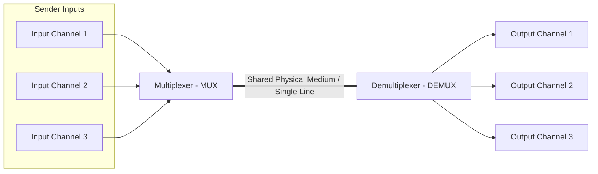

← [[Computer Networking - Study Notes|Go Back to Networking Hub]]

# 🔄 40. Multiplexing & Its Types (FDM, TDM, WDM)

### 📝 Introduction (Intro)
**Multiplexing** ek aisi networking technique hai jisme multiple analog ya digital signals ko ek sath combine karke ek hi physical transmission medium (jaise a single copper wire, fiber optic cable, or radio channel) par transmit kiya jata hai. 

* **The MUX-DEMUX Model:**
  - **Multiplexer (MUX):** Sender side par hota hai jo alag-alag input lines se signals lekar unhe single medium lane me merge kar deta hai.
  - **Demultiplexer (DEMUX):** Receiver side par hota hai jo shared channel se combined signal lekar wapas unhe original individual output lines me split/separate kar deta hai.

#### 🗂️ Primary Types of Multiplexing:
1. **FDM (Frequency Division Multiplexing):** Ye ek analog technique hai. Isme channel ki total available bandwidth (frequency range) ko different smaller non-overlapping frequency bands me share kiya jata hai. Har signal ko ek unique frequency band diya jata hai. Signals aapas me na takrayein, iske liye beech me blank frequency space chhodte hain jise **Guard Bands** kehte hain. (e.g. FM Radio, Cable TV).
2. **TDM (Time Division Multiplexing):** Ye ek digital technique hai. Isme puri bandwidth ka control har user ko diya jata hai, par sirf ek specific limited time slot ke liye. Time slots ko frame cycles me split kiya jata hai:
   - *Synchronous TDM:* Har sender device ke liye time slot pehle se reserved hota hai, bhale hi device data bhej raha ho ya nahi (Wastes bandwidth if idle).
   - *Asynchronous (Statistical) TDM:* Slots dynamic allocate hote hain, jo sender active hai sirf use hi time slot diya jata hai (Highly efficient).
3. **WDM (Wavelength Division Multiplexing):** Ye optical fiber cables me use hone wali technique hai. Ye basically optical fiber standard ke liye FDM ka hi dusra roop hai. Isme electromagnetic light source ki alag-alag wavelengths (colours of light) ko prism module ke jariye single fiber cable par merge kiya jata hai. (e.g. High-speed trans-oceanic fiber backbones).

### ➕ Advantages (Fayde)
* **High Infrastructure Cost Savings:** Har communication link ke liye alag-alag physical wire bichhane ki zarurat nahi hoti. Single cable line multiple signals handle karti hai.
* **Maximum Bandwidth Utilization:** Transmission line ki empty idle capacity waste nahi hoti, physical media utilization optimal ho jata hai.
* **Simplicity of Architecture:** Backend connection points reduce hone se cabling mess control ho jata hai.

### ➖ Disadvantages (Nuksan)
* **Single Point of Medium Failure:** Agar shared physical cable break/cut ho jaye, toh uske par travel karne wale saare channels (signals) instantly drop ho jayenge.
* **MUX-DEMUX Overhead Delay:** Signals ko merge aur separate karne me systems circuits levels par processing latency delays generate hote hain.
* **Complexity of Synchronization:** TDM cases me sender aur receiver ke clock sync blocks check strict hone chahiye, clock timing difference packet data mix-up crash kar sakta hai.

### 📊 Diagram
Ye layout basic Multiplexing model (MUX merge & DEMUX split) ko show karta hai:

### 💡 Real-world Example (Udaharan)
* **Highway Narrow Bridge Metaphor:**
  - Maan lijiye do alag-alag cities se 3 roadways lanes (Input Channels) aa rahi hain. Aage raste me ek single narrow river bridge (Shared Medium) hai.
  - **FDM Approach:** Hum bridge ko vertical partitions banakar 3 patli lanes me divide kar dein, jahan se teeno cars ek sath par karein.
  - **TDM Approach:** Hum bridge par ek traffic signal (Time slots) lagayein: Pehle 10 seconds sirf City A ki car jayegi, agle 10 seconds City B ki, fir City C ki. Bridge cross karne ke baad cars wapas apne destination paths (Split channels) par chali jayengi.
* **Cable Television Line:** Aapke ghar me aane wali single coaxial Cable TV wire me hazaaron channels (Star Sports, Discovery, etc.) ek sath travel karte hain. Aapka set-top-box tuning filter select karke specific frequency decode karta hai aur us signal channel ko screen par chala deta hai.

### 🚀 Application (Kahan use hota hai?)
* **Broadcasting Telecoms:** FM/AM radio waves and Cable television grids networks.
* **Fiber Optic Backbones:** High bandwidth transcontinental undersea fiber cables grids using WDM.
* **Cellular Mobile networks:** Multi-user call signals allocations using TDM slot structures.

---