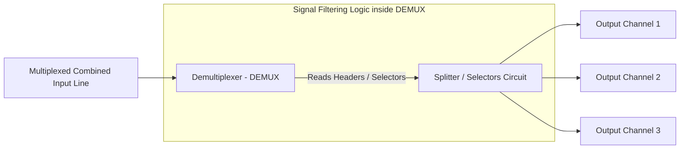

← [[Computer Networking - Study Notes|Go Back to Networking Hub]]

# 🔌 41. Demultiplexing (Signal Separation process)

### 📝 Introduction (Intro)
**Demultiplexing** multiplexing ka exact reverse process hai. Ye receiver side par perform kiya jata hai. Iska kaam ek hi physical medium ke jariye aane wale combined (multiplexed) signal/stream ko receive karna aur use wapas unki original **multiple individual output lines (signals)** me separate/split karna hai.

* **The Hardware (DEMUX):** Demultiplexing karne wale electronic/networking device ko **Demultiplexer (DEMUX)** kehte hain. Ye ek **1-to-N (One input, many outputs)** port device hota hai jo control signals inputs padh kar correct output lines allocate karta hai.
* **How it separates signals:**
  - *FDM Demultiplexing:* Bandpass filters use karke specific frequency ranges split kiya jata hai.
  - *TDM Demultiplexing:* Timing registers check karke fixed time slot sequences output line map cards par distribute kiya jata hai.
  - *WDM Demultiplexing:* Optical prisms modules use karke single white light light stream ko different color wavelengths (light beams) me divide kiya jata hai.

### ➕ Advantages (Fayde)
* **Accurate Data Recovery:** Multiple signals single wire se cross karne ke baad bina aapas me mix-up or corrupt hue original raw formats me recover ho jate hain.
* **Destination Isolation:** Har client machine ko wahi data receive hota hai jo uske liye bheja gaya tha, dynamic signal leaks block rehte hain.
* **Infrastructure optimization support:** Multiplexing-demultiplexing duo ke chalte, multiple systems aapas me coordinate ho pate hain minimal cables configurations ke sath.

### ➖ Disadvantages (Nuksan)
* **Processing Latency:** Combined channel se streams parse karna, filtering checks lagana aur outputs ports distribute karne me MUX/DEMUX circuit devices level delays add hote hain.
* **Strict Synchronization Dependency:** Digital TDM systems me agar sender (MUX) aur receiver (DEMUX) ke clocks synchronization milliseconds mismatch ho jayein, toh message lines swap aur corrupt data stream generate ho sakti hai.
* **Crosstalk / Interference Risks:** Analog FDM systems filters agar standard level par lock na hon, toh adjacent frequency ranges aapas me bleed/mix hokar shor (crosstalk) create karte hain.

### 📊 Diagram
Ye layout Demultiplexer (DEMUX) 1-to-N decoding flow mechanism ko show karta hai:

### 💡 Real-world Example (Udaharan)
* **Post Office Mail Sorting Metaphor:**
  - **Multiplexing (MUX):** Mumbai city se Delhi city ke liye jaane wale saare post-cards ko post master ne ek bade dynamic canvas bag (combined channel) me collect kiya.
  - **Demultiplexing (DEMUX):** Jab wo canvas bag Delhi Main sorting center (DEMUX) pahunchta hai, toh post officers bag open karte hain aur har card ka local code address read karke unhe different areas (Output Channels: Sector 1, Sector 2, Sector 3) ke local postman boxes me separate/sort kar dete hain.
* **Prism splitting light:** Jab aap ek prism glass slide par single concentrated white light beam (multiplexed light) project karte hain, toh prism light refraction structure ke jariye use wapas rainbow ke 7 colors (Demultiplexed colors) me alag-alag split kar deta hai.

### 🚀 Application (Kahan use hota hai?)
* **Consumer Radio / TV Tuners:** Sound signals filter selectors networks.
* **Fiber Optic LC-SC demultiplexers:** Splitting composite lasers signals into distinct data fibers.
* **Processor Memory Address buses:** Decoders systems routing binary data to targeted hardware addresses in motherboard slots.

---