← [[Computer Networking - Study Notes|Go Back to Networking Hub]]

# 📖 59. Networking Story (The Life & Complete Journey of a Data Packet)

### 📝 Introduction (Intro)
Networking seekhte waqt alag-alag protocols (**HTTP, TCP, IP, ARP, MAC, DNS, DHCP, FIB, TTL, NAT, Firewalls**) ko alag-alag padhna aasan lagta hai, par jab sab ek sath kaam karte hain toh confusion hota hai. **Networking Story** ek master narrative framework hai jo computer networking ke har ek micro-protocol aur device ko ek continuous end-to-end thriller story (**"Chhotu Packet Ka Complete Safar"**) me weave karta hai. Isme hum ek single Web/WhatsApp request ke janam se lekar 7-layers encapsulation, local ARP resolution, ISP core routing, Firewall inspection, NAT translation, aur ultimate receiver de-encapsulation ki poori internal bit-level detailing dekhte hain.

---

### ➕ Advantages (Fayde)
* **Micro-Protocol Mastery:** HTTP, SSL/TLS, TCP, IP, ARP, MAC, FIB, TTL, NAT, aur DHCP ke aapas ke exact handshake aur encapsulation sequence ko clear karta hai.
* **Master Technical Interview Answer:** *"Explain what happens under the hood when you type https://google.com or send a message"* jaise top-tier interview questions ka 100% complete, flawless answer.
* **Visualizing Deep Encapsulation:** Data ➔ Segment (TCP) ➔ Packet (IP) ➔ Frame (Ethernet) ➔ Bits (Physical) ka conversion dimaag me picture-perfect set ho jata hai.

---

### ➖ Disadvantages (Nuksan)
* **Extreme Detailing Length:** Kyunki har micro-step aur header field included hai, is story ko padhne me thoda extra time lagta hai.

---

### 📊 Diagram

```mermaid
flowchart TD
    subgraph Stage1 ["1. Device Initialization & App Layer"]
        A1[DHCP DORA Process] -->|Assigns Private IP, Subnet, Gateway| A2[App Layer: HTTP Request / HTTPS SSL-TLS Handshake]
        A2 -->|Generates Payload Data| A3[DNS Resolution: Hostname -> Destination Public IP]
    end

    subgraph Stage2 ["2. Transport & Network Encapsulation"]
        A3 --> B1[Transport Layer L4: Adds TCP Source/Dest Ports + SEQ/ACK + Checksum]
        B1 --> B2[TCP 3-Way Handshake: SYN -> SYN-ACK -> ACK]
        B2 --> B3[Network Layer L3: Adds Source/Dest IP + TTL=64]
    end

    subgraph Stage3 ["3. Local LAN & Data Link Layer"]
        B3 --> C1[Subnet Mask Check: Dest IP is Remote?]
        C1 -->|Yes: Need Gateway MAC| C2[ARP Request Broadcast: Who has Gateway IP?]
        C2 -->|ARP Reply Unicast| C3[Data Link Layer L2: Adds Source/Dest MAC + FCS Checksum]
        C3 --> C4[Physical Layer L1: Converts Frame to Bits 0/1 over Wi-Fi/Fiber]
    end

    subgraph Stage4 ["4. Core Transit & ISP Highway"]
        C4 --> D1[Layer 2 Switch: ASIC MAC Table Lookup]
        D1 --> D2[Default Gateway Router]
        D2 --> D3[ISP Core Routers: FIB Lookup + Longest Prefix Match LPM]
        D3 -->|Each Hop| D4[TTL Decrement: TTL = TTL - 1]
    end

    subgraph Stage5 ["5. Destination Perimeter & Delivery"]
        D4 --> E1[Firewall: Stateful Inspection & Port 443 Check]
        E1 --> E2[NAT / PAT Router: Translates Public IP:Port -> Private IP:Port]
        E2 --> E3[Receiver LAN Switch -> Target Device]
        E3 --> E4[De-Encapsulation L1 -> L7: Verifies FCS & Reassembles TCP Data]
        E4 --> E5[HTTP Response / Message Delivered Successfully!]
    end
```

---

### 💡 Real-world Example (Udaharan)

> [!quote] 🎬 **"Chhotu Packet Ka Safar" (The Ultimate Micro-Protocol Thriller)**

#### 📍 Scene 0: Device Startup & Room Key Allocation (DHCP DORA)
Amit ne subah jaise hi apna mobile Wi-Fi se connect kiya, uske phone ne **DHCP Protocol (Topic 58)** dwara **DORA Process** chalaya:
1. **Discover (Broadcast):** Phone ne pure network par shor machaya: *"Mujhe ek IP address chahiye!"*
2. **Offer (Unicast):** Router ke DHCP daemon ne offer bheja: *"Tum `192.168.1.10` le sakte ho."*
3. **Request:** Phone ne bola: *"Done, `192.168.1.10` mere naam lock kar do."*
4. **ACK:** Router ne lease confirm kar di! Amit ke phone ko IP `192.168.1.10`, Subnet Mask `255.255.255.0`, aur Default Gateway `192.168.1.1` mil gaya.

---

#### 📍 Scene 1: App Request & Secret Address Lookup (HTTP/HTTPS & DNS)
Amit ne Chrome me `https://sumit-server.com` khola aur Message bheja: *"Exam All The Best!"*.
1. **HTTP/HTTPS (Topic 20):** Application Layer ne HTTP Request Header (GET/POST payload) banaya. HTTPS hone ke kaaran **SSL/TLS Handshake** chala aur data AES encryption se secure kar diya gaya.
2. **DNS Resolution (Topic 38, 39):** Hostname `sumit-server.com` ko IP me badalne ke liye DNS query nikli:
   - Phone ne Local DNS Server se poocha.
   - Local DNS ne **Root DNS (`.`)** ➔ **TLD DNS (`.com`)** ➔ **Authoritative DNS** se puchte hue exact Target IP **`142.250.190.46`** dhoond nikalaya!

---

#### 📍 Scene 2: Packaging & Reliable Connection Setup (TCP & 3-Way Handshake)
Data ab **Layer 4 (Transport Layer - Topic 23, 46)** me aaya. Yahan humara Hero **Chhotu Packet** paida hua!
1. **Header Addition:** Transport layer ne Data ke aage header chipkaya:
   - **Source Port:** `54321` (Ephemeral Random Port)
   - **Destination Port:** `443` (HTTPS Standard Port)
   - **Sequence Number:** `SEQ = 1000` (Ordering ke liye - Topic 44)
   - **Checksum:** Error detection hash (Topic 42)
2. **TCP 3-Way Handshake (Topic 48):** Actual Data bhejne se pehle, TCP ne 3 test packets bheje:
   - **SYN:** Amit ➔ Server: *"SEQ=1000, Ready ho?"*
   - **SYN-ACK:** Server ➔ Amit: *"ACK=1001, SEQ=5000, Haan ready hun!"*
   - **ACK:** Amit ➔ Server: *"ACK=5001! Connection Established!"*

---

#### 📍 Scene 3: Envelope Wrapping & Subnet Logic (IP Layer & TTL)
Packet ab **Layer 3 (Network Layer - Topic 24, 54)** par aaya:
1. **IP Header:** Lifafa laga aur uspar details likhi gayi:
   - **Source IP:** `192.168.1.10` (Amit)
   - **Destination IP:** `142.250.190.46` (Sumit/Server)
   - **TTL (Time to Live - Topic 55):** Counter set hua `TTL = 64`.
2. **Subnetting Calculation (Topic 53):** Phone ne Subnet Mask (`255.255.255.0`) se AND operation karke check kiya:
   - Target IP (`142.250.190.46`) local network ka NAHI hai! 
   - Decision: Packet ko local **Default Gateway Router (`192.168.1.1`)** par bhejna padega!

---

#### 📍 Scene 4: Local Door Finder (ARP & Ethernet Frame)
Packet ab **Layer 2 (Data Link Layer - Topic 25, 49)** par aaya:
1. **ARP Resolution (Address Resolution Protocol):** Phone ko Gateway IP (`192.168.1.1`) pata tha, par uska **Physical MAC Address** nahi pata tha!
   - Phone ne **ARP Request Broadcast** kiya: *"Kiska IP 192.168.1.1 hai? Mujhe apna MAC address do!"*
   - Router ne **ARP Reply** bheja: *"Mera MAC `AA:BB:CC:DD:EE:FF` hai."*
2. **Ethernet Frame Assembly:** Lifafe ke bahar ek bada Box (Frame) banaya gaya:
   - **Source MAC:** Amit's Phone MAC (`11:22:33:44:55:66`)
   - **Destination MAC:** Router MAC (`AA:BB:CC:DD:EE:FF`)
   - **FCS / CRC Checksum:** Frame-level integrity hash.

---

#### 📍 Scene 5: Signal Conversion & Local Switch (Physical Layer & Switch)
1. **Layer 1 (Physical Layer - Topic 26):** Pure Frame ko Voltage Pulses / Wi-Fi Radio Frequencies ($0$ aur $1$) me badal kar hawa me chor diya gaya.
2. **Network Switch (Topic 30):** Signal Router tak jaane se pehle Local Switch par aaya. Switch ne apne **ASIC Hardware MAC Address Table** se dekha ki `AA:BB:CC:DD:EE:FF` Router ke Port 2 par hai, aur bina kisi collision ke packet Router par bhej diya.

---

#### 📍 Scene 6: Core ISP Highway & FIB Lookup (Routers, FIB & TTL)
Router par aate hi Layer 2 Frame strip hua aur Layer 3 Packet nikla:
1. **FIB Lookup & LPM (Forwarding Table & Longest Prefix Match - Topic 50):** Core ISP Routers ne apne TCAM Memory me majood **FIB Table** me Destination IP `142.250.190.46` ko **Longest Prefix Match (LPM)** algorithm se search kiya aur sabse fast Next-Hop Interface chun liya.
2. **TTL Decrement (Topic 55):** Har router se hote waqt counter $1$ kam hua: `64 ➔ 63 ➔ 62 ➔ 61...`. Agar raste me koi badismast routing loop hota, toh TTL $0$ hote hi packet drop ho jata aur ICMP Time Exceeded bhej deta!

---

#### 📍 Scene 7: Security Clearance & Address Translation (Firewall & NAT/PAT)
Chhotu Destination Server ke Perimeter Network par pahuncha:
1. **Firewall Guard (Topic 56):** **Stateful Inspection Firewall** ne packet ke TCP Flags (`ACK/PSH`), Destination Port `443`, aur Data Signature ko Security Rules से match kiya. Green signal milte hi andar aane diya.
2. **NAT / PAT (Port Address Translation - Topic 57):** Destination Router ke pass sirf 1 Public IP thi. **PAT Table** ne Public Port `44300` ko dekhkar decode kiya ki ye packet andar ke Private IP `192.168.1.50:443` ke liye aaya hai, aur envelope par internal Private IP stamp kar diya.

---

#### 📍 Scene 8: Delivery & Reassembly (De-Encapsulation & TCP ACK)
Destination Device ke Wi-Fi chip ne packet pakda:
1. **Layer 1-2:** Bits ➔ Frame. **FCS Checksum** verify hua (No Data Corruption!).
2. **Layer 3:** MAC aur IP Header utara gaya.
3. **Layer 4:** TCP Header utara gaya. Sequence numbers (`SEQ=1000`) se saare chote segments ko ek sath reassemble kiya gaya. Transport Layer ne Sender ko **TCP ACK** bhej diya!
4. **Layer 7:** SSL/TLS Decryption hua, HTTP Payload unwrap hua, aur Screen par Notification chamka: **"Exam All The Best!"** 🥳

---

### 🚀 Application (Kahan use hota hai?)
* **Master Revision for Exams:** Exam se pehle pure networking stack (L1 se L7, ARP se NAT) ko ek hi continuous flow me revise karne ke liye.
* **Senior Network Engineer Interviews:** FAANG / Cisco / Cloud Systems Engineering interviews me end-to-end packet traversal demonstrate karne ke liye.
* **Troubleshooting & Packet Capture (Wireshark):** Real Wireshark pcap logs ko trace aur debug karte waqt.