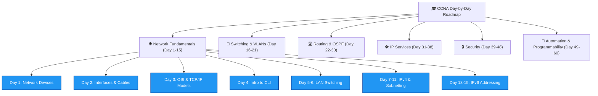

# 🎓 Course on CCNA (Jeremy's IT Lab Day-by-Day)

> [!IMPORTANT]
> **🚀 CCNA Day 1-5 Practice Quiz App is Ready!**
> Day 1 to Day 5 (except Day 4) ka detailed test dene ke liye yahan click karein: 
> **[👉 Open CCNA Quiz App](file:///C:/Users/Sudhanshu%20Singh/OneDrive/Documents/study_material/CCNA_Quiz_App.html)**
> *(Note: HTML files Obsidian file explorer me default hidden hoti hain, isliye aap is link par click karke use browser me open karein).*

Welcome to the CCNA Study Vault! Ye notebook **Jeremy's IT Lab CCNA 200-301 Complete Course** ke Day-by-Day schedule ko track karne ke liye hai. Yahan aapke saare learning sessions ke notes, CLI configurations, Cisco Packet Tracer labs, aur visual diagrams safe रहेंगे.

---

## 🗺️ Course Visual Roadmap

Cisco CCNA certification path ke key modules ka flow niche diya gaya hai:

---

## 📚 Day-by-Day Table of Contents (TOC)

Niche aapki progress tracker index hai. Jis day ka note ban jayega, wo solid link ho jayega:

### 🌐 Module 1: Network Fundamentals (Days 1 - 15)
- **Day 01:** 🔌 [[CCNA Course/Day 01 - Network Devices|Network Devices]]
- **Day 02:** 🔌 [[CCNA Course/Day 02 - Interfaces and Cables|Interfaces and Cables]]
- **Day 03:** 🔌 [[CCNA Course/Day 03 - OSI Model and TCP-IP Suite|OSI Model & TCP/IP Suite]]
- **Day 04:** 🔌 [[CCNA Course/Day 04 - Introduction to the CLI|Introduction to the CLI]]
- **Day 05:** 🔌 [[CCNA Course/Day 05 - Ethernet LAN Switching - Part 1|Ethernet LAN Switching - Part 1]]
- **Day 06:** 🔌 [[CCNA Course/Day 06 - Ethernet LAN Switching - Part 2|Ethernet LAN Switching - Part 2]]
- **Day 07:** 🔌 [[CCNA Course/Day 07 - IPv4 Addressing - Part 1|IPv4 Addressing - Part 1]]
- **Day 08:** 🔌 [[CCNA Course/Day 08 - IPv4 Addressing - Part 2|IPv4 Addressing - Part 2]]
- **Day 09:** 🔌 [[CCNA Course/Day 09 - Switch Interfaces|Switch Interfaces]]
- **Day 10:** 🔌 [[CCNA Course/Day 10 - The IPv4 Header|The IPv4 Header]]
- **Day 11 (Part 1):** 🔌 [[CCNA Course/Day 11 - Routing Fundamentals|Routing Fundamentals]]
- **Day 11 (Part 2):** 🔌 [[CCNA Course/Day 11 - Static Routing|Static Routing]]
- **Day 12:** 🔌 [[CCNA Course/Day 12 - Life of a Packet|The Life of a Packet]]
- **Day 13:** 🔌 [[CCNA Course/Day 13 - Subnetting - Part 1|Subnetting - Part 1]]
- **Day 14:** 🔌 [[CCNA Course/Day 14 - Subnetting - Part 2|Subnetting - Part 2]]
- **Day 15:** 🔌 [[CCNA Course/Day 15 - Subnetting - Part 3|Subnetting - Part 3]]

### 🔌 Module 2: LAN Switching & VLANs (Days 16 - 23)
- **Day 16:** 🔌 [[CCNA Course/Day 16 - VLANs - Part 1|VLANs - Part 1]]
- **Day 17:** 🔌 [[CCNA Course/Day 17 - VLANs - Part 2|VLANs - Part 2]]
- **Day 18:** 🔌 [[CCNA Course/Day 18 - VLANs - Part 3|VLANs - Part 3]]
- **Day 19:** 🔌 [[CCNA Course/Day 19 - DTP and VTP|DTP and VTP]]
- **Day 20:** 🔌 [[CCNA Course/Day 20 - STP - Part 1|Spanning Tree Protocol - Part 1]]
- **Day 21:** 🔌 [[CCNA Course/Day 21 - STP - Part 2|Spanning Tree Protocol - Part 2]]
- **Day 22:** 🔌 [[CCNA Course/Day 22 - RSTP|Rapid STP (RSTP)]]
- **Day 23:** 🔌 [[CCNA Course/Day 23 - EtherChannel|EtherChannel (LACP & PAgP)]]

### 🛣️ Module 3: Routing & OSPF (Days 24 - 29)
- **Day 24:** 🔌 [[CCNA Course/Day 24 - Dynamic Routing Concepts|Dynamic Routing Concepts]]
- **Day 25:** 🔌 [[CCNA Course/Day 25 - OSPF - Part 1|OSPF - Part 1]]
- **Day 26:** 🔌 [[CCNA Course/Day 26 - OSPF - Part 2|OSPF - Part 2]]
- **Day 27:** 🔌 [[CCNA Course/Day 27 - OSPF - Part 3|OSPF - Part 3]]
- **Day 28:** 🔌 [[CCNA Course/Day 28 - FHRP|First Hop Redundancy Protocols (FHRP)]]
- **Day 29:** 🔌 [[CCNA Course/Day 29 - TCP and UDP|TCP & UDP]]

### 🛠️ Module 4: IP Services & IPv6 (Days 30 - 38)
- **Day 30:** 🔌 [[CCNA Course/Day 30 - IPv6 - Part 1|IPv6 - Part 1]]
- **Day 31:** 🔌 [[CCNA Course/Day 31 - IPv6 - Part 2|IPv6 - Part 2]]
- **Day 32:** 🔌 [[CCNA Course/Day 32 - IPv6 - Part 3|IPv6 - Part 3]]
- **Day 33:** 🔌 [[CCNA Course/Day 33 - Access Control Lists - Part 1|Access Control Lists (ACLs) - Part 1]]
- **Day 34:** 🔌 [[CCNA Course/Day 34 - Access Control Lists - Part 2|Access Control Lists (ACLs) - Part 2]]
- **Day 35:** 🔌 [[CCNA Course/Day 35 - CDP and LLDP|CDP & LLDP]]
- **Day 36:** 🔌 [[CCNA Course/Day 36 - NTP|Network Time Protocol (NTP)]]
- **Day 37:** 🔌 [[CCNA Course/Day 37 - DNS|Domain Name System (DNS)]]
- **Day 38:** 🔌 [[CCNA Course/Day 38 - DHCP|Dynamic Host Configuration Protocol (DHCP)]]

### 🔒 Module 5: Security & Network Management (Days 39 - 50)
- **Day 39:** 🔌 [[CCNA Course/Day 39 - SNMP|Simple Network Management Protocol (SNMP)]]
- **Day 40:** 🔌 [[CCNA Course/Day 40 - Syslog|Syslog]]
- **Day 41:** 🔌 [[CCNA Course/Day 41 - SSH|Secure Shell (SSH)]]
- **Day 42:** 🔌 [[CCNA Course/Day 42 - FTP and TFTP|FTP & TFTP]]
- **Day 43:** 🔌 [[CCNA Course/Day 43 - NAT - Part 1|Network Address Translation (NAT) - Part 1]]
- **Day 44:** 🔌 [[CCNA Course/Day 44 - NAT - Part 2|Network Address Translation (NAT) - Part 2]]
- **Day 45:** 🔌 [[CCNA Course/Day 45 - QoS - Part 1|Quality of Service (QoS) - Part 1]]
- **Day 46:** 🔌 [[CCNA Course/Day 46 - QoS - Part 2|Quality of Service (QoS) - Part 2]]
- **Day 47:** 🔌 [[CCNA Course/Day 47 - Security Fundamentals|Security Fundamentals]]
- **Day 48:** 🔌 [[CCNA Course/Day 48 - Port Security|Port Security]]
- **Day 49:** 🔌 [[CCNA Course/Day 49 - DHCP Snooping|DHCP Snooping]]
- **Day 50:** 🔌 [[CCNA Course/Day 50 - Dynamic ARP Inspection|Dynamic ARP Inspection (DAI)]]

### 🏢 Module 6: Advanced Architectures & Wireless (Days 51 - 57)
- **Day 51:** 🔌 [[CCNA Course/Day 51 - LAN Architectures|LAN Architectures]]
- **Day 52:** 🔌 [[CCNA Course/Day 52 - WAN Architectures|WAN Architectures]]

---
> [!TIP]
> **Obsidian Graph Shortcut:** Obsidian mein local graph open karne ke liye sidebar check karein ya `Ctrl + G` press karein. Is index ke open hone par visual graph is central node (`Course on CCNA`) se connect hote huye nodes show karega.
