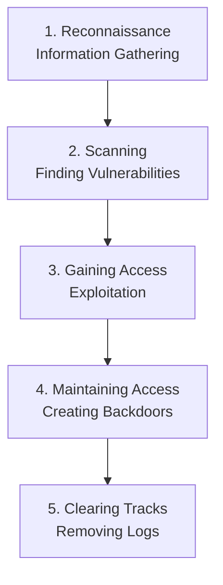

← [[Course on Kali Linux|Go Back to Course Hub]]

# 💀 Topic 1: What is Hacking?

Bhai, simple words me bolें toh: **"Kisi computer system, network, ya application ki kamzoriyo (vulnerabilities) ko dhundhna aur unka use karke system me unauthorized access gain karna hacking kehlata hai."**

Lekin yaad rakhna, hacking sirf galat kaam ke liye nahi hoti. Hacking ek **skillset** hai. Jaise ek **chaku (knife)** se sabzi bhi kaati ja sakti hai aur kisi ko nuksan bhi pahunchaya ja sakta hai, thik waise hi hacking ka use security badhane ke liye bhi kiya jata hai aur nuksan pahunchane ke liye bhi.

---

### 🔑 Real-World Analogy (Ghar ka Tala 🔐)
* **Black Hat Hacker:** Ek chor jo bina poochhe aapke ghar ka tala todta hai taaki wo chori kar sake.
* **White Hat Hacker (Ethical Hacker):** Ek safety expert jise aap khud bulate ho taaki wo aapke ghar ke taale ko check kare aur bataye ki kya koi chor ise tod sakta hai. Wo tala todkar dikhata hai taaki aap kamzori ko theek kar sako.

---

### 🎭 Types of Hackers (Hackers Ke Rang 🎨)

Security domain me hackers ko unke **intention (irada)** aur **authorization (permission)** ke basis par categorize kiya jata hai:

| Hacker Type | Permission? | Intention (Irada) | Legit/Legal? |
| :--- | :--- | :--- | :--- |
| **White Hat (Ethical Hacker)** | ✅ Haan (Fully Authorized) | Security ko strong karna aur vulnerabilities ko fix karna. | 100% Legal |
| **Black Hat (Malicious Hacker)** | ❌ Nahi (Unauthorized) | Paise kamana, data chorana, ya system ko damage karna. | Illegal |
| **Grey Hat (The In-Between)** | ❌ Nahi | Bas maze ke liye ya skill test karne ke liye. Kamzori dhoondh kar admin ko bata dete hain (kabhi-kabhi paise maangte hain). | Gray Area (Technically Illegal) |

#### 💡 Other Notable Types:
* **Script Kiddies:** Ye wo log hote hain jinhe coding ya internal system ki bilkul knowledge nahi hoti. Ye bas internet se ready-made tools (jaise automated scripts) download karke hacking ka try karte hain (sirf show-off ke liye).
* **Hacktivists:** Jo kisi political, social, ya religious agenda ko promote karne ke liye websites hack karte hain (e.g., Anonymous group).
* **State-Sponsored Hackers:** Jinko kisi country ki government hire karti hai doosri countries ke critical systems par attack karne ya espionage (jasoosi) karne ke liye.

---

### 🔄 5 Phases of Hacking (Hacking Kaise Hoti Hai?)

Ek professional hacker ya penetration tester jab kisi target par attack karta hai, toh wo ek standard process follow karta hai jise **Hacking Lifecycle** kehte hain:

1. **Reconnaissance (Info Gathering):** 
   * Sabse pehle target ke baare me jitni ho sake details nikali jati hain (IP address, domain names, employee details, active emails).
   * *Real-world:* Chor pehle ghar ki rekki karta hai ki kab log ghar se bahar jaate hain, kitne log rehte hain.
2. **Scanning:**
   * Is step me tools (jaise **Nmap**) ka use karke active hosts, open ports, aur operating systems ka pata lagaya jata hai taaki kamzori (vulnerabilities) ka pata chal sake.
   * *Real-world:* Chor ghar ke darwaze aur khidkiyon ko check karta hai ki kaunsa tala loose hai ya khula hai.
3. **Gaining Access (Exploitation):**
   * Pata chali kamzori ka fayda utha kar system ke andar ghusna (e.g., exploit chalana, password crack karna, malware bhejna).
   * *Real-world:* Chor us loose khidki se ghar ke andar ghus jata hai.
4. **Maintaining Access:**
   * System ke andar ghusne ke baad ek permanent rasta (backdoor ya trojan) chhod dena taaki agar system restart bhi ho jaye, toh dubara bina mehnat ke access mil sake.
   * *Real-world:* Chor ghar ke pichhe ke darwaze ki duplicate chabi bana kar rakh leta hai.
5. **Clearing Tracks (Covering Footprints):**
   * Kisi ko pata na chale ki koi andar aaya tha, isliye log files delete karna, system logs modify karna, aur hacking tools ko remove karna.
   * *Real-world:* Chor aate-jaate time apne fingerprint saaf kar deta hai taaki police pakad na sake.

> [!IMPORTANT]
> **Ethical Hacking vs. Hacking:**
> Hacking seekhna galat nahi hai, par bina permission ke kisi ke system me ghusna criminal offense hai (IT Act ke andar). Hamesha apni skills ko **authorized environments (jaise TryHackMe, HackTheBox, ya local labs)** me hi practice karein!

---