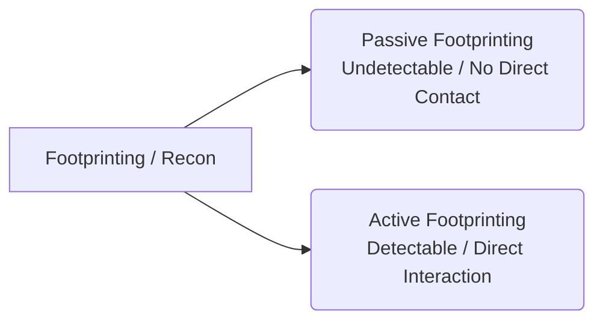

← [[Course on Kali Linux|Go Back to Course Hub]]

# 🔍 Topic 2: Footprinting & Reconnaissance

Bhai, **Footprinting** hacking lifecycle ka sabse pehla aur sabse important phase hai. Iska simple matlab hai: **"Apne target ke baare me zyada se zyada information collect karna."**

Jaise agar koi army kisi enemy base par attack karti hai, toh wo pehle wahan ki jasoosi (reconnaissance) karti hai—maps, weapons, guards ki timing, aur entry/exit points ki details nikalti hai. Hacking me isi jasoosi ko hum **Footprinting** ya **Information Gathering** kehte hain.

---

### 🎯 Goal of Footprinting (Hum kya dhoondhte hain?)
Footprinting ke time ek hacker ka main aim niche di gayi details nikalna hota hai:
1. **Network Information:** IP Addresses range, Subnet mask, Domain Names, Subdomains, Network Topology.
2. **System Information:** Operating System (OS) versions, active services, system banners, web server type.
3. **Organizational Information:** Employee names, email addresses, phone numbers, location, physical security details.

---

### 📂 Types of Footprinting (Recon ke Tarike)

Footprinting do tarike se ki ja sakti hai:



#### 1. Passive Footprinting (Chhupkar Jasoosi 🕵️‍♂️)
Isme hacker target server ya organization ke sath **directly interact nahi karta**. Hum publicly available sources se info nikalte hain. Target ko kabhi pata nahi chalta ki koi us par research kar raha hai.
* **Examples:**
  * Target ki company website par employees ke profiles dekhna.
  * Public databases (WHOIS) search karna.
  * Google Dorking aur Shodan search engine ka use karna.
  * *Real-world Analogy:* Kisi ke social media profiles se uske baare me pata lagana.

#### 2. Active Footprinting (Direct Interaction ⚡)
Isme hacker **directly target network/system ke sath interact karta hai**. Isme info toh bohot accurate aur jaldi milti hai, lekin target ke firewalls aur security systems (IDS/IPS) is activity ko log kar lete hain aur alerts generate ho sakte hain.
* **Examples:**
  * Target website par active port scanning karna (Nmap scan).
  * System ko ping karke dekhna ki wo active hai ya nahi.
  * Server se banner grabbing (version check) karna.
  * *Real-world Analogy:* Kisi ke ghar ki doorbell baja kar check karna ki andar koi hai ya nahi.

---

### 🛠️ Key Tools & Techniques (in Kali Linux)

Kali Linux me Footprinting ke liye bohot saare powerful pre-installed tools milte hain:

#### 1. Google Dorking (Advanced Google Search)
Google par ordinary search ke bajaye specialized query operators ka use karke sensitive documents dhoondhna jo galti se index ho gaye hain.
* **Operators Examples:**
  * `site:target.com filetype:pdf "confidential"` (Target company ki confidential PDF files)
  * `inurl:admin site:target.com` (Target company ke admin login pages)
  * `intitle:"index of" /admin/` (Web directory listings jahan open files hain)

#### 2. WHOIS Lookup (Domain Information)
Domain name kisne register kiya hai, kab expiry hai, owner ka email aur phone number kya hai—ye sab is command se milta hai.
```bash
whois google.com
```

#### 3. DNS Reconnaissance (Domain Name System Info)
Target ke DNS servers se specific records (jaise Mail Server record **MX**, IPv4 record **A**, ya Text records **TXT**) ko extract karna.
* `dig` or `nslookup` tools ka use karke:
```bash
dig target.com MX       # Mail servers ki detail nikalne ke liye
dig target.com ANY      # Saare available DNS records nikalne ke liye
```

#### 4. TheHarvester (OSINT Tool)
Target ke subdomains, emails, employee names, aur open ports ko alag-alag public search engines se search karke ek hi jagah consolidate karta hai.
```bash
theHarvester -d target.com -b google,bing
```
*(Yahan `-d` target domain ke liye hai aur `-b` sources define karta hai)*

#### 5. Shodan (IoT Search Engine)
Shodan normal web pages search nahi karta, balki pure internet par connected **devices** (servers, routers, webcams, smart TVs) ko scan karke unki open ports aur details show karta hai.

---

> [!TIP]
> **OSINT (Open Source Intelligence):**
> Footprinting me **OSINT** ka bohot bada role hota hai. OSINT ka matlab hai wo sari information jo internet par publicly aur legally available hai (social media, public forums, government records). Iska use karke hacker target ka ek detailed map bana leta hai bina koi firewall alert trigger kiye!

---