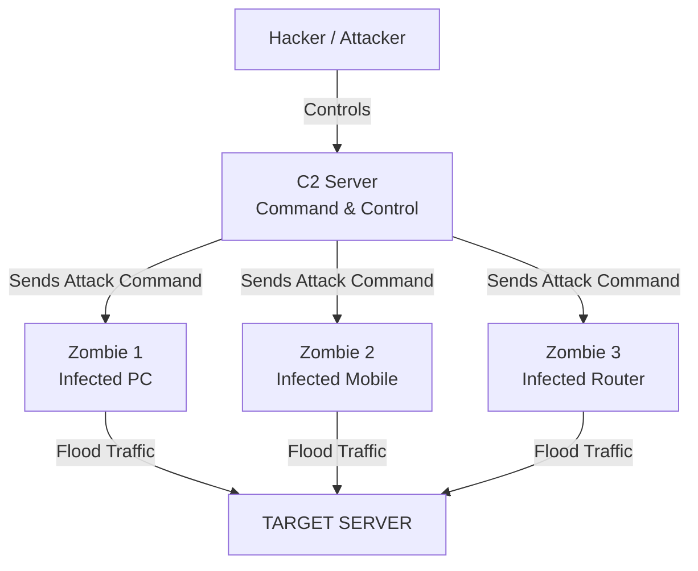

← [[Course on Kali Linux|Go Back to Course Hub]]

# 💥 Topic 3: DoS & DDoS Attacks

Bhai, **DoS** aur **DDoS** cyber security ke sabse common aur dangerous attacks me se hain. Inka main aim data chorana nahi hota, balki target network ya website ko **down (offline)** karna hota hai.

---

### 🆚 DoS vs. DDoS (Difference Kya Hai?)

| Feature | DoS (Denial of Service) | DDoS (Distributed Denial of Service) |
| :--- | :--- | :--- |
| **Attackers Count** | **Ek single** computer se attack hota hai. | **Hazaron (Distributed)** computers se ek sath attack hota hai. |
| **Traffic Vol** | Low to Medium. | Extremely High (Gbps ya Tbps me). |
| **Mitigation (Stop karna)** | Aasan hai (sirf us ek IP address ko block kar do). | Bohot mushkil hai (kyunki traffic pure world ke alag-alag IP se aata hai). |
| **Mechanism** | Simple script ya packet flooding. | **Botnet** (Zombies) ka use kiya jata hai. |

---

### 🔑 Real-World Analogy (Momo ki Shop 🥟)
Maan lo aapki ek Momos ki dukaan hai aur wahan ek baar me **10 log** hi khade ho sakte hain:
* **DoS Attack:** Ek badmash aadmi counter par aakar khada ho jata hai aur faimly pack, menu, rates ke baare me faltu sawaal puchhne lagta hai par order nahi deta. Is wajah se dusre real customers ko service nahi milti.
* **DDoS Attack:** Wahi badmash apne **50 dosto** ko bulata hai aur unko poore counter ke aage khada kar deta hai. Wo sab aapas me baat kar rahe hain aur counter block kar chuke hain. Ab real customer dukaan tak pahunch hi nahi payega aur dukaan band karni padegi.

---

### 🤖 Botnets & Zombies (DDoS ki Jaan)

DDoS attack ko safal banane ke liye hackers **Botnets** ka use karte hain:



1. **Zombie:** Har wo device (PC, Mobile, Router, Smart Bulb) jo internet se connected hai aur jise hacker ne malware bhej kar hack kar liya hai. User ko pata bhi nahi hota ki unka phone/PC hack ho chuka hai aur background me kisi attack me use ho raha hai.
2. **Botnet:** Aise hazaron aur lakhon "Zombies" ke group ko Botnet kehte hain.
3. **C2 Server (Command & Control):** Hacker ek central server se in sabhi zombies ko control karta hai aur unhe order deta hai: *"Sab log ek sath sham 5 baje XYZ website par attack karo!"*

---

### 🛡️ Common Types of DoS/DDoS Attacks

#### 1. SYN Flood (TCP Handshake Attack)
TCP protocol me connections connect karne ke liye 3-way handshake hota hai (Client sends SYN ➡️ Server sends SYN-ACK ➡️ Client sends ACK).
* **Attack:** Attacker target server ko lagatar **SYN** packets bhejta hai. Server **SYN-ACK** se reply karta hai aur port open rakh kar user ke reply (ACK) ka wait karta hai. Attacker kabhi **ACK** nahi bhejta. Aise hazaron open connections ke wait me server ki memory full ho jati hai aur server crash ho jata hai.

```
Attacker ➡️ [SYN Packet] ➡️ Server (Creates pending connection)
Server  ⬅️ [SYN-ACK]      ⬅️ Attacker (Ignores it & sends another SYN)
Server RAM is full waiting for ACK! 💥
```

#### 2. HTTP Flood (Application Layer Attack)
Isme hacker real user ki tarah dikhne wali HTTP GET/POST requests ka flood bhejta hai. Web server ko un requests ko process karne ke liye dynamic pages load karne padte hain, SQL queries chalani padti hain, jisse server ka CPU aur database limit crash ho jata hai.

#### 3. Slowloris (Slow & Low Attack)
Ye bohot smart attack hai. Hacker server ke sath connection open karta hai aur bohot slowly data bhejta hai (jaise har 10 second me ek byte). Server samajhta hai ki client ka internet slow hai isliye connection close nahi karta. Aise sabhi connection pools ko block karke server ko freeze kar diya jata hai.

---

### 🛠️ Lab Testing Tool in Kali Linux (Educational Use Only)

Kali Linux me networks ki stress testing (ki server kitna traffic jhel sakta hai) ke liye tools hote hain:

#### 💻 hping3 Command Line Tool
`hping3` ka use karke custom TCP/IP packets banaye ja sakte hain. 

**SYN Flood Attack (Lab Example):**
```bash
sudo hping3 -S --flood -V -p 80 <Target_IP>
```
* **Flags Breakdown:**
  * `-S`: SYN flag set karne ke liye (TCP connection request).
  * `--flood`: Bina kisi response ka wait kiye jitni jaldi ho sake packets bhejte raho.
  * `-V`: Verbose mode (detailed info display karega).
  * `-p 80`: Target port 80 (HTTP server).

> [!WARNING]
> **Warning:** Apne local network/labs ke bahar kisi bhi system par `hping3` ya koi doosra DoS tool chalana 100% illegal hai aur isse server crash hone par aapko jail/fine ho sakta hai. Isko sirf penetration testing labs me hi practice karein!

---