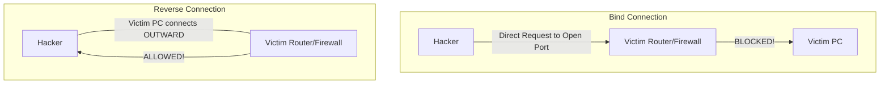

← [[Course on Kali Linux|Go Back to Course Hub]]

# 🐀 Topic 5: RAT (Remote Access Trojan)

Bhai, **RAT** cyber security aur hacking domain ke sabse khatarnak payloads me se ek hai. 

RAT ka full form hota hai **Remote Access Trojan**. Ye ek aisa malware program hai jise targets ke computer ya mobile me install karke hacker **pure device ka complete access aur control** (jaise file browser, camera, keystrokes) kisi bhi dur-daraaz location se gain kar sakta hai.

Jaise iske naam me **Trojan** hai: Ye file dekhne me ekdum normal, safe software/game ki tarah lagti hai par background me iske andar remote management payload hidden hota hai.

---

### 🗄️ RAT Architecture (Kaam Kaise Karta Hai?)

RAT main do parts me split hota hai:

```mermaid
graph LR
    Hacker[Hacker's PC<br>Control Panel / Client] <---. [Internet / Reverse Connection] .---> Victim[Victim's PC<br>Infected Stub / Server]
```

1. **Hacker Side (Controller / Client):** 
   * Hacker ke paas ek software panel hota hai (Control Panel) jahan par sabhi connected compromised devices (Victims) ki real-time details dikhti hain.
2. **Victim Side (Payload / Stub / Server):** 
   * Ye wo small executable/malware file hoti hai jo victim ke system par double-click hone ke baad run hoti hai. Ye chupchap system process me background me fit ho jati hai.

---

### 🔄 Bind Connection vs. Reverse Connection (FIREWALL BYPASS 🔥)

Hacker ko victim se connect karne ke liye do types ke network routes use ho sakte hain:



#### 1. Bind Connection (Direct Port Listening):
* Hacker target computer ka IP address use karke uske open port par connection request bhejta hai.
* **Problem:** Har modern router, firewall ya network NAT incoming random traffic ko seedhe block kar deta hai. Isliye modern hacks me bind connection direct fail ho jata hai.

#### 2. Reverse Connection (Default choice for RATs):
* Isme victim ki machine par run hone wala malware (stub) automatic bahar (outbound) call lagata hai aur hacker ke server (DNS/IP) par connectivity request bhejta hai.
* **Why it works:** Firewalls aur routers normal web browsing aur outgoing traffic (ports 80, 443, 53) ko restrict nahi karte. Firewall ko lagta hai ki user kisi safe website se connect ho raha hai, aur wo target system ko access de deta hai.

---

### 🎯 Key Features of a RAT (Hacker kya-kya kar sakta hai?)

Jab koi victim system RAT se infect ho jata hai, toh hacker is control panel se niche diye saare actions le sakta hai:

* **⌨️ Keylogger (Spying):** Victim keyboard par jo bhi type karega (Passwords, Emails, Bank account pins), wo sab ek text file me hacker ke paas live pahunch jayega.
* **🖥️ Remote Screen Capture:** Real-time desktop control. Hacker victim ke screen ko live video feed ki tarah dekh sakta hai aur virtual mouse/keyboard se control kar sakta hai.
* **📁 Remote File Explorer:** System me store kisi bhi file ko check karna. Hacker system me naye files upload kar sakta hai, sensitive files download kar sakta hai ya system command run kar sakta hai.
* **📸 Webcam & Mic Hijack:** Live camera stream. Bina kisi green light blink hue system camera aur mic capture kiya ja sakta hai.
* **💻 Command Shell Access:** Backdoor terminal. Cmd/Powershell direct console controller window me chalana.

---

### 🌐 Famous RATs in Cyber History
* **NJRat:** Ek bohot hi popular .NET framework based Windows RAT. Iska use simple hacking tutorials se lekar middle-east APT (cyber warfare) groups tak ne kiya hai.
* **DarkComet RAT:** Delphi me likha gaya ek extremely advanced remote management tool tha jo bad me cyber attacks me misuse hone laga, is wajah se creator ne iski development stop kar di.
* **Quasar RAT:** Ek open-source C# based tool jo professional remote support ke liye banna tha par hackers iska use customized RATs banane me karte hain.
* **SpyNote / L3MON / SpyMax:** Android phones ke liye specialized mobile RATs (jo contact logs, SMS read, aur location tracking backup support karte hain).

---

> [!IMPORTANT]
> **Defending against RATs:**
> 1. **No Cracked Software:** Hamesha serial keys, patches, aur cracked applications se bachein (90% chances hote hain ki unme RAT stub pre-binded hota hai).
> 2. **Check Outgoing Connections:** Apne Windows task manager aur firewall me active connections check karein jo dynamic unknown IPs par connected hain.

---