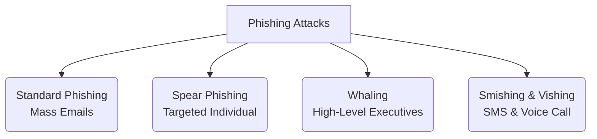

← [[Course on Kali Linux|Go Back to Course Hub]]

# 🎣 Topic 7: Phishing (Social Engineering Attacks)

Bhai, cyber security domain me ek baat bilkul sach hai: **"Aap technical firewall ko kitna bhi strong kar lo, par insaani dimaag (Human Factor) ko hack karna sabse aasan hota hai."** 

Social engineering ke isi concept par kaam karta hai **Phishing** attack.

---

### 🎣 Phishing Kya Hai? (Fishing Analogy 🐟)
Jaise ek machhuara (fisherman) machhli pakadne ke liye kante par ek aakarshak chaara (bait) lagata hai, thik waise hi cybercriminals users ko trap karne ke liye fake emails, messages, ya fake websites ka **"chaara"** fekte hain.
* **Definition:** Ek aisi technique jisme attacker ek legitimate (asli) trustworthy organization ya insaan hone ka dikhawa (impersonation) karke user se unka sensitive data (usernames, passwords, credit card details, OTPs) nikalwa leta hai.

---

### 📂 Types of Phishing (Targeting Styles 🎯)

Phishing attacks target aur medium ke basis par alag-alag types ke hote hain:

1. **Standard/Mass Phishing:**
   * Bina kisi specific target ke lakho logon ko generic fake email bhejna (e.g., *"Dear Customer, Aapka bank account block ho gaya hai, turant login karein"*). Isme jo fasta hai, wo fas jata hai.
2. **Spear Phishing:**
   * Ek specific targeted individual ya organization ke upar research karke custom email bhejna. Hacker pehle target ke social media profile se unki interests ka pata lagata hai aur uske basis par personalized trap set karta hai.
3. **Whaling:**
   * Jab target koi aam insaan nahi, balki company ka **CEO, CFO, ya koi high-profile executive** hota hai. Isme large financial transactions ya company confidential data ko access karne ke liye target kiya jata hai.
4. **Vishing (Voice Phishing):**
   * Phone calls ke zariye fraud karna (e.g., Fake customer care executive ban kar phone par OTP maangna).
5. **Smishing (SMS Phishing):**
   * Text messages ke zariye malicious links bhejkar target karna (e.g., *"Aapka Rs 5,000 ka reward points expire ho raha hai, claim karne ke liye is link par click karein"*).

---

### 🌐 Fake Domain Techniques (Visual Deception 👁️)

Attackers phishing pages ke URLs ko asli website ki tarah dikhane ke liye niche di gayi techniques use karte hain:

* **Typosquatting (URL Spoofing):**
   * Asli brand ke spelling me halka-sa badlav jo dhyan se na dekhne par pakda na ja sake.
   * *Examples:* `faceb00k.com` (use of zeros), `paypa1.com` (use of one instead of 'l'), `goog1e.com`.
* **Subdomain Trick:**
   * Legitimate name ko subdomain me use karna.
   * *Example:* `netflix.com.login-verify-account.support-domain.in` (User ko lagta hai ki ye netflix.com hai, par actual main domain `support-domain.in` hai).

---

### 🛡️ Defensive Engineering Against Phishing

Organisations aur individuals phishing attacks se bachne ke liye ye techniques use karte hain:

#### 1. Multi-Factor Authentication (MFA/2FA)
Agar user phishing page par apna password daal bhi deta hai, tab bhi attacker bina OTP (One-Time Password) ya authenticator app code ke bina login nahi kar sakta. (FIDO2 keys sabse strong safety deti hain).

#### 2. SPF, DKIM, DMARC (Email Security Protocols)
Mail servers me in records ko configure kiya jata hai taaki koi dusra server aapki company ke name se spoofed emails na bhej sake.
* **SPF (Sender Policy Framework):** Un servers ke IP list karta hai jo domain se email bhejne ke liye authorized hain.
* **DKIM (DomainKeys Identified Mail):** Har email par ek cryptographic signature add karta hai jo check karta hai ki mail beech me alter toh nahi hui.
* **DMARC:** SPF aur DKIM check fail hone par email ko drop karne ya spam me bhejne ka rule batata hai.

#### 3. Security Awareness & Simulation
Penetration testers organizations me fake phishing campaigns (tools jaise **GoPhish**) chalate hain taaki ye test kiya ja sake ki kitne employees galti se links par click kar dete hain, aur unhe training di jati hai.

---

> [!IMPORTANT]
> **Hamesha Check Karein:**
> Hamesha address bar me domain name ke direct root (`domain.com`) ko carefully check karein. Agar koi email aapse urgent action (e.g., *"Urgent: Update password within 24 hours"*) karne ko bol raha hai, toh 99% chances hain ki wo ek social engineering attack hai.

---