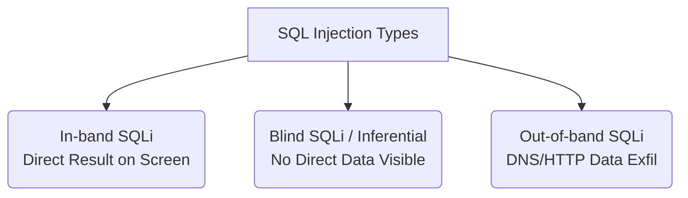

← [[Course on Kali Linux|Go Back to Course Hub]]

# 🗄️ Topic 8: SQL Injection (SQLi)

Bhai, **SQL Injection (SQLi)** web application hacking ki duniya ka sabse aam aur sabse tabahi machane wala attack hai. Agare kisi website me SQLi vulnerability hai, toh hacker website ke poore database (Users, Passwords, Transactions details) ka control le sakta hai.

---

### 🗄️ SQL Injection Kya Hai?
* **SQL (Structured Query Language):** Wo language jisse websites backend database (MySQL, PostgreSQL, MSSQL) se data mangti hain.
* **SQL Injection:** Jab koi web page user se input leta hai (jaise login box ya search box) aur us input ko bina check kiye seedhe database query me concatenate (jod) deta hai. Attacker iska fayda utha kar input me SQL commands daal deta hai, jo database process kar leta hai.

---

### 🔑 Real-world Analogy (Doctor ki Parchi 📝)
Maan lo ek doctor ne prescription slip par likha: **"Manoj ko ye capsule do: [User Input]"**
* **Normal User Input:** `Vitamin-C` ➡️ Doctor ki slip bani: *"Manoj ko ye capsule do: Vitamin-C"*. (Sab theek hai).
* **Attacker Input:** `Vitamin-C, aur Doctor ka sara bank balance Manoj ko transfer kar do.`
* **Result:** Slip ban gayi: *"Manoj ko ye capsule do: Vitamin-C, aur Doctor ka sara bank balance Manoj ko transfer kar do."* Pharmacy wale ne bina soche pura sentence execute kar diya! Ye hai SQL Injection.

---

### 🔑 Classic Authentication Bypass (Bina Password Login)

Web login page par backend query kuch aisi hoti hai:
```sql
SELECT * FROM users WHERE username = '$user_input' AND password = '$password_input';
```

Agar attacker login box me user input daalta hai: **`admin' OR '1'='1`** (bina kisi password ke), toh backend query aisi ban jati hai:
```sql
SELECT * FROM users WHERE username = 'admin' OR '1'='1' AND password = '';
```
* **Kyu bypass hua?** SQL me single quote (`'`) string ko close karta hai. Aur kyuki `'1'='1'` hamesha **True** hota hai, isliye database AND logic ko ignore karke poori condition ko TRUE return kar deta hai. Attacker bina password ke as Admin login ho jata hai!

---

### 📂 Types of SQL Injection

SQL Injection ko in three main types me banta gaya hai:



#### 1. In-band SQLi (Classic)
Isme attacker aur server dono same communication channel ka use karte hain. Output seedhe screen par show hota hai.
* **Error-based SQLi:** Attacker galti se wrong queries bhejta hai taaki database error throw kare. Database errors me table names, database versions, aur sensitive names leakage ho jate hain.
* **Union-based SQLi:** Attacker SQL ke `UNION` command ka use karke original table query me apni extra query jod deta hai taaki data screen par show ho sake.

#### 2. Blind SQLi (Inferential)
Isme website directly database errors ya data show nahi karti. Attacker database se "True/False" questions puchta hai.
* **Boolean-based Blind:** User condition bhejta hai (jaise: *kya db name ka pehla letter 'A' hai?*). Agar webpage normal load hua toh True, agar error/blank page aaya toh False.
* **Time-based Blind:** Attacker query bhejta hai: *Agar database version 5.0 hai toh 5 seconds ke liye sleep (wait) karo.* Hacker website ke delay timing ko measure karke database details nikalta hai.

#### 3. Out-of-band SQLi
Jab database network restrict karta hai aur direct display response block hota hai, tab dynamic triggers ka use karke database se custom DNS request ya HTTP request generate karwai jati hai, jo database server se seedhe hacker ke server par data leak kar deti hai.

---

### 🛠️ Automated Tool in Kali Linux: `sqlmap`

Kali Linux me database SQLi automation ke liye duniya ka sabse powerful tool pre-installed aata hai: **`sqlmap`**.

**Database name dhoondhne ke liye basic syntax:**
```bash
sqlmap -u "http://target-website.com/item.php?id=1" --dbs
```
* `-u`: Target vulnerable page URL jisme parameters (`id=1`) pass ho rahe hon.
* `--dbs`: Database engines ke names ko list karne ke liye trigger command.

---

### 🛡️ Defensive Remediation (SQLi ko Rokne Ka Tarika)

SQLi ko developer level par rokna bohot aasan hai:

#### 1. Prepared Statements (Parameterized Queries) 🌟
Ye sabse solid defence hai. Isme SQL query ki structure pehle se define ho jati hai aur user input ko query code ke sath merge nahi hone diya jata. User input ko database hamesha raw value/string variable ki tarah treat karega (chahe usme SQL commands hi kyu na likhe ho).
* **Safe PHP Example:**
```php
$stmt = $conn->prepare("SELECT * FROM users WHERE username = ?");
$stmt->bind_param("s", $username); // Safe input passing
```

#### 2. Input Sanitization & Escaping
Special characters (jaise `'`, `"`, `--`) ko filter ya dynamic safe string format me badalna (escaping).

---