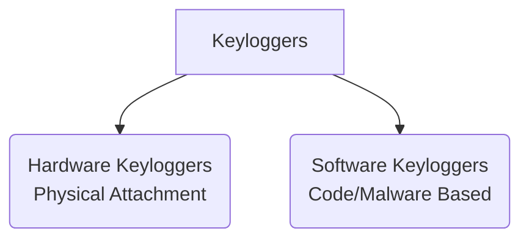

← [[Course on Kali Linux|Go Back to Course Hub]]

# ⌨️ Topic 13: Keyloggers (Keystroke Loggers)

Bhai, **Keyloggers** cyber-criminals aur spyware systems ka ek classic aur silent weapon hai. Iska main kaam user ke system par hone wali har **keyboard activity ko monitor aur record karna** hota hai.

---

### ⌨️ Keylogger Kya Hai?
* Keylogger = **Key**stroke + **Logger**.
* Ye ek hardware device ya software program ho sakta hai jo keyboard ke input events ko capture karta hai, use ek hidden log file me write karta hai, aur baad me use hacker ke mail ya server (via FTP/HTTP) par automatic transmit kar deta hai.
* **Danger:** Keyboard par key press hone ki wajah se passwords, usernames, bank transaction card numbers aur personal chats sab kuch bina copy-paste kiye leak ho jate hain.

---

### 📂 Types of Keyloggers (Classification)

Keyloggers main do broad categories me divided hote hain:



#### 1. Hardware Keyloggers (Physical Device)
Inhe system ke ports me physical touch ke zariye connect karna padta hai:
* **USB/PS2 Keylogger:** Ek small device jo keyboard wire aur CPU port ke beech me lagti hai (jaise ek mini extension pin). Ye keyboard se aane wali signals ko read karke local memory me save karti rehti hai.
* **Acoustic Keylogger:** Ye technology keyboard typing ki *sound patterns* ko analyze karke identify karti hai ki kaunsi key dabayi gayi.
* **Keyboard Overlays:** ATM machines par asli numeric pad ke upar lagaya jane wala fake touch screen overlay jo key-pins capture karta hai.
* *Pros:* Antivirus software inhe kabhi detect nahi kar sakta kyunki isme koi local software/malware run nahi hota.

#### 2. Software Keyloggers (Malware)
Ye computers me software scripts ke zariye chalte hain aur system APIs ko target karte hain:
* **API Hooks (User-mode):** Windows OS me `SetWindowsHookEx` API function ka use karke keyboard signals ko direct capture karna jab koi user key dabata hai. (Sabse simple aur generic software level).
* **Kernel-mode Keyloggers:** Ye system drivers level par inject ho jate hain. OS Kernel ke pass hone wali hardware raw keys events ko read karte hain. Inhe detect karna bohot mushkil hota hai.
* **Hypervisor-mode Keyloggers:** Ye malware virtual machine environments (Blue Pill technique) ke through hardware levels monitor karte hain.

---

### 📊 How Hacker Analyzes Logs (Log File Sample)
Keylogger se collect kiya gaya raw data pehle messy dikhta hai, par scripts use filter kar leti hain:
```text
[Window: Chrome - Login Page]
admin[TAB]
MyS3cretP@ssword123[ENTER]
[Window: Notepad - Notes]
Hello bhai, kaisa hai[BACKSPACE]
```
*(Yahan brackets me keys modifiers/actions, active application aur inputs clean read hote hain).*

---

### 🛡️ Defenses Against Keyloggers (Kaise Bachein?)

1. **Virtual Keyboards:**
   * Banking sites par financial transactions ke time screen par dikhne wale virtual keys (mouse click keys) use karein. Kyunki mouse clicks standard keyboard events generate nahi karte, isliye basic keyloggers ise capture nahi kar pate.
2. **Keystroke Encryption Tools:**
   * Kuch applications keyboard inputs ko OS kernel tak pahunchne se pehle hi encrypt kar deti hain. Keylogger ko raw database ke badle encrypted garbage values milti hain.
3. **MFA (Multi-Factor Authentication):**
   * Kyunki OTP dynamic hoti hai (har 30 seconds me change), agar hacker ko keylogger se password mil bhi jaye, toh bina secondary check device (phone OTP) ke system open nahi ho payega.
4. **Regular Device Inspection:**
   * CPU ports check karte rahein ki koi unknown extra small device USB connector ke aage toh nahi judi hai.

---