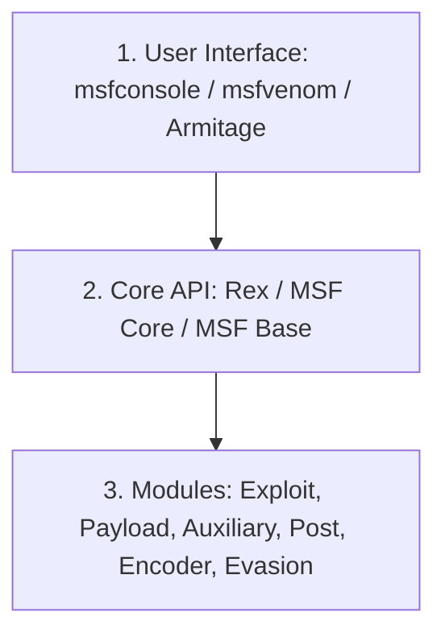

# Topic 01 - Introduction to Metasploit Framework

Metasploit Framework (MSF) ethical hacking aur penetration testing ki duniya ka sabse bada aur powerful software hai. Ise hacking ka **"Swiss Army Knife"** (ek hi tool mein saare hathiyar) kaha jata hai.

---

## 1. Real-World Analogy: Metasploit Kya Hai?

Maan lijiye aap ek security investigator (ya chor) hain jise alag-alag tarah ke taale (locks) kholne hain:
* **Purana Tarika (Manual):** Aap har taale ke liye alag se chabi banate hain, lohe ki rod se koshish karte hain, har cheez manually karte hain. Isme bohot waqt lagta hai.
* **Metasploit Tarika:** Aapke paas ek aisi high-tech toolkit hai jisme duniya ke lagbhag har taale ka blueprint hai, taale ko bypass karne ke liye alag-alag tools hain, aur taala khulne ke baad kya karna hai (jaise camera lagana ya files churaney) uske liye pre-made gadgets hain.
* **Metasploit basically wahi high-tech toolkit hai.**

---

## 2. Framework vs Tool (Dono mein kya farq hai?)
Bohot log kehte hain "Metasploit ek hacking tool hai", jo ki galat hai. Metasploit ek **Framework** hai.
* **Tool:** Jo sirf ek kaam kare (jaise Nmap sirf scanning karta hai).
* **Framework:** Ek aisa platform jo alag-alag tools, modules aur libraries ko aapas mein jodta hai. Aap isme apna khud ka exploit script likh kar load kar sakte hain, ya doosre tools (jaise Nmap, Nessus) ko iske andar integrate kar sakte hain.

---

## 3. Metasploit Architecture (Under the Hood)

Metasploit ke andar teen main layers hoti hain:



### A. User Interfaces (Lakhpat):
Aap Metasploit se kaise interact karte hain:
1. **`msfconsole` (Sabse Popular):** CLI environment jahan saari hacking commands chalti hain.
2. **`msfvenom` (Backdoor Generator):** Custom payloads aur executable malware (e.g. `.exe`, `.apk`) generate karne ke liye.
3. **Armitage:** Java-based GUI tool (graphics wala version).

### B. Core Libraries (Engine):
* **Rex:** Poore basic tasks handle karta hai (network sockets, protocols, SSH, SSL connections).
* **MSF Core:** Engine ki core functional class jo exploits aur sessions ko manage karti hai.
* **MSF Base:** API interfaces jo module management aur interfaces (like CLI) ke beech communication karwati hain.

### C. Modules (Hathiyar):
Modules wahi blocks hain jinse hum actual penetration testing karte hain.
*(Exploits, Payloads, Auxiliaries, Encoders, Evasion, Post, NOPs)*

---

## 4. Basic to Advanced Practical: Initial Setup & Exploration

Chalo terminal khol kar iski testing karte hain:

### Step 1: Services Start aur Launch
Metasploit bina database ke bhi chal sakta hai, par data save karne ke liye **PostgreSQL** database zaroori hai. Ab hum dynamic tarike se direct launch karenge:
```bash
# Sudo privilege se direct database service start karke msfconsole launch karein
sudo msfdb run
```
*(Password: `kali`)*

### Step 2: Database Check (Verify)
Console khulne ke baad check karein ki engine database se linked hai ya nahi:
```text
msf6 > db_status
```
*Output aana chahiye:* `[*] Connected to msf. Connection type: postgresql.`

### Step 3: Core Version check karna
Aap jo Metasploit version use kar rahe ho, uski system specification check karein:
```text
msf6 > version
```
*(Yeh framework version aur console version details show karega).*

### Step 4: Modules count aur summary stats
Aapke installed framework mein kitne total exploits aur payloads hain unki count check karne ke liye:
```text
msf6 > stats
```

---

## 5. Advanced: Search Command Mastery (The Gateway)

Metasploit mein sahi exploit dhundne ke liye `search` command sabse bada tool hai. Chalo filters seekhte hain:

* **Sabhse Basic Search (Keyword based):**
  ```text
  msf6 > search windows
  ```
* **Specific Platform aur Excellent rank waale modules dhundna:**
  ```text
  msf6 > search platform:linux rank:excellent type:exploit
  ```
* **CVE Reference ke zariye search karna:**
  ```text
  msf6 > search cve:2020-0796
  ```
* **Author ke name par search karna:**
  ```text
  msf6 > search author:hdmoore
  ```

---

## 6. Practice Exercises for Mastery

1. **Exercise 1 (Version Check):**
   Apne Kali Linux terminal par `msfconsole` launch karke `version` check karein aur system database output report karein.

2. **Exercise 2 (Advanced Search Query):**
   `msfconsole` mein ek aisi query run karein jo **Android** platform ke exploits dhunde jinka rank **excellent** ho. Query kya thi aur kitne exploits mile?
