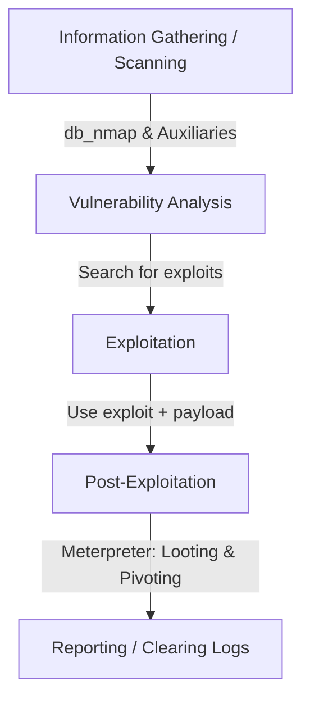

# Topic 02 - Introduction to Metasploit Framework

Metasploit Framework (MSF) ethical hacking aur penetration testing ka ek de-facto standard (sabsay bada) tool hai. Agar aap cyber security ya pentesting mein ho, toh Metasploit ke bina kaam chalna namumkin hai. 

Is topic mein hum Metasploit ki history, interfaces, lifecycle, aur iske filesystem ko bilkul basic se lekar advanced tarike se samjhenge.

---

## 1. History & Evolution (Kya, Kisne aur Kab?)

* **Creator:** Metasploit ko **H.D. Moore** ne 2003 mein ek open-source project ke roop mein banaya tha. Shuruat mein ise Perl language mein likha gaya tha.
* **Ruby Rewrite:** 2007 mein is poore framework ko fir se likha gaya **Ruby** programming language mein. Aaj bhi yeh Ruby par hi chalta hai.
* **Rapid7 Acquisition:** 2009 mein security company **Rapid7** ne ise acquire (kharid) liya.
* **Versions:**
  * **Metasploit Framework (Free/Open Source):** CLI based community version jo hum use karte hain.
  * **Metasploit Pro (Paid):** Web-based GUI version jo enterprise environments mein penetration testing automated karne ke liye use hota hai.

---

## 2. Metasploit Interfaces (Hum ise kaise use kar sakte hain?)

Metasploit ko chalane ke kai tarike hain. Inke baare mein jaanna zaroori hai:

| Interface | Description |
| :--- | :--- |
| **`msfconsole`** | Sabse popular interactive command-line interface. Har pentester isi ko use karta hai. Isme autocomplete (`TAB` key) aur system shell access bhi hota hai. |
| **`msfvenom`** | Payload generator aur encoder tool. Yeh pehle ke do purane tools (`msfpayload` aur `msfencode`) ko jodkar banaya gaya hai. Isse hum custom exe, apk, elf files (backdoors/payloads) banate hain. |
| **Armitage** | Java-based GUI wrapper hai jo Metasploit ko visual banata hai. Isme aap click-to-hack, visual network graphs aur automatically systems ko target kar sakte ho. |
| **Meterpreter** | Yeh ek advanced payload shell hai jo tab active hota hai jab target machine hack ho jati hai. Yeh ordinary shell se 100x zyada powerful hota hai. |

---

## 3. The Professional Penetration Testing Workflow (Metasploit Lifecycle)

Real-world penetration testing mein Metasploit ko step-by-step kaise use kiya jata hai:



### Step 1: Reconnaissance / Scanning (Auxiliary modules)
Sabse pehle target system ko scan kiya jata hai taaki open ports aur chal rahe services ke version pata lag sakein (jaise port 80 par Apache chal raha hai, ya port 445 par SMB).
* **Command Example:** `db_nmap -sV -O <target>`

### Step 2: Vulnerability Analysis
Pata lagaye gaye services aur unke versions ko search kiya jata hai ki kya unme koi public exploit available hai ya nahi.
* **Command Example:** `search ms17_010` (EternalBlue vulnerability search karna).

### Step 3: Exploitation
Sahi exploit choose karke, target variables (IP, Port) set karke aur ek payload configure karke target par attack kiya jata hai.
* **Command Example:** `exploit` ya `run`

### Step 4: Post-Exploitation
Target ka access milne ke baad (Meterpreter shell ke zariye), target machine par files search karna, network details nikala, passwords dump karna aur aage ke systems (Pivoting) par access badhana.

---

## 4. Metasploit Filesystem Structure (Under the Hood)

Kali Linux mein Metasploit ka poora software structure do main directories mein divide hota hai:

### A. The System Directory: `/usr/share/metasploit-framework/`
Yahan Metasploit ka actual core code, modules aur plugins store hote hain.
* `/modules/`: Yahan saare exploits, payloads, auxiliaries folderwise hote hain.
* `/plugins/`: Extra scripts jo Metasploit ke functionalities ko load karti hain (jaise `openvas`, `nessus`).
* `/tools/`: Useful scripts jo utilities ki tarah kaam karti hain (e.g., pattern generators buffer overflow ke liye).

### B. The User Directory: `~/.msf4/` (Hidden Directory)
Yeh aapke user home ke andar hoti hai. Agar aap koi custom script likhte ho ya internet se download karke naya exploit load karna chahte ho, toh use is directory mein rakha jata hai:
* `~/.msf4/modules/`: Custom/Third-party modules rakhne ke liye space.
* `~/.msf4/history`: Msfconsole mein run ki gayi commands ki history save hoti hai.
* `~/.msf4/logs/`: Framework ke logs store hote hain debug karne ke liye.

---

## 5. Pro-Tip: Searching modules like a Pro

Metasploit mein hazaron exploits hain. Sahi exploit dhundne ke liye `search` command ke filters seekhna bohot zaroori hai.

### Examples:
* **Platform ke hisab se filter karna:**
  ```text
  msf6 > search platform:windows type:exploit
  ```
* **CVE ID ke hisab se filter karna:**
  ```text
  msf6 > search cve:2017-0144
  ```
* **Specific Service ya Protocol ke hisab se filter karna:**
  ```text
  msf6 > search smb rank:excellent
  ```
  *(Rank: excellent ka matlab hai ki yeh exploit target system ko crash nahi karega aur 99% reliable hai).*
