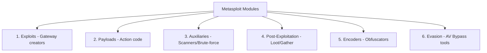

# Topic 04 - Metasploit Modules Deep Dive

Metasploit Framework poori tarah se **Modular architecture** par chalta hai. Is note mein hum samjhenge ki Metasploit Modules kya hote hain, unki 6 core categories kya hain, aur background mein ek module kaise kaam karta hai.

---

## 1. Real-World Analogy: Modules Kya Hote Hain?

Maan lijiye aap ek special operations team (Special Forces) ke commander hain aur aapko ek heist/mission complete karna hai. Aap alag-alag specialists ko hire karenge:
* **The Breaker (Exploit):** Jo entry gate ka lock todega ya diwar mein hole karega taaki team andar jaa sake.
* **The Spy (Payload):** Jo andar jaakar locker se files nikalega aur secure communication setup karega.
* **The Scout (Auxiliary):** Jo pehle jaakar security cameras, guards, aur portals ko scan aur observe karega (bina kisi ko nuksaan pahunchaye).
* **The Cleaner (Post-Exploitation):** Jo access milne ke baad safe lock kholkar passwords churaega aur fingerprint saaf karega.
* **The Master of Disguise (Encoder):** Jo team ko mask/disguise pehnayega taaki security systems unhe na pehchan sakein.

**Metasploit Modules bhi bilkul isi tarah aapas mein team-up karke kaam karte hain.**

---

## 2. What is a Metasploit Module?

Metasploit Module ek **independent piece of Ruby code** hota hai jo kisi specific action ko target ya perform karta hai.
* **Modular Design:** Iska sabse bada fayda yeh hai ki framework core ko touch kiye bina aap naya code "Plug-and-Play" kar sakte hain. 
* Agar aaj koi nayi vulnerability aati hai, toh purana Metasploit reinstall nahi karna padta, bas us vulnerability ka naya exploit script `modules/` directory mein copy-paste ho jata hai.

---

## 3. Dissecting the 6 Core Modules



### A. Exploits (Taala Todna)
Exploit code target machine par kisi hardware/software ki security kamzori (vulnerability) ko trigger karta hai taaki hume access mil sake.
* **Active Exploits:** Direct target par attack karke connection initiate karte hain.
  * *Example Path:* `exploit/windows/smb/ms17_010_eternalblue`
* **Passive Exploits:** Target user ke interaction (click) ka wait karte hain.
  * *Example Path:* `exploit/windows/browser/ms10_002_aurora`

### B. Payloads (Andar Kaam Karne Wala Spy)
Payload woh shell-code hota hai jo exploit hone ke baad execute hota hai. Yeh attacker ko shell terminal deta hai.
* **Types:** Singles (standalone binary), Stagers (chhota code jo socket banata hai), aur Stages (bada shell-code, jaise Meterpreter).

### C. Auxiliary (Scout / Scanner)
Auxiliary modules bina kisi payload ko send kiye targets par information gathering, scanning, brute-forcing aur fingerprinting karte hain.
* *Example Path:* `auxiliary/scanner/portscan/tcp` (TCP port scan karna).
* *Example Path:* `auxiliary/scanner/ssh/ssh_login` (SSH login brute force test karna).

### D. Encoders (Obfuscator)
Anti-virus software files ke pattern (signature) ko check karke unhe malware bolte hain. Encoders payload ke bytes ko XOR algorithm se encode kar dete hain taaki static signature analytics bypass ho sake.
* *Example Path:* `encoder/x86/shikata_ga_nai`

### E. Evasion (Advanced Evasion Modules)
Yeh Windows Defender ya newer endpoint detection features ko bypass karne ke liye customize binaries build karte hain.
* *Example Path:* `evasion/windows/windows_defender_exe`

### F. Post (Post-Exploitation)
Jab target compromise ho jata hai, tab iske modules credentials dump karne, network pivot karne, aur backdoors setup karne mein help karte hain.
* *Example Path:* `post/windows/gather/hashdump` (password hashes extract karna).

---

## 4. Dissecting a Module Code Structure (Ruby)

Metasploit ka har module ek basic format follow karta hai:
1. **Header/Metadata Block:** Module ka title, description, author name, license, aur references (CVE numbers) likhe hote hain.
2. **Initialization Block:** Module ko bataya jata hai ki ise kis tarah ke inputs (RHOSTS, RPORT) chahiye.
3. **Exploit / Run Function:** Actual action code jo execute dabane par run hoga.

---

## 5. Practical commands inside msfconsole

Apne console par jaakar modules list check karein:

* **Kitne modules loaded hain details dekhna:**
  ```text
  msf6 > stats
  ```
* **Specific types ke modules filter karke dekhna:**
  ```text
  msf6 > show exploits
  msf6 > show auxiliary
  msf6 > show payloads
  ```

---

## 6. Practice Exercises

1. **Exercise 1 (Module Path Verification):**
   `msfconsole` ke andar `search eternalblue` chala kar batayein ki is exploit ka category module type kya hai (Exploit, Auxiliary, ya Post)?

2. **Exercise 2 (Auxiliary Selection):**
   Metasploit mein SMB version scan karne ke liye kaun sa auxiliary module use hota hai? Path search karke dhoondo.
   *(Hint: `search smb_version`)*
