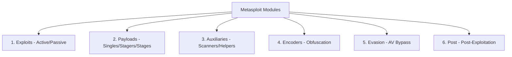

# Topic 05 - Metasploit Framework Modules

Metasploit ka poora power iske **Modules** mein chhupa hua hai. Modules independent pieces of code hote hain jo kisi specific task ko perform karte hain (jaise scan karna, hack karna, ya shell dena). 

Is note mein hum Metasploit ke 6 main module categories ko detail mein aur practical examples ke sath dekhenge.

---

## 1. Dissecting the 6 Core Modules



### A. Exploits (Nishana lagana)
* **Active Exploits:** Yeh target machine par directly attack karte hain, exploit run karte hain, shell open hone ka wait karte hain, aur phir close ho jate hain.
  * *Example:* Scanning a vulnerable port, pushing exploit code, and instantly getting a shell.
* **Passive Exploits:** Yeh target ke system par focus nahi karte, balki target user ke actions ka wait karte hain (jaise phishing link click karna, web browser open karna).
  * *Example:* Web browser exploits (like client-side attacks).

### B. Payloads (Kaam karne waala code)
Payload woh malicious code hai jo target machine par exploit hone ke baad chalta hai. Isko teen category mein divide kiya gaya hai (is-se aage hum detailed topic mein bhi padhenge):
1. **Singles (Inline):** Ek single file jisme exploit aur action dono code automatic pre-packed hote hain.
2. **Stagers:** Chhota code jo connection set karta hai aur target machine par bada payload (Stage) download karta hai.
3. **Stages:** Bada main payload (jaise Meterpreter) jo target machine par stager ke aane ke baad execute hota hai.

### C. Auxiliary (Helper / Information Gatherer)
Auxiliary modules target system par koi payload drop nahi karte. Yeh reconnaissance, scanning, brute-forcing, aur fingerprinting ke liye hote hain.
* **Categories:**
  * `scanner/`: Port scanners, FTP scanners, SMB scanners.
  * `admin/`: Configuration changes karne ke liye scripts.
  * `dos/`: Denial of service attacks test karne ke liye modules.
  * `fuzzer/`: Application input boundaries test karne ke liye.

### D. Encoders (Shikata-ga-nai)
Yeh payloads ko dynamic encrypt/encode karte hain taaki signature-based Anti-Viruses unhe detect na kar sakein.
* *Example:* `shikata_ga_nai` (Polymorphic XOR additive feedback encoder). Yeh binary instructions ko alter karta hai bina payload ki final execution badle.

### E. Evasion (Bypass techniques)
Metasploit 5 aur 6 mein direct evasion modules include kiye gaye hain. Yeh Windows Defender ya normal AV detections ko bypass karne ke liye customize files generate karne mein help karte hain.

### F. Post (Post-Exploitation - Lootna!)
Jab hume target machine ka access mil jata hai, tab is module ka kaam shuru hota hai.
* *Examples:*
  * Gathering Wi-Fi profiles/passwords.
  * Dumping password hashes (`hashdump`).
  * Running keyloggers.
  * Taking screenshots/webcam photos.

---

## 2. Practical: Running an Auxiliary Module (Without Nmap)
Hum Kali Linux terminal ke bahar generic port scanning Nmap ke bina direct Metasploit module se bhi kar sakte hain. Chalo ek local TCP Port Scanner run karte hain:

### Steps:
1. **Msfconsole open karo:**
   ```bash
   sudo msfdb run
   ```
2. **TCP Port Scanner module search aur select karo:**
   ```text
   msf6 > search portscan/tcp
   msf6 > use auxiliary/scanner/portscan/tcp
   ```
3. **Options check karo:**
   ```text
   msf6 auxiliary(scanner/portscan/tcp) > show options
   ```
4. **Target IP range aur ports configure karo:**
   ```text
   msf6 auxiliary(scanner/portscan/tcp) > set RHOSTS <target-ip>
   msf6 auxiliary(scanner/portscan/tcp) > set PORTS 21-80
   msf6 auxiliary(scanner/portscan/tcp) > set THREADS 10
   ```
   *(Threads badhane se scanning speed fast ho jayegi).*
5. **Scan run karo:**
   ```text
   msf6 auxiliary(scanner/portscan/tcp) > run
   ```

---

## 3. Practice Exercises

1. **Exercise 1 (Port Scanner):**
   Apne lab target IP (`192.168.98.129`) par `auxiliary/scanner/portscan/tcp` scanner run karo (ports `21-100` ke liye). Check karo ki nmap ke mukable iska output kaisa dikhta hai.

2. **Exercise 2 (FTP Login Brute-force):**
   Metasploitable 2 ki FTP service (Port 21) par brute force test karne ke liye kaun sa auxiliary module use hota hai? Metasploit mein search karke module ka path dhoondo.
   *(Hint: `search ftp_login`)*
