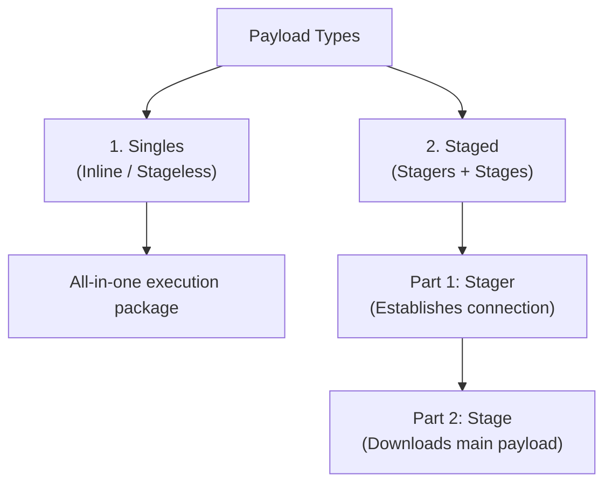

# Topic 18 - Payload Types (Single, Stager, Stage)

Metasploit Framework ke andar exploit code target system ke check verification ko bypass karke rasta banata hai, par actual remote control link hume **Payload** ke through hi milta hai. 

Is guide mein hum payloads ke teen main classifications (Single, Stager, Stage) aur unke selection criteria ke logical concepts ko detail mein samjhenge.

---

## 1. The Three Payload Classifications



---

### A. Singles (Inline / Stageless Payloads)
* **Concept:** Yeh complete self-contained payloads hote hain. Inka matlab hai ki target compromise hote hi, execution command aur code (jaise custom shells) **ek hi block mein** target memory mein load ho jata hai.
* **Pros:** 
  * **Network Stealth:** Attacker aur target ke beech koi extra dynamic download connections establish nahi hote, isliye Intrusion Detection Systems (IDS) ise easily catch nahi kar paate.
  * **Simplicity:** Inhe run karne ke liye complex handling execution setups ki zaroorat nahi padti.
* **Cons:**
  * **Size Limitation:** Inka size bada hota hai. Agar target vulnerability buffer limit choti (`small stack space`) hai, toh payload fit nahi ho paata aur exploit fail ho jata hai.

### B. Staged Payloads (Split Execution)
Yeh bade payloads ko system constraints ke according do steps mein split karke execute karte hain:

#### 1. Stager (The Initial Connection)
* **Size:** Bahut hi chota (minimal bytes).
* **Role:** Target memory space lock hote hi, yeh code target server par execute hota hai aur iska sirf ek hi kaam hota hai: Attacker (Kali Linux) ke dynamic listening port ke sath secure network pipe connection configure karna.

#### 2. Stage (The Heavy Payload)
* **Size:** Bada (e.g. Meterpreter dynamic DLLs).
* **Role:** Jaise hi stager aur listener ke beech connection complete hota hai, Kali Linux background pipeline ke zariye main stage (bada software shell code) target par download karke system memory ke stack mein directly injection ke zariye run kar deta hai.

* **Pros:** Size limit restrictions ko easily bypass kar deta hai kyunki exploit ke time sirf tiny stager use hota hai.
* **Cons:** Network traffic parameters monitor karne par extra stage downloads visible hote hain.

---

## 🏷️ Metasploit Payload Naming Conventions (The `/` vs `_` Rule)

Metasploit ke internal repository structures mein payloads ke syntax structure ko dekh kar aap unka type identify kar sakte hain:

* **Staged Payload (Uses `/` in path name):**
  ```text
  linux/x86/shell/reverse_tcp
  # and
  windows/meterpreter/reverse_tcp
  ```
  *(Path path name mein `shell` or `meterpreter` ke baad slash `/` ka matlab hai ki yeh staged execution follow karega).*

* **Single/Inline Payload (Uses `_` instead of `/`):**
  ```text
  linux/x86/shell_reverse_tcp
  # and
  windows/meterpreter_reverse_tcp
  ```
  *(Underscore `_` verify karta hai ki yeh stageless/inline execution package hai).*

---

## 🛡️ Secure Operations Guidelines (Remediation checks)

Defensive network security audits mein, system hardening ke rules:

1. **Inline Payloads Inspection:** Security firewalls par unknown host connections patterns aur memory signatures analysis filter set karein.
2. **Restricting Stage Downloads:** Firewalls aur deep-packet inspection (DPI) sensors ko configure karein jo raw executable payloads stages code injections ke behavior ko block kar sakein.

---

## 📝 Practice Exercises (Hinglish Tasks)

1. **Exercise 1 (Single vs Staged Naming):**  
   Maan lijiye aapko command shell chahie Windows par. Payload list mein do options hain:  
   A) `windows/shell/reverse_tcp`  
   B) `windows/shell_reverse_tcp`  
   Inme se kaun sa **Single (Inline)** payload hai aur kaun sa **Staged** payload hai? Kaise pehchana?

2. **Exercise 2 (Space Constraint Logic):**  
   Agar target system par memory buffer vulnerability bohot choti space (small buffer size) de rahi hai, toh aap Single payload use karoge ya Staged? Kyun?

3. **Exercise 3 (Staged Payload Flow):**  
   Staged payload execution mein **Stager** ka actual kaam kya hota hai? (Technically batao).

4. **Exercise 4 (Identify Payload Type in msfconsole):**  
   Metasploit console par `show payloads` chalane par, agar kisi payload ke aage description mein `Stageless` likha ho, toh iska kya matlab hai?

5. **Exercise 5 (Analyze reverse_http payload):**  
   `windows/meterpreter/reverse_http`  
   Is payload ka pattern dekho. Kya yeh single payload hai ya staged? Aur yeh connect karne ke liye kis network protocol ka use karega?

6. **Exercise 6 (Under the Hood Architecture):**  
   Meterpreter shell chalane ke liye by default staged payload (`/meterpreter/`) kyun preferred hota hai compared to single meterpreter (`meterpreter_`)? (Think: Meterpreter ke feature extensions ke baare mein).

7. **Exercise 7 (Network Traffic Trace):**  
   Agar firewall rules dynamic targets par extra incoming connections track kar rahe hain, toh kya staged payload run hone par firewall alerts trigger hone ka risk single inline payload se zyada hai? Explain check.

8. **Exercise 8 (Msfvenom output format checking):**  
   Msfvenom se custom payload build karte waqt, raw payload formats (`-f raw`) generate karte waqt single aur staged ke execution output format check standard default libraries mein kaise load hote hain?
