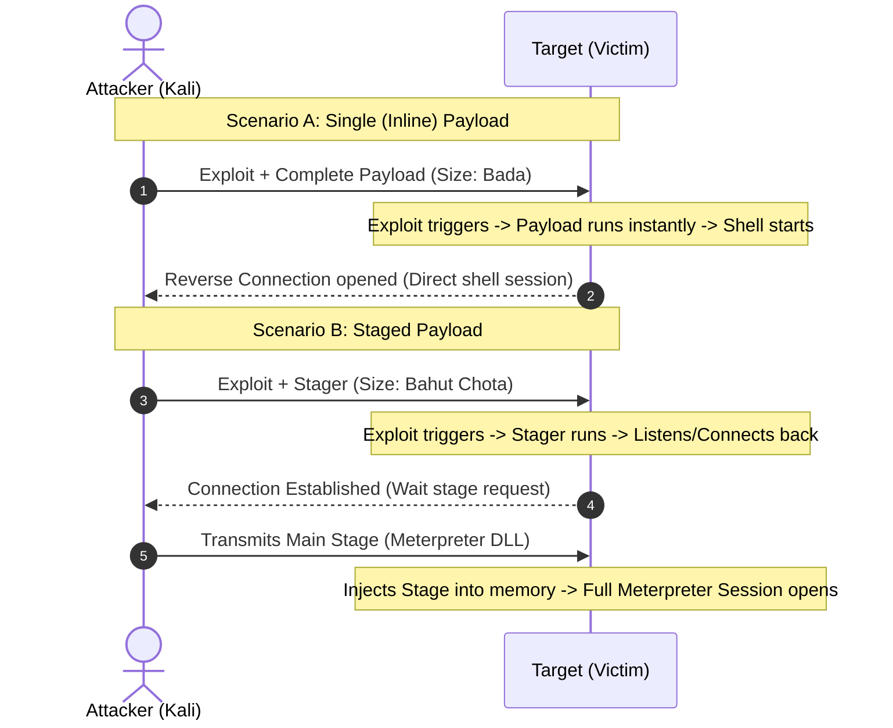

# Topic 18 - Payload Types (Single, Stager, Stage)

Metasploit Framework ke andar exploit code target system ke check verification ko bypass karke memory mein space banata hai, par actual remote control link hume **Payload** ke through hi milta hai. 

Is guide mein hum payloads ke teen main classifications (Single, Stager, Stage), unke naming conventions, aur unke exact size/execution characteristics ko concrete examples ke saath detail mein samjhenge.

---

## 🗺️ The Architecture of Payload Delivery



---

## 1. The Three Payload Classifications & Detailed Mechanics

### A. Singles (Inline / Stageless Payloads)
* **Concept:** Yeh "All-in-One" independent binary packages hote hain. Inka matlab hai ki target compromise hote hi, target control command aur shell execution code **ek hi payload packet mein** target memory mein load ho jata hai.
* **Concrete Example (Command Shell):**
  `windows/shell_reverse_tcp`
  * **Size:** ~324 bytes (Saara shell logic, connection parameters aur execution instructions isi single block mein hain).
  * **Execution Flow:** Jab aap is exploit ko execute karoge, toh Kali Linux target ko direct complete binary block send karegi. Target host code execute karke seedhe Kali par bash/cmd connection return kar dega.
* **Pros:**
  * **Intrusion Detection Bypass:** Target ko execute hone ke baad Kali se koi doosra code download karne ki zaroorat nahi padti. Isliye network monitors (IDS) ko extra stages downloads transfer patterns detect nahi hote.
* **Cons:**
  * **Large Size:** Agar stack buffer vulnerability size limit target par restricted hai (jaise exploit memory block size maximum 100 bytes allow kar raha hai), toh yeh 320+ bytes ka payload wahan fit nahi hoga aur target machine instantly crashed ho jayegi.

---

### B. Staged Payloads (Split Execution Method)
Bade payloads ko limited memory buffer areas mein execute karne ke liye, Metasploit payload ko do alag-alag parts mein split karke send karta hai:

#### 1. The Stager (The Initial Connection Loader)
* **Concept:** Yeh ek behad chota, lightweight assembler assembly code script block hota hai.
* **Size:** ~15 se 28 bytes! (Bohot chota).
* **Role:** Iska sirf ek hi function hota hai: Target par load hokar Kali Linux (Attacker) ke local interface port ke sath connect karna aur network link open banana.
* **Example:** `windows/shell/reverse_tcp` (ka stager part).

#### 2. The Stage (The Main Controller Payload)
* **Concept:** Yeh main payload code (jaise dynamic Windows DLL file or heavy meterpreter packages) hota hai jo link open hone ke baad download hota hai.
* **Size:** Bada (jaise Meterpreter core payload: ~1 MB+).
* **Role:** Jaise hi stager Kali ke listener se connect hota hai, Kali Linux is main block (Stage) ko network link ke through target machine memory buffer range mein stream (inject) kar deti hai.

---

## 🏷️ Metasploit Payload Naming Conventions (The `/` vs `_` Rule)

Metasploit ke directories aur output menus mein payloads ke paths dekh kar aap direct samajh sakte ho ki kaun sa single hai aur kaun sa staged:

| Naming Syntax Pattern | Classification | Real Example | Execution Logic |
| :--- | :--- | :--- | :--- |
| **Double Slashes ( `/` )** | **Staged** | `linux/x86/shell/reverse_tcp` | `shell` is the Stage; `reverse_tcp` is the Stager. |
| **Single Underscore ( `_` )** | **Single (Inline)** | `linux/x86/shell_reverse_tcp` | All-in-one execution package block. |

### Comparative Naming Grid:
* **Meterpreter (Staged):** `windows/meterpreter/reverse_tcp` (Sends stager -> downloads meterpreter DLL).
* **Meterpreter (Single):** `windows/meterpreter_reverse_tcp` (Sends the entire meterpreter package in one shot).

---

## 🔍 Network Analysis Example (Wireshark Perspective)

Agar aap target aur attacker ke beech ke traffic ko Wireshark parser se analysis karoge:

1. **Single Payload Execution:**
   * Packet 1: Exploit Buffer Overflow + Payload data (TCP push).
   * Packet 2: Target returns shell terminal access payload.
   * *Conclusion:* Low network noise, only one port transaction.

2. **Staged Payload Execution:**
   * Packet 1: Exploit code + Stager (Very small packet).
   * Packet 2: Target establishes connection back to Kali Linux port 4444.
   * Packet 3: Kali streams raw binary stream (Stage DLL) of large size to target.
   * Packet 4: Execution starts and Meterpreter shell transaction starts.
   * *Conclusion:* High network noise. Network monitoring team can easily see a raw binary stream download occurring immediately after connection establishment.

---

## 🛡️ Remediation & System Hardening (Defense Rules)

System secure karne ke standard checks:

1. **DPI Inspection (Deep Packet Inspection):** Network switches par configuration verify karein jo dynamic EXE/DLL compilation files ya staging binaries transfer codes signature block block kar sakein.
2. **Network Segmentation:** Local servers se unauthorized outbound connections (LHOST port requests) block karne ke liye outbound rules update karein:
   ```bash
   # Block arbitrary outbound connections on port 4444
   sudo iptables -A OUTPUT -p tcp --dport 4444 -j DROP
   ```

---

## 📝 Practice Exercises (Hinglish Tasks)

1. **Exercise 1 (Single vs Staged Naming):**  
   Maan lijiye aapko command shell chahie Windows par. Payload list mein do options hain:  
   A) `windows/shell/reverse_tcp`  
   B) `windows/shell_reverse_tcp`  
   Inme se kaun sa **Single (Inline)** payload hai aur kaun sa **Staged** payload hai? Kaise identify kiya?

2. **Exercise 2 (Space Constraint Logic):**  
   Agar target system par memory buffer vulnerability bohot choti space (small buffer size) de rahi hai, toh aap Single payload use karoge ya Staged? Kyun?

3. **Exercise 3 (Staged Payload Flow):**  
   Staged payload execution mein **Stager** code ka exact technical kaam kya hota hai?

4. **Exercise 4 (Identify Payload Type in msfconsole):**  
   Metasploit console par `show payloads` chalane par, agar kisi payload ke aage description mein `Stageless` likha ho, toh iska kya matlab hai?

5. **Exercise 5 (Analyze reverse_http payload):**  
   `windows/meterpreter/reverse_http`  
   Is payload ka pattern dekho. Kya yeh single payload hai ya staged? Aur yeh connect karne ke liye kis network protocol ka use karega?

6. **Exercise 6 (Under the Hood Architecture):**  
   Meterpreter shell chalane ke liye by default staged payload (`/meterpreter/`) kyun preferred hota hai compared to single meterpreter (`meterpreter_`)? (Think: Meterpreter ke feature extensions ke baare mein).

7. **Exercise 7 (Network Traffic Trace):**  
   Agar firewall rules dynamic targets par extra incoming connections track kar rahe hain, toh kya staged payload run hone par firewall alerts trigger hone ka risk single inline payload se zyada hai? Explain check.

8. **Exercise 8 (Msfvenom output format checking):**  
   Msfvenom se custom payload build karte waqt, raw payload formats (`-f raw`) generate karte waqt single aur staged ke execution output format check standard default libraries mein kaise load hote hain?
