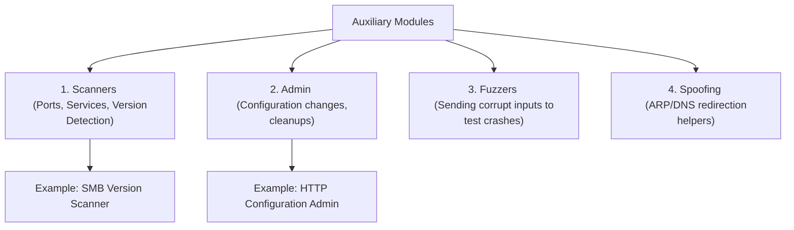

# Topic 21 - Metasploit Auxiliary Modules Deep Dive

Metasploit Framework ke andar exploits ke alawa jo sabse bada aur useful module database hai, use **Auxiliary Modules** kehte hain. Yeh modules target system ko hack (exploit) nahi karte, balki scanning, target information gathering, brute-forcing, aur vulnerability assessment ke liye use hote hain.

Is guide mein hum auxiliary modules ke type, unke internal workflows, and multiple practicals ko detail mein samjhenge.

---

## 🗺️ Auxiliary Module Workflow & Architecture



---

## 1. Deep Dive Explanation (Auxiliary Modules Kya Hain?)

### A. The Core Concept
* **No Payload Requirement:** Exploits ko chalne ke liye payload (jaise Meterpreter shell) chahiye hota hai. Lekin auxiliary modules ko execute hone ke liye **zero payload** ki zaroorat hoti hai. Yeh run hokar seedhe output return karte hain aur terminate ho jaate hain.
* **The Helper System:** Inka main use reconnaissance (recon) and scanning phase mein target machine ka structural mapping data, open ports, software banners, and default configuration bypass loopholes dhoondne ke liye kiya jata hai.

### B. Categories of Auxiliary Modules:
1. **Scanner:** (Sabse zyaada used) Target services ke version aur weaknesses ko automatic query verify karne ke liye.
2. **Admin:** Target interfaces ke configuration parameters audit ya adjust karne ke liye.
3. **Fuzzer:** Application parameters mein invalid data push karke test karna ki kahin buffer overflow crash anomalies toh nahi hain.
4. **Dos (Denial of Service):** Test system ki crash recovery properties check karne ke liye.

---

## Part 2: Bhar-Bhar Ke Practicals (Basic to Advance)

### Practical 1: TCP Port Scanner (`auxiliary/scanner/portscan/tcp`)
Nmap ke bina, msfconsole ke andar se hi multiple target ports scan karne ke liye:

#### Step 1: Scanner Module load karein:
```text
msf6 > use auxiliary/scanner/portscan/tcp
```
#### Step 2: Parameters set karein:
```text
msf6 auxiliary(scanner/portscan/tcp) > set RHOSTS 192.168.98.129
msf6 auxiliary(scanner/portscan/tcp) > set PORTS 21,22,23,80,445
msf6 auxiliary(scanner/portscan/tcp) > set THREADS 10
```
#### Step 3: Run execution:
```text
msf6 auxiliary(scanner/portscan/tcp) > run
```

---

### Practical 2: SMB Service Version Verification (`auxiliary/scanner/smb/smb_version`)
Target system par run ho rahe file sharing (Samba/SMB) ke version ko identify karne ke liye:

#### Step 1: Load SMB Version Module:
```text
msf6 > use auxiliary/scanner/smb/smb_version
```
#### Step 2: Check target variables (Using global IP if set):
```text
msf6 auxiliary(scanner/smb/smb_version) > show options
```
#### Step 3: Run scan:
```text
msf6 auxiliary(scanner/smb/smb_version) > run
```
* **Output Example:**
  `[+] 192.168.98.129:445 - Host is running Unix (Samba 3.0.20-Debian)`

---

### Practical 3: HTTP Directory Scanner (`auxiliary/scanner/http/dir_scanner`)
Target web server par hidden paths/directories (jaise admin login portals, backup folders) scan karne ke liye:

#### Step 1: Load Directory Scanner:
```text
msf6 > use auxiliary/scanner/http/dir_scanner
```
#### Step 2: Target parameters update karein:
```text
msf6 auxiliary(scanner/http/dir_scanner) > set RHOSTS 192.168.98.129
msf6 auxiliary(scanner/http/dir_scanner) > set PATH /
```
#### Step 3: Run search:
```text
msf6 auxiliary(scanner/http/dir_scanner) > run
```

---

## Part 3: Pro-Tips & Advanced Configurations

### 1. Speed Up Scans using `THREADS`
* By default, auxiliary scanners `THREADS` variable ko `1` par configure rakhte hain. Iska matlab ek baar mein ek hi connection packet trigger hoga (bohot slow).
* **Pro-Tip:** Multiple ports scan karte waqt `set THREADS 20` ya `50` set karein taaki multi-threaded scan faster terminate ho sake. (Ensure target local VM crash na ho).

### 2. Workspace Database Integration
* Jab aap database connect (`db_status`) karke auxiliary modules run karte ho, toh scanners automatic parsed details ko metasploit database workspace mein save kar dete hain.
* Scan complete hone ke baad, `hosts` or `services` commands chala kar aap target state direct view kar sakte hain.

---

## 📝 Practice Exercises (Hinglish Tasks)

1. **Exercise 1 (Auxiliary vs Exploit):**  
   Auxiliary modules ko execute hone ke liye Payload selection parameters ki zaroorat kyun nahi hoti? Technical design logic batao.

2. **Exercise 2 (Brute Force module):**  
   SSH default credentials verification ke liye Metasploit ka kaun sa scanner auxiliary module standard bypass checks run karta hai? Path name search query likho.

3. **Exercise 3 (Threads constraint check):**  
   Auxiliary scanners mein `THREADS` variable badhane se scan operations speed aur network bandwidth par kya effects padte hain?

4. **Exercise 4 (Analyze Fuzzer Modules):**  
   Fuzzing auxiliary modules ka primary goal vulnerability discovery lifecycle mein kya hota hai?

5. **Exercise 5 (Verify db_nmap alternative):**  
   Metasploit auxiliary scanner and `db_nmap` scan execution save results ke metadata integration details mein main difference kya hai?

6. **Exercise 6 (Search filter for Auxiliary):**  
   Framework database ke andar sirf scan category modules search filter karne ka exact query path syntax parameters kya hai?

7. **Exercise 7 (RPORT behavior in scanners):**  
   Scanner module (jaise `scanner/ssh/ssh_version`) load karte hi, iska default `RPORT` change verification automatic target ports standard follow kyun karta hai?

8. **Exercise 8 (Check execution output values):**  
   Scan parameters compile verification success hone par, green `[+]` aur green `[*]` status output logs console reports indicators ka dynamic meaning kya represent karta hai?
