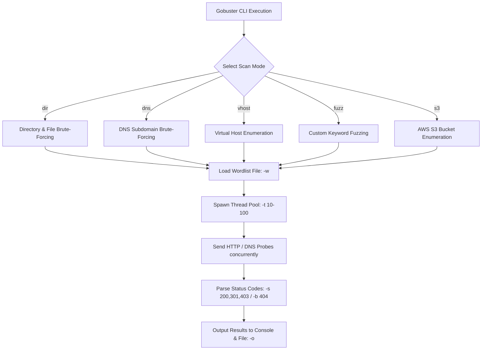

# Gobuster - Complete In-Depth Masterclass Guide

---

## 1. Overview & Deep Dive: What is Gobuster?

**Gobuster** is an extremely fast, multi-threaded open-source tool written in **Go (Golang)** used by penetration testers and Red Teams for brute-forcing URI paths (directories and files), DNS subdomains, Virtual Hosts (Vhosts), Amazon S3 buckets, and parameter fuzzing.

---

## 2. Gobuster Execution Architecture & Mode Pipeline

---

## 3. Comprehensive Mode-by-Mode & Flag-by-Flag Reference

### 3.1 Global Flags
- `-w` / `--wordlist`: Wordlist file path.
- `-t` / `--threads`: Concurrent threads (default 10).
- `-o` / `--output`: Output result file.
- `-q` / `--quiet`: Quiet mode.
- `-v` / `--verbose`: Verbose output.
- `--delay`: Delay between probes.

### 3.2 Directory Mode Flags (`gobuster dir`)
- `-u` / `--url`: Base Target URL.
- `-x` / `--extensions`: File extensions (`php,html,txt,json,bak`).
- `-s` / `--status-codes`: Allowed HTTP status codes (`200,204,301,302,401,403`).
- `-b` / `--status-codes-blacklisted`: Blacklisted status codes (`404,500`).
- `-k` / `--insecure`: Skip SSL verification.
- `-c` / `--cookies`: Session Cookies (`PHPSESSID=...`).
- `-H` / `--headers`: Custom Headers (`Authorization: Bearer ...`).
- `--proxy`: Route through Burp Suite (`http://127.0.0.1:8080`).
- `--exclude-length`: Filter specific byte size responses.

### 3.3 Subdomain Mode Flags (`gobuster dns`)
- `-d` / `--domain`: Target Domain Name.
- `-r` / `--resolver`: Custom DNS Resolver IP.
- `-i` / `--show-ips`: Display resolved IP addresses.

### 3.4 Vhost Mode Flags (`gobuster vhost`)
- `-u` / `--url`: Base Target IP/URL.
- `--domain`: Base Domain.
- `--append-domain`: Append domain to wordlist entries.

### 3.5 Fuzzing Mode Flags (`gobuster fuzz`)
- `-u` / `--url`: URL with `FUZZ` placeholder (`http://target.thm/view.php?id=FUZZ`).

---

## 🎯 10 Detailed Hands-On Practical Questions & Solutions

1. **Task 1 (Dir Extensions):** `gobuster dir -u http://10.10.14.33 -w /usr/share/wordlists/dirb/common.txt -x php,html,bak -t 50`
2. **Task 2 (SSL Insecure):** `gobuster dir -u https://192.168.1.150 -w /usr/share/wordlists/dirb/common.txt -k`
3. **Task 3 (DNS IPs):** `gobuster dns -d acme.thm -w /usr/share/wordlists/secLists/Discovery/DNS/subdomains-top1million-5000.txt -i`
4. **Task 4 (Cookie Auth):** `gobuster dir -u http://target.thm -w /usr/share/wordlists/dirb/common.txt -c "PHPSESSID=9a8b7c6d5e4f3210"`
5. **Task 5 (Vhost Discovery):** `gobuster vhost -u http://10.10.10.100 -w /usr/share/wordlists/secLists/Discovery/DNS/subdomains-top1million-5000.txt --append-domain`
6. **Task 6 (Burp Proxy):** `gobuster dir -u http://10.10.10.50 -w /usr/share/wordlists/dirb/common.txt --proxy http://127.0.0.1:8080`
7. **Task 7 (Length Exclude):** `gobuster dir -u http://10.10.10.50 -w /usr/share/wordlists/dirb/common.txt --exclude-length 512`
8. **Task 8 (Fuzz Mode):** `gobuster fuzz -u "http://target.thm/view.php?id=FUZZ" -w /home/kali/numbers.txt -b 404`
9. **Task 9 (Stealth Delay):** `gobuster dir -u http://10.10.10.50 -w /usr/share/wordlists/dirb/common.txt -t 5 --delay 500ms`
10. **Task 10 (Custom Header):** `gobuster dir -u http://api.target.thm/v1 -w /usr/share/wordlists/dirb/common.txt -H "Authorization: Bearer my_secret_token_123" -o /home/kali/api_dirs.txt`
